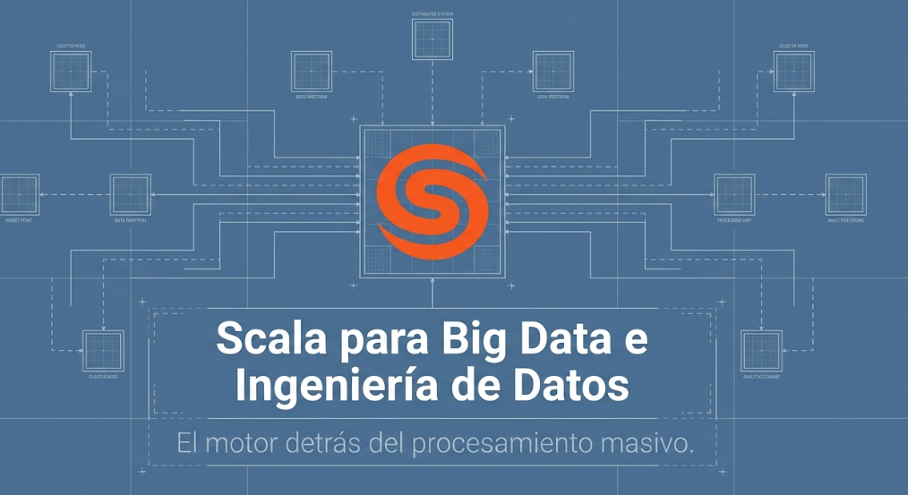

# 💻Clase 05 - Scala en Big Data

---

# Agenda:

<aside>
💡

#### 9:00 - 9:50 → **Sesión 1: Orígenes de Scala**

#### 9:50 - 11:20 → Actividad Practica 1

#### 11:40 - 12:40 → **Sesión 2: Scala y el ecosistema Spark**

#### 12:40 - 14:00 → Actividad practica 2

</aside>

# Sesión 1 - Orígenes de Scala

<aside>
💡

## **Actividad práctica 1:**

1. Investiga en la web o con IA (modo deep research en ingles mejor) de qué trata el perfil Big Data Specialist y cual es la demanda laboral de este perfil en el mercado. Crea una presentación power point con tus resultados
2. Investiga la demanda laboral que existe en Scala . Añade tus resultados al power point del punto 1.
3. Escucha el audio podcast 1 compartido en clase y elabora un resumen en word/google docs/libreoffice
</aside>

# Sesión 2: **Scala y el Ecosistema de Spark para Big Data**

<aside>
💡

## **Actividad practica 2:**

- Investiga en la web o con IA (modo deep research en ingles mejor) Todas las herramientas que conforman el ecosistema Spark. Crea una presentación power point con tus resultados.
- Escucha el audio podcast 2 compartido en clase y elabora un resumen en word/google docs/libreoffice.
</aside>