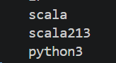

# 💻Clase 06 - Sintaxis Básica

---

# Agenda:

<aside>
💡

#### 9:00 - 9:50 → **Sesión 1: V**ariables, tipos y operadores

#### 9:50 - 11:20 → Actividad Practica 1

#### 11:40 - 12:40 → Sesión 2: Control de Flujo

#### 12:40 - 14:00 → Actividad practica 2

</aside>

# Sesión 1.

# 1. Instalación de scala 2.13

<aside>
💡

En la clase 4 (tutorial 2 y 3 ) se dejó instalado un kernel de scala 3 en jupyter notebook. Necesitamos tener también el kernel de Scala 2.13. Para ello nos vamos a la terminal de VSCode y en la terminal PowerShell y escribimos:

</aside>

```powershell
cs launch almond:0.14.5 --scala 2.13.18 -- --install --id scala213 --display-name "Scala 2.13 (Spark)"
```

> La versión `0.14.5` aparece como release reciente de Almond, y ese proyecto publica assets separados para `Scala 2.13`.
> 

Una vez realizada la instalación del kernel, vamos a listar todos los kernels que tenemos:

```powershell
python -m jupyter kernelspec list
```

Se deberían tener al menos dos kernels de Scala y uno de Python:



Donde: `scala213` hace referencia a **Scala 2.13** el cual es compatible con Spark. Mientras que el otro kernel `scala` hace referencia a la **versión 3** que, según vimos en la clase 5 no es compatible del todo con Spark pero es el futuro de Big Data. En este curso trabajaremos con scala 2.13. 

> Si no apareciera scala213 cierra vscode y todos los terminales de powershell que tengas abiertos y luego vuelve a abrir vscode.
> 

Vamos a crear una carpeta para los ejercicios con nombre `Practicas_Scala`

```powershell
mkdir Practicas_scala
```

Vas a crear un notebook con nombre clase_06.ipynb:


 Una vez creado el notebook, vamos a seleccionar el kernel scala213:


Seleccionar el que dice Scala 2.13 (Spark):


<aside>
💡

Si no te aparece Scala 2.13 (Spark) debes seleccionar una opción que dice: Jupyter Kernels y allí estará.

</aside>

Crea una celda de código:


Debe crearse una celda vacía:


Una buena practica, es comprobar la versión de Scala que tenemos en el kernel de este notebook. Copia y pega lo siguiente en tu celda y ejecuta:

```scala
scala.util.Properties.versionString
```

Deberías ver esto:


# 2. Sintaxis básica de Scala I: variables, tipos y operadores

### 2.1. `val` vs `var`: la base de la inmutabilidad

En Scala, hay dos formas de declarar un valor:

| Palabra clave | Significado | ¿Se puede reasignar? |
| --- | --- | --- |
| `val` | value (valor) | ❌ No |
| `var` | variable | ✅ Sí |

```scala
// val: inmutable. Una vez asignado, no cambia.
val nombre = "Scala"
// nombre = "Java"  // ← ERROR de compilación
```

```scala
// var: mutable. Se puede reasignar.
var contador = 0
contador = contador + 1  // ← correcto
```

```scala
contador = 5             // ← correcto
```

> 💡 **Regla de oro en Scala:** usa siempre `val` por defecto. Solo cambia a `var` cuando tengas una razón concreta para necesitar reasignación. Esta preferencia por la inmutabilidad es uno de los pilares de la programación funcional y de Spark.
> 

---

### 2.2 Tipos de datos primitivos

> Scala tiene un sistema de tipos estático y fuerte. Los tipos básicos son:
> 

| Tipo | Descripción | Ejemplo |
| --- | --- | --- |
| `Int` | Número entero (32 bits) | `42`, `-10`, `0` |
| `Long` | Entero grande (64 bits) | `1000000000L` |
| `Double` | Decimal de doble precisión | `3.14`, `-0.5` |
| `Float` | Decimal de precisión simple | `3.14f` |
| `Boolean` | Verdadero o falso | `true`, `false` |
| `Char` | Un carácter Unicode | `'A'`, `'z'`, `'3'` |
| `String` | Cadena de texto | `"Hola Scala"` |
| `Unit` | Equivale al `void` de Java | Valor: `()` |

```scala
val edad: Int        = 30
val precio: Double   = 99.99
val activo: Boolean  = true
val inicial: Char    = 'S'
val lenguaje: String = "Scala"
```

> 📌 En Scala, los tipos se escriben después del nombre con `:`. Ejemplo: `val x: Int = 5`.
> 

<aside>
💡

**`Unit` es el tipo de retorno de cualquier función que solo produce un efecto** (imprimir, escribir, modificar estado) sin devolver un valor útil. Su único valor posible es `()`.

</aside>

Ejemplo 1 de `Unit` . 

```scala
def saludar(nombre: String): Unit =
  println(s"Hola, $nombre!")

saludar("Ana")
// Hola, Ana!

```

Ejemplo 2 de `Unit` . 

```scala
def imprimirLinea(longitud: Int): Unit =
  println("-" * longitud)

imprimirLinea(30)
// ------------------------------
// el kernel muestra: ()
```

<aside>
💡

`Float` vs `Double` — precisión decimal

 **¿Cuándo usar cada uno?**

- `Double` es el estándar en Scala y en Spark. Úsalo siempre salvo que tengas una razón concreta.
- `Float` solo tiene sentido cuando el volumen de datos es enorme y cada byte importa (por ejemplo, modelos de Machine Learning con millones de parámetros), y puedes aceptar algo de imprecisión a cambio de ocupar la mitad de memoria.
</aside>

**Float** — precisión simple (32 bits, ~7 dígitos significativos). Se declara con el sufijo `f`:

```scala
val precio: Float = 3.14159265358979f
println(precio)
// 3.1415927   ← solo 7 dígitos, el resto se pierde
```

**Double** — precisión doble (64 bits, ~15 dígitos significativos). Es el tipo decimal por defecto en Scala:

```scala
val precio: Double = 3.14159265358979
println(precio)
// 3.14159265358979   ← 15 dígitos conservados
```

Comparación directa:

```scala
val f: Float  = 1.123456789f
val d: Double = 1.123456789

println(f)   // 1.1234568   ← redondeo por falta de precisión
println(d)   // 1.123456789 ← valor exacto
```

---

### 2.3 Inferencia de tipos

> Scala puede deducir el tipo automáticamente a partir del valor asignado. No es obligatorio escribirlo:
> 

```scala
val ciudad      = "Madrid"  // Scala infiere: String
val temperatura = 22.5      // Scala infiere: Double
val esDia       = true      // Scala infiere: Boolean
val año         = 2024      // Scala infiere: Int
```

Aunque el tipo no se escribe, sigue existiendo. Scala lo conoce en tiempo de compilación. En el notebook, `Almond` muestra el tipo inferido junto al resultado de cada celda:

```scala
val numero = 10
```

El kernel mostrará:

```
numero: Int = 10
```

> 💡 La inferencia de tipos hace el código más limpio sin sacrificar la seguridad de tipos. Es especialmente útil cuando los tipos son obvios por el contexto.
> 

---

### 2.4 Operadores

### 2.4.1 Aritméticos

```scala
val a = 10
val b = 3

val suma     = a + b   // 13
val resta    = a - b   // 7
val producto = a * b   // 30
val cociente = a / b   // 3  (división entera entre Int)
val resto    = a % b   // 1  (módulo)

// Para obtener resultado decimal, al menos uno debe ser Double:
val division = a.toDouble / b   // 3.3333...
```

> 💡 En el notebook, si la última línea de la celda es una expresión, Almond la muestra automáticamente sin `println`. Por ejemplo, escribir solo `suma` en una celda mostrará `res0: Int = 13`.
> 

### 2.4.2 Comparación

Devuelven siempre un `Boolean`:

```scala
val x = 5
val y = 8

x == y   // false  (igualdad)
x != y   // true   (diferencia)
x < y    // true
x > y    // false
x <= y   // true
x >= y   // false
```

### 2.4.3 Lógicos

```scala
val esAdulto = true
val tieneDNI = false

esAdulto && tieneDNI   // false  (AND: ambos deben ser true)
esAdulto || tieneDNI   // true   (OR: al menos uno debe ser true)
!esAdulto              // false  (NOT: invierte el valor)
```

---

### 2.5. Interpolación de cadenas

> Scala ofrece tres formas de construir strings dinámicos:
> 

### 2.5.1 Interpolador `s` — el más usado

> Permite embeber variables y expresiones directamente en el string:
> 

```scala
val nombre = "Ana"
val edad   = 28

val saludo = s"Hola, $nombre. Tienes $edad años."
// "Hola, Ana. Tienes 28 años."

// Con expresiones entre llaves:
val info = s"El doble de tu edad es ${edad * 2}."
// "El doble de tu edad es 56."
```

### 2.5.2 Interpolador `f` — formato numérico

Aplica formato de precisión al estilo de `printf`:

```scala
val precio = 1234.5678

val ticket = f"Total: $precio%.2f euros"
// "Total: 1234.57 euros"

val porcentaje = 0.876
val resultado  = f"Tasa de éxito: ${porcentaje * 100}%.1f%%"
// "Tasa de éxito: 87.6%"
```

### 2.5.3 Interpolador `raw` — sin secuencias de escape

```scala
val ruta = raw"C:\Users\juan\Documentos"
// "C:\Users\juan\Documentos"  (las \ no se interpretan como escapes)
```

> 💡 En el 90% de los casos usarás el interpolador `s`. Los interpoladores `f` y `raw` cubren necesidades específicas de formato y rutas de fichero.
> 

---

# 💻 Práctica

---

### 🔹 Ejercicio 1 — `val` y `var`: cuándo usar cada uno

**Celda 1 — Markdown:**

```markdown
## Ejercicio 1 — val y var
```

**Celda 2 — Code:**

```scala
// val: describe el curso (no cambia durante la ejecución)
val nombreCurso = "Big Data con Scala"
val numeroDias  = 28
val horasPorDia = 5.0

println(s"Curso: $nombreCurso")
println(s"Duración: $numeroDias días × $horasPorDia h/día = ${numeroDias * horasPorDia} horas")
```

**Salida esperada:**

```
Curso: Big Data con Scala
Duración: 28 días × 5.0 h/día = 140.0 horas
```

**Celda 3 — Code:**

```scala
// var: el contador de sesiones cambia a lo largo del programa
var sesionesCompletadas = 0
println(s"Sesiones completadas al inicio: $sesionesCompletadas")

sesionesCompletadas = sesionesCompletadas + 1
println(s"Después de la Sesión 1: $sesionesCompletadas")

sesionesCompletadas += 1
println(s"Después de la Sesión 2: $sesionesCompletadas")
```

**Salida esperada:**

```
Sesiones completadas al inicio: 0
Después de la Sesión 1: 1
Después de la Sesión 2: 2
```

**Celda 4 — Code (para ver el error de reasignación):**

```scala
// Descomenta la siguiente línea para ver el error de compilación:
// numeroDias = 30
// error: reassignment to val
```

**Celda 5 — Markdown (preguntas de reflexión):**

```markdown
### Preguntas de reflexión
1. ¿Por qué `nombreCurso` y `numeroDias` son `val` y no `var`?
2. ¿Por qué `sesionesCompletadas` es `var`?
3. ¿Qué mensaje de error aparece si intentas reasignar un `val`?
```

---

### 🔹 Ejercicio 2 — Calculadora básica con tipos

**Celda 1 — Markdown:**

```markdown
## Ejercicio 2 — Calculadora básica
```

**Celda 2 — Code:**

```scala
val a: Double = 15.0
val b: Double = 4.0

val suma     = a + b
val resta    = a - b
val producto = a * b
val division = a / b
val modulo   = a % b

println("=== Calculadora Scala ===")
println(f"  $a%.1f + $b%.1f = $suma%.1f")
println(f"  $a%.1f - $b%.1f = $resta%.1f")
println(f"  $a%.1f × $b%.1f = $producto%.1f")
println(f"  $a%.1f ÷ $b%.1f = $division%.4f")
println(f"  $a%.1f %% $b%.1f = $modulo%.1f")
```

**Salida esperada:**

```
=== Calculadora Scala ===
  15.0 + 4.0 = 19.0
  15.0 - 4.0 = 11.0
  15.0 × 4.0 = 60.0
  15.0 ÷ 4.0 = 3.7500
  15.0 % 4.0 = 3.0
```

**Celda 3 — Code:**

```scala
// División entera con Int
val x: Int = 15
val y: Int = 4

println(s"División entera: $x / $y = ${x / y}")
println(s"Resto:           $x % $y = ${x % y}")

// Comparaciones
println(s"\n¿$a > $b?   ${a > b}")
println(s"¿$a == $b?  ${a == b}")
println(s"¿$a != $b?  ${a != b}")
```

**Salida esperada:**

```
División entera: 15 / 4 = 3
Resto:           15 % 4 = 3

¿15.0 > 4.0?   true
¿15.0 == 4.0?  false
¿15.0 != 4.0?  true
```

**Celda 4 — Code (ampliación — cálculo del IMC):**

```scala
val pesoKg    = 75.0
val alturaMts = 1.78

val imc = pesoKg / (alturaMts * alturaMts)

val categoria =
  if      (imc < 18.5) "Bajo peso"
  else if (imc < 25.0) "Normal"
  else if (imc < 30.0) "Sobrepeso"
  else                 "Obesidad"

println(f"IMC: $imc%.2f → $categoria")
```

**Salida esperada:**

```
IMC: 23.67 → Normal
```

---

### 🔹 Ejercicio 3 — Interpolación de strings

**Celda 1 — Markdown:**

```markdown
## Ejercicio 3 — Interpolación de strings
```

**Celda 2 — Code:**

```scala
val nombre       = "Carlos García"
val edad         = 32
val nota         = 8.756
val aprobado     = nota >= 5.0
val rutaInformes = raw"C:\Informes\Alumnos\2024"

// Interpolador s
println(s"Alumno: $nombre")
println(s"Edad:   $edad años")
println(s"¿Ha aprobado? $aprobado")
println(s"Años hasta jubilación (65): ${65 - edad}")
```

**Salida esperada:**

```
Alumno: Carlos García
Edad:   32 años
¿Ha aprobado? true
Años hasta jubilación (65): 33
```

**Celda 3 — Code:**

```scala
// Interpolador f: formato decimal
println(f"Nota final:    $nota%.2f")
println(f"Nota sobre 10: $nota%05.2f")

// Interpolador raw: ruta Windows sin problemas con \
println(s"\nRuta de informes: $rutaInformes")
```

**Salida esperada:**

```
Nota final:    8.76
Nota sobre 10: 08.76

Ruta de informes: C:\Informes\Alumnos\2024
```

# 💻 Ejercicios propuestos:

---

### Ejercicio P1 — Ficha personal

Declara las siguientes variables con el tipo adecuado e imprime una ficha con interpolador `s`:

- Tu nombre (texto)
- Tu edad (entero)
- Tu altura en metros (decimal)
- Si estás trabajando actualmente (booleano)

**Salida esperada** (con tus datos):

```
=== Ficha Personal ===
Nombre:   Laura Martínez
Edad:     35 años
Altura:   1.68 m
Trabajando: true
```

> 💡 Decide qué variables deben ser `val` y cuáles podrían ser `var`. Justifica tu elección en una celda Markdown.
> 

---

### Ejercicio P2 — Conversor de minutos

Declara una variable `minutosTotales` con el valor `137`. Calcula y muestra cuántas horas y minutos son usando división entera y el operador módulo `%`.

**Salida esperada:**

```
137 minutos = 2 horas y 17 minutos
```

> 💡 Recuerda: la división entre dos `Int` da un `Int`. Aquí no necesitas decimales.
> 

---

### Ejercicio P3 — Comparador de precios

Declara dos precios: `precioA = 49.99` y `precioB = 67.50`. Usando operadores de comparación, imprime:

**Salida esperada:**

```
¿precioA es menor que precioB?   true
¿Son iguales?                    false
¿precioA es mayor o igual?       false
La diferencia es: 17.51 €
```

> 💡 Usa el interpolador `f` para mostrar los decimales con 2 cifras.
> 

---

### Ejercicio P4 — Etiqueta de producto

Declara estas variables:

- `producto = "Teclado mecánico"`
- `precio = 89.99`
- `unidades = 3`
- `enStock = true`

Construye e imprime la siguiente etiqueta usando **únicamente** el interpolador `f`:

**Salida esperada:**

```
Producto:  Teclado mecánico
Precio:    89.99 €
Unidades:  3
Subtotal:  269.97 €
En stock:  true
```

---

### Ejercicio P5 — Ruta de fichero

Declara una variable `carpeta` con el valor `"Documentos"` y una variable `fichero` con el valor `"informe_2024.csv"`. Construye e imprime la ruta completa de dos formas:

**Salida esperada:**

```
Ruta con s:   C:\Usuarios\Alumno\Documentos\informe_2024.csv
Ruta con raw: C:\Usuarios\Alumno\Documentos\informe_2024.csv
```

> 💡 Con el interpolador `s` necesitarás escribir `\\` para obtener `\`. Con `raw` no.
> 

### Ejercicio P6 — Detector de tipo con `getClass`

Scala permite consultar el tipo real de una variable en tiempo de ejecución con `.getClass.getSimpleName`. Declara seis variables sin especificar su tipo, una por cada tipo primitivo de la sesión (`Int`, `Long`, `Double`, `Float`, `Boolean`, `Char`), y muestra el nombre de tipo que infiere Scala para cada una.

**Salida esperada:**

```
42          → Int
1000000000L → Long
3.14        → Double
3.14f       → Float
true        → Boolean
'S'         → Char
```

> 💡 Consulta: `val x = 42; println(x.getClass.getSimpleName)`
> 

---

### Ejercicio P7 — Ticket de compra con IVA desglosado

Declara tres productos con su precio base (sin IVA). El IVA general es del 21%. Calcula e imprime el ticket con el precio base, el importe del IVA y el precio final de cada producto, más los totales. Usa el interpolador `f` para todo el formato.

**Salida esperada:**

```
========================================
           TICKET DE COMPRA
========================================
Producto          Base     IVA    Total
----------------------------------------
Monitor 4K      299.99   63.00  362.99 €
Teclado          49.99   10.50   60.49 €
Ratón             29.99    6.30   36.29 €
----------------------------------------
TOTAL           379.97   79.79  459.76 €
========================================
```

> 💡 Declara los precios base como `val`. El IVA y los totales derívales con expresiones, no con nuevas variables `var`.
> 

---

### Ejercicio P8 — Análisis de una nota

Declara `val nota: Double = 6.85`. A partir de **solo esa variable**, calcula e imprime todo lo siguiente usando únicamente operadores y los tres interpoladores (`s`, `f`, `raw`):

**Salida esperada:**

```
Nota:              6.85
Nota redondeada:   6.9
¿Aprobado?         true
¿Notable o más?    false
Sobre 100:         68.5
Déficit a 10:      3.15
Informe guardado en: C:\Notas\informe_nota_6.85.txt
```

> 💡 Para `Nota redondeada` usa `f"$nota%.1f"`. Para la ruta del fichero, construye el nombre dinámicamente incluyendo la nota con el interpolador `s` dentro de `raw`.
> 

### Ejercicio P9 — Validador de credenciales

Declara las siguientes variables:

```scala
val usuario       = "admin"
val contrasena    = "Scala2024"
val intentos: Int = 3
val bloqueado     = intentos >= 3
```

Usando **operadores lógicos** (`&&`, `||`, `!`), calcula e imprime:

**Salida esperada:**

```scala
¿Usuario correcto?         true
¿Contraseña correcta?      true
¿Cuenta bloqueada?         true
¿Puede acceder?            false
¿Necesita resetear clave?  true
```

> Donde "puede acceder" es `true` solo si el usuario es correcto, la contraseña es correcta Y la cuenta NO está bloqueada. Y "necesita resetear clave" es `true` si está bloqueado O la contraseña no es correcta.
> 

### Ejercicio P10 — Conversor de unidades múltiple

Declara `val distanciaKm: Double = 142.5`. A partir de **solo esa variable**, calcula la equivalencia en las cuatro unidades siguientes y muestra la tabla con el interpolador `f`:

- **Metros:** 1 km = 1.000 m
- **Millas:** 1 km = 0.621371 millas
- **Pies:** 1 km = 3.280,84 pies
- **Pulgadas:** 1 km = 39.370,1 pulgadas

**Salida esperada:**

```scala
=== Conversor de distancia ===
Distancia original:   142.50 km

En metros:       142500.00 m
En millas:           88.55 millas
En pies:         467369.70 pies
En pulgadas:    5608436.43 pulgadas
```

> 💡 Declara los factores de conversión como `val` con nombre descriptivo antes de calcular. Usa `%12.2f` para alinear los números a la derecha.
> 

---

---

# Sesión 2:

# 🧠 3. Sintaxis básica de Scala II: control de flujo

### 3.1. Condicionales: `if` / `else`

> En Scala, `if` no es solo una instrucción: es una **expresión que devuelve un valor**. Esto lo distingue de Java o Python.
> 

```scala
val edad = 20

// Uso como instrucción (al estilo Java)
if (edad >= 18) {
  println("Mayor de edad")
} else {
  println("Menor de edad")
}
```

Pero lo más idiomático en Scala es usarlo como expresión:

```scala
val edad = 20

// if como expresión: el resultado se asigna directamente
val categoria = if (edad >= 18) "adulto" else "menor"
println(s"Categoría: $categoria")
// "Categoría: adulto"
```

Con más de dos ramas:

```scala
val nota = 7.5

val calificacion =
  if      (nota >= 9.0) "Sobresaliente"
  else if (nota >= 7.0) "Notable"
  else if (nota >= 5.0) "Aprobado"
  else                  "Suspenso"

println(s"Calificación: $calificacion")
// "Calificación: Notable"
```

> 💡 Cuando `if` se usa como expresión, ambas ramas deben devolver el mismo tipo (o un tipo compatible). Scala lo verifica en tiempo de compilación.
> 

---

### 3.2. Bucles

### 3.2.1 `while`

> Ejecuta el bloque mientras la condición sea verdadera:
> 

```scala
var i = 1
while (i <= 5) {
  println(s"Iteración $i")
  i += 1
}
```

**Salida:**

```
Iteración 1
Iteración 2
Iteración 3
Iteración 4
Iteración 5
```

### 3.2.2 `do-while`

Ejecuta el bloque al menos una vez y luego comprueba la condición:

```scala
var intentos = 0
do {
  println(s"Intento ${intentos + 1}")
  intentos += 1
} while (intentos < 3)
```

**Salida:**

```
Intento 1
Intento 2
Intento 3
```

> 💡 **En la práctica**, `while` y `do-while` se usan poco en Scala idiomático porque requieren `var`. Las colecciones y los métodos funcionales (`foreach`, `map`) son la alternativa preferida. Los veremos en los días siguientes.
> 

---

### 3.3. Bucle `for` con rangos

> El `for` de Scala es muy expresivo. La forma más básica usa rangos:
> 

```scala
// Rango inclusivo: 1 hasta 5 (incluye el 5)
for (i <- 1 to 5) {
  println(s"i = $i")
}
// Se lee: "para cada i extraído de (1 to 5)"
```

<aside>
💡

`<-` — generador de secuencia.
No es una comparación. Es un símbolo propio de Scala que significa **"para cada elemento de"**. Se usa exclusivamente dentro de un `for` para extraer elementos de una colección o rango uno a uno.

</aside>

```scala
// Rango exclusivo: excluye el límite superior
for (i <- 1 until 5) {
  println(s"i = $i")
}
// Imprime: 1, 2, 3, 4
```

```scala
// Con paso personalizado
for (i <- 0 to 10 by 2) {
  print(s"$i ")
}
// 0 2 4 6 8 10
```

```scala
// Recorrer una colección
val frutas = List("manzana", "pera", "naranja")
for (fruta <- frutas) {
  println(s"Fruta: $fruta")
}
```

---

### 3.4. `for comprehensions`: filtros dentro del `for`

> Las **for comprehensions** añaden potencia al bucle `for` con (`if`) y generadores múltiples:
> 

```scala
// Guardia: filtrar elementos durante el recorrido
val numeros = List(1, 2, 3, 4, 5, 6, 7, 8, 9, 10)

for (n <- numeros if n % 2 == 0) {
  println(s"Par: $n")
}
// Par: 2, 4, 6, 8, 10
```

```scala
// Múltiples generadores: producto cartesiano
for {
  x <- 1 to 3
  y <- 1 to 3
  if x != y
} println(s"($x, $y)")
// (1,2) (1,3) (2,1) (2,3) (3,1) (3,2)
```

Con `yield`, el `for` devuelve una colección nueva en lugar de imprimir:

```scala
val cuadrados = for (n <- 1 to 5) yield n * n
println(cuadrados)
// Vector(1, 4, 9, 16, 25)
```

---

### 3.5. `match` / `case`: pattern matching básico

El `match` es la versión potenciada del `switch` de Java. 

> En Scala es también una expresión que devuelve un valor:
> 

```scala
val dia = "lunes"

val tipo = dia match {
  case "sábado" | "domingo" => "fin de semana"
  case "lunes" | "martes" | "miércoles" | "jueves" | "viernes" => "laborable"
  case _ => "día desconocido"   // caso por defecto
}

println(s"$dia es un día $tipo")
// "lunes es un día laborable"
```

<aside>
💡

`if` — evalúa condiciones booleanas
`match` — compara un valor contra patrones

|  | `if` | `match` |
| --- | --- | --- |
| Evalúa | condiciones booleanas independientes | un único valor contra patrones |
| Ideal para | rangos, cálculos, condiciones mixtas | valores concretos, tipos, estructuras |
| Caso por defecto | `else` | `case _` |
| Puede mezclar condiciones distintas | ✅ Sí | ⚠️ Solo con guardas `if` |
</aside>

Con guardas (`if`) sobre el valor:

```scala
val nota = 7.5

val calificacion = nota match {
  case n if n >= 9.0 => "Sobresaliente"
  case n if n >= 7.0 => "Notable"
  case n if n >= 5.0 => "Aprobado"
  case _             => "Suspenso"
}

println(calificacion)
// "Notable"
```

Con tipos diferentes:

```scala
val valor: Any = 42

val descripcion = valor match {
  case n: Int if n > 0 => s"entero positivo: $n"
  case n: Int if n < 0 => s"entero negativo: $n"
  case 0               => "es cero"
  case s: String       => s"es un texto: '$s'"
  case _               => "tipo desconocido"
}

println(descripcion)
// "entero positivo: 42"
```

<aside>
💡

`Any` es el tipo más general de Scala.
En Scala **todos los tipos tienen un padre común** llamado `Any`. Es la cima de la jerarquía:

```scala
Any
├── AnyVal  (tipos primitivos: Int, Double, Boolean, Char...)
└── AnyRef  (objetos: String, List, clases propias...)
```

Cuando declaras `val valor: Any = 42` estás diciendo: **"esta variable puede contener cualquier cosa"**.

```scala
val a: Any = 42          // Int
val b: Any = "hola"      // String
val c: Any = true        // Boolean
val d: Any = 3.14        // Double
val e: Any = List(1,2,3) // List
```

Todo cabe en `Any`. No se usarse mucho en Scala salvo en temas de APIs muy genéricas donde el tipo realmente es desconocido.

</aside>

> 💡 El `match` es uno de los mecanismos más poderosos de Scala. En proximas clases lo extenderemos con `case class` y `sealed trait` para modelar datos complejos, que es exactamente el patrón que usa Apache Spark internamente.
> 

## 💻 Práctica

### 🔹 Ejercicio 1 — Condicionales como expresiones

**Celda 1 — Markdown:**

```markdown
## Ejercicio 1 — Condicionales como expresiones
```

**Celda 2 — Code:**

```scala
// Sistema de clasificación de temperatura
val temperatura: Double = 23.5

val clima =
  if      (temperatura < 0)  "bajo cero"
  else if (temperatura < 10) "frío"
  else if (temperatura < 20) "fresco"
  else if (temperatura < 30) "agradable"
  else                       "caluroso"

println(s"Temperatura: $temperatura°C → Clima: $clima")
```

**Salida esperada:**

```
Temperatura: 23.5°C → Clima: agradable
```

**Celda 3 — Code:**

```scala
// Sistema de descuentos en tienda
val precioBase: Double     = 120.0
val esSocio: Boolean       = true
val unidadesCompradas: Int = 3

val descuento =
  if      (esSocio && unidadesCompradas >= 3) 0.20
  else if (esSocio)                           0.10
  else if (unidadesCompradas >= 3)            0.05
  else                                        0.0

val precioFinal = precioBase * (1 - descuento)

println(f"Precio base:  $precioBase%.2f €")
println(f"Descuento:    ${descuento * 100}%.0f%%")
println(f"Precio final: $precioFinal%.2f €")
```

**Salida esperada:**

```
Precio base:  120.00 €
Descuento:    20%
Precio final: 96.00 €
```

**Modifica el ejercicio:** cambia `esSocio` a `false` y `unidadesCompradas` a `1`. ¿Cuál es el precio final?

---

### 🔹 Ejercicio 2 — Tabla de multiplicar con `for`

**Celda 1 — Markdown:**

```markdown
## Ejercicio 2 — Tabla de multiplicar con for
```

**Celda 2 — Code:**

```scala
val numero = 7

println(s"=== Tabla del $numero ===")
for (i <- 1 to 10) {
  val resultado = numero * i
  println(f"  $numero%2d × $i%2d = $resultado%3d")
}
```

**Salida esperada:**

```
=== Tabla del 7 ===
   7 ×  1 =   7
   7 ×  2 =  14
   7 ×  3 =  21
   7 ×  4 =  28
   7 ×  5 =  35
   7 ×  6 =  42
   7 ×  7 =  49
   7 ×  8 =  56
   7 ×  9 =  63
   7 × 10 =  70
```

**Celda 3 — Code:**

```scala
// Solo los resultados pares con una guardia if
println(s"Resultados pares de la tabla del $numero:")
for (i <- 1 to 10 if (numero * i) % 2 == 0) {
  println(s"  $numero × $i = ${numero * i}")
}
```

**Salida esperada:**

```
Resultados pares de la tabla del 7:
  7 × 2 = 14
  7 × 4 = 28
  7 × 6 = 42
  7 × 8 = 56
  7 × 10 = 70
```

**Celda 4 — Code (ampliación):**

```scala
// Tablas del 1 al 5 con dos generadores
for {
  tabla <- 1 to 5
  i     <- 1 to 3
} println(s"  $tabla × $i = ${tabla * i}")
```

---

### 🔹 Ejercicio 3 — Pattern matching con tipos básicos

**Celda 1 — Markdown:**

```markdown
## Ejercicio 3 — Pattern matching
```

**Celda 2 — Code:**

```scala
def describirFigura(lados: Int): String = lados match {
  case 3              => "triángulo"
  case 4              => "cuadrilátero"
  case 5              => "pentágono"
  case 6              => "hexágono"
  case n if n > 6     => s"polígono de $n lados"
  case _              => "figura no reconocida"
}

for (n <- List(3, 4, 5, 6, 8, 1)) {
  println(s"$n lados → ${describirFigura(n)}")
}
```

**Salida esperada:**

```
3 lados → triángulo
4 lados → cuadrilátero
5 lados → pentágono
6 lados → hexágono
8 lados → polígono de 8 lados
1 lados → figura no reconocida
```

**Celda 3 — Code:**

```scala
val notas = List(9.5, 8.0, 6.3, 4.9, 2.0)

println("=== Calificaciones ===")
for (nota <- notas) {
  val calificacion = nota match {
    case n if n >= 9.0 => "Sobresaliente ⭐"
    case n if n >= 7.0 => "Notable"
    case n if n >= 5.0 => "Aprobado"
    case n if n >= 3.0 => "Suspenso"
    case _             => "Muy deficiente"
  }
  println(f"  $nota%.1f → $calificacion")
}
```

**Salida esperada:**

```
=== Calificaciones ===
  9.5 → Sobresaliente ⭐
  8.0 → Notable
  6.3 → Aprobado
  4.9 → Suspenso
  2.0 → Muy deficiente
```

---

## 💻 Ejercicios propuestos:

---

### Ejercicio P1 — Clasificador de edad

Declara `val edad: Int = 17`. Usando `if/else` como expresión, asigna a `val categoria` una de estas etiquetas y muéstrala:

- Menor de 0 → `"edad no válida"`
- 0 a 12 → `"niño"`
- 13 a 17 → `"adolescente"`
- 18 a 64 → `"adulto"`
- 65 o más → `"senior"`

**Salida esperada:**

```
Edad: 17 → adolescente
```

> 💡 Prueba cambiando el valor de `edad` a `5`, `30` y `70`. ¿Obtienes la categoría correcta en cada caso?
> 

---

### Ejercicio P2 — Contador regresivo

Usando un bucle `while`, imprime una cuenta atrás desde 10 hasta 1 y al final muestra `"¡Despegue!"`.

**Salida esperada:**

```
10
9
8
7
6
5
4
3
2
1
¡Despegue!
```

> 💡 Necesitarás una variable `var` para el contador. ¿Por qué no puedes usar `val` aquí?
> 

---

### Ejercicio P3 — Números del 1 al 20

Usando un `for` con rango, imprime todos los números del 1 al 20. En la misma celda, usando otro `for` con guardia `if`, imprime solo los múltiplos de 3 de ese mismo rango.

**Salida esperada:**

```
1 2 3 4 5 6 7 8 9 10 11 12 13 14 15 16 17 18 19 20

Múltiplos de 3:
3 6 9 12 15 18
```

> 💡 Usa `print(s"$i ")` en lugar de `println` para que los números salgan en la misma línea.
> 

---

### Ejercicio P4 — Día de la semana

Declara `val numeroDia: Int = 3`. Usando `match`, muestra el nombre del día correspondiente (1 = lunes, 2 = martes… 7 = domingo). Si el número está fuera de rango, muestra `"día no válido"`.

**Salida esperada:**

```
El día 3 es: miércoles
```

> 💡 Prueba con `numeroDia = 7` y con `numeroDia = 9`.
> 

---

### Ejercicio P5 — Par o impar

Declara `val numero: Int = 14`. Usando `if` como expresión, asigna el resultado a un `val` e imprímelo.

**Salida esperada:**

```
14 es par
```

> 💡 Un número es par si `numero % 2 == 0`.
> 

---

### Ejercicio P6 — Estaciones del año

Declara `val mes: Int = 11`. Usando `match` con el operador `|` para agrupar casos, determina la estación correspondiente:

- Diciembre, enero, febrero → `"invierno"`
- Marzo, abril, mayo → `"primavera"`
- Junio, julio, agosto → `"verano"`
- Septiembre, octubre, noviembre → `"otoño"`
- Cualquier otro → `"mes no válido"`

**Salida esperada:**

```
Mes 11 → otoño
```

---

### Ejercicio P7 — Suma acumulada con `while`

Declara `val limite: Int = 100`. Usando un bucle `while`, acumula la suma de todos los números enteros desde 1 hasta `limite` y muestra el resultado.

**Salida esperada:**

```
Suma de 1 a 100 = 5050
```

> 💡 Necesitarás dos variables `var`: una para el contador y otra para la suma acumulada. Después de resolver el ejercicio, verifica el resultado con la fórmula matemática: `n × (n + 1) / 2`.
> 

---

### Ejercicio P8 — Triángulo de asteriscos

Usando un `for` con rango y el operador `*` de String, imprime un triángulo de asteriscos de 6 filas.

**Salida esperada:**

```
*
**
***
****
*****
******
```

> 💡 `"*" * 3` produce `"***"`. Combínalo con la variable del `for`.
> 

---

### Ejercicio P9 — Cuadrado de números con `yield`

Usando un `for` con `yield`, genera una colección con los cuadrados de los números del 1 al 10 y muéstrala. Después, usando otro `for` con `yield`, genera una segunda colección con solo los cuadrados que sean mayores que 50.

**Salida esperada:**

```
Todos los cuadrados:        Vector(1, 4, 9, 16, 25, 36, 49, 64, 81, 100)
Cuadrados mayores que 50:   Vector(64, 81, 100)
```

---

### Ejercicio P10 — Clasificador de números con `match`

Declara `val n: Int = -7`. Usando `match` con guardas `if`, clasifica el número en una de estas categorías y muéstrala:

- Negativo menor que -100 → `"muy negativo"`
- Negativo entre -100 y -1 → `"negativo"`
- Cero → `"cero"`
- Positivo entre 1 y 100 → `"positivo"`
- Positivo mayor que 100 → `"muy positivo"`

**Salida esperada:**

```
-7 → negativo
```

---

### Ejercicio P11 —  Semáforo con `match`

Declara `val color: String = "verde"`. Usando `match`, muestra la instrucción correspondiente y el tiempo de espera en segundos:

- `"rojo"` → `"STOP — espera 60 segundos"`
- `"amarillo"` → `"PRECAUCIÓN — espera 3 segundos"`
- `"verde"` → `"ADELANTE — sin espera"`
- Cualquier otro → `"color no reconocido"`

**Salida esperada:**

```
verde → ADELANTE — sin espera
```

> 💡 Prueba cambiando `color` a `"rojo"`, `"amarillo"` y `"azul"`. ¿Qué ocurre con `"azul"`?
> 

---

### Ejercicio P12 — FizzBuzz

Recorre los números del 1 al 30 con un `for`. Para cada número:

- Si es múltiplo de 3 y de 5 → imprime `"FizzBuzz"`
- Si es múltiplo de 3 → imprime `"Fizz"`
- Si es múltiplo de 5 → imprime `"Buzz"`
- En cualquier otro caso → imprime el número

**Salida esperada (primeras líneas):**

```
1
2
Fizz
4
Buzz
Fizz
7
8
Fizz
Buzz
11
Fizz
13
14
FizzBuzz
...
```

> 💡 El orden de las condiciones importa: comprueba primero el múltiplo de 15 (o de 3 y 5 simultáneamente). Puedes resolverlo con `if` o con `match`. ¿Cuál te resulta más legible?
> 

---

### Ejercicio P13 — Números primos del 2 al 50

Usando un `for` externo para recorrer los candidatos del 2 al 50, y un bucle `while` interno para comprobar si cada número es divisible, imprime todos los números primos de ese rango. Un número `n` es primo si no es divisible por ningún número entre 2 y `n-1`.

**Salida esperada:**

```
Primos entre 2 y 50:
2 3 5 7 11 13 17 19 23 29 31 37 41 43 47
```

> 💡 Para cada candidato `n` del `for`, usa un `while` que recorra los divisores desde `2` hasta `n-1`. Necesitarás una variable `var esPrimo = true` que cambie a `false` en cuanto encuentres un divisor exacto. Si al salir del `while` sigue siendo `true`, el número es primo.
> 

---

### Ejercicio P14 — Pirámide de números

Usando un `for` externo que controle las filas y un `for` interno que imprima los números de cada fila, construye esta pirámide. Usa `print` para los números de cada fila y `println` para el salto de línea al final de cada fila.

**Salida esperada:**

```
1
1 2
1 2 3
1 2 3 4
1 2 3 4 5
```

> 💡 El `for` externo recorre las filas del 1 al 5. El `for` interno recorre los números desde 1 hasta el número de fila actual. Usa `print(s"$j ")` dentro del `for` interno y `println()` fuera de él para bajar de línea.
> 

---

### Ejercicio P15 — Conversor de puntuación a rango

Declara `val puntuacion: Int = 850`. Usando `match` con guardas, asigna una medalla y un mensaje según la puntuación:

- 900 o más → `🥇 "Oro — rendimiento excepcional"`
- 750 a 899 → `🥈 "Plata — muy buen rendimiento"`
- 500 a 749 → `🥉 "Bronce — buen rendimiento"`
- 250 a 499 → `"Sin medalla — rendimiento aceptable"`
- Menos de 250 → `"Sin medalla — necesita mejorar"`

**Salida esperada:**

```
Puntuación: 850 → 🥈 Plata — muy buen rendimiento
```

> 💡 Prueba con `puntuacion = 920`, `puntuacion = 600` y `puntuacion = 100`. ¿El `match` cubre todos los casos posibles? ¿Qué pasa si introduces un número negativo?
>