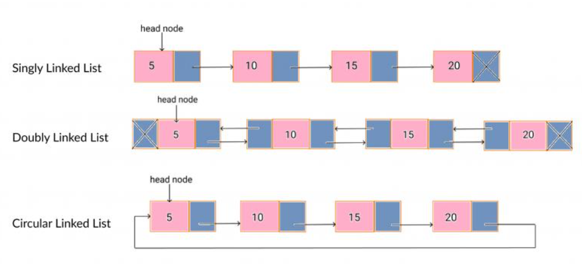

# 💻Clase 08 - Collecciones

---

# Agenda:

<aside>
💡

#### 9:00 - 9:50    →  **Sesión 1:** `List`, `Array` y `Vector`

#### 9:50 - 11:20   → Practicas

#### 11:40 - 12:40  → Sesión 2: `Set` , `Map`  y `Tuple`

#### 12:40 - 14:00  → Practicas

</aside>

# Sesión 1. `List`, `Array` y `Vector`

## 1. ¿Qué es una colección?

Una **colección** es una estructura que agrupa varios valores bajo un mismo nombre. En lugar de declarar `val nota1 = 8.5`, `val nota2 = 6.0`, `val nota3 = 9.1`… puedes agruparlos en una sola colección y operarlos todos a la vez.

Scala tiene un sistema de colecciones muy rico. En esta sesión trabajamos con las tres más fundamentales:

| Colección | Mutable | Ordenada | Acceso por índice | Uso típico |
| --- | --- | --- | --- | --- |
| `List[T]` | ❌ No | ✅ Sí | Lento (O(n)) | Procesamiento funcional, Spark |
| `Array[T]` | ✅ Sí | ✅ Sí | Rápido (O(1)) | Datos fijos en memoria, interop Java |
| `Vector[T]` | ❌ No | ✅ Sí | Rápido (~O(1)) | Colección inmutable con acceso eficiente |

> 💡 **Regla general:** en Scala funcional (y en Spark) preferimos **colecciones inmutables**. `List` y `Vector` son inmutables por defecto. `Array` es mutable y se usa cuando necesitas acceso por índice o interoperabilidad con código Java.
> 

---

## 2. Colecciones mutables vs. inmutables

INMUTABLE: no puedes cambiar su contenido una vez creada

```scala
// 
val lista = List(1, 2, 3)
// lista(0) = 99  // ← ERROR de compilación
```

MUTABLE: puedes modificar elementos en su posición

```scala
val array = Array(1, 2, 3)
array(0) = 99    // ← correcto: array ahora es Array(99, 2, 3)
```

> La **inmutabilidad** es una de las propiedades más importantes de la programación funcional. Cuando los datos no pueden cambiar de forma inesperada, el código es más predecible, más fácil de depurar y más seguro en entornos distribuidos como Spark.
> 

---

## 3. `List[T]`  -  La colección estrella de Scala

> `List` es la colección funcional por excelencia. Internamente es una **lista enlazada** (linked list):
> 

> ❓ Una **linked list** (lista enlazada) es una estructura de datos donde cada elemento (nodo) apunta al siguiente.
> 
> 
> 
> 
> A diferencia de un array, **los elementos no están en posiciones contiguas en memoria**, sino conectados mediante referencias.
> 

<aside>
💡

Una **linked list** es eficiente para insertar/eliminar, pero **lenta para acceso directo.**

</aside>

```scala
List(10, 20, 30)  →  10 :: 20 :: 30 :: Nil
```

- `Nil` es la lista vacía (el final de la cadena). Aquí `Nil` indica: *“ya no hay más elementos”.*
- `::` (pronunciado "cons") añade un elemento al frente. es un operador para añadir un elemento al inicio de una lista.

`::` SOLO añade por delante:

```scala
val lista = List(2, 3)
val nueva = 1 :: lista  // OK → List(1,2,3)
```

### 3.1 Crear una lista

Forma habitual

```scala
val notas: List[Double] = List(8.5, 6.0, 9.1, 4.8)
```

Lista de Strings

```scala
val paises: List[String] = List("España", "Francia", "Italia")
```

Lista vacía (tipada)

```scala
val vacia: List[Int] = List.empty[Int]
```

o equivalente:

```scala
val vacia2: List[Int] = Nil
```

### 3.2 Operaciones básicas

 Acceso a elementos

```scala
val nums = List(10, 20, 30, 40, 50)

println(nums.head)        // 10  (primer elemento)
println(nums.tail)        // List(20, 30, 40, 50)  (todo menos el primero)
println(nums(2))          // 30  (índice 0-based, pero lento en List)
println(nums.last)        // 50  (último elemento)
```

Información sobre la lista

```scala
println(nums.length)      // 5
println(nums.isEmpty)     // false
println(Nil.isEmpty)      // true
println(nums.contains(30))// true
println(nums.indexOf(40)) // 3
```

### 3.3 Añadir elementos

En Scala, "añadir" a una lista inmutable **crea una nueva lista**; la original no cambia:

- `::` añade al FRENTE (eficiente — O(1))
    
    ```scala
    val original = List(2, 3, 4)
    
    // 
    val conPrimero = 1 :: original       // List(1, 2, 3, 4)
    ```
    
- `:+` añade al FINAL (menos eficiente — O(n))
    
    ```scala
    val conUltimo = original :+ 5        // List(2, 3, 4, 5)
    ```
    
- `:::` concatena dos listas
    
    ```scala
    // 
    val listA = List(1, 2)
    val listB = List(3, 4, 5)
    val concatenada = listA ::: listB    // List(1, 2, 3, 4, 5)
    ```
    
    ```scala
    println(original)     // List(2, 3, 4)  ← no ha cambiado
    println(conPrimero)   // List(1, 2, 3, 4)
    println(concatenada)  // List(1, 2, 3, 4, 5)
    ```
    

> 💡 **Regla de rendimiento:** en `List`, añadir al frente con `::` es la operación más barata. Añadir al final con `:+` recorre toda la lista. Si necesitas añadir mucho al final, considera usar `Vector` en su lugar.
> 

### 3.4 Métodos funcionales esenciales

- `map`: transforma cada elemento → nueva lista del mismo tamaño
    
    ```scala
    val nums = List(1, 2, 3, 4, 5, 6)
    
    val dobles = nums.map(n => n * 2)          // List(2, 4, 6, 8, 10, 12)
    ```
    
- `filter`: conserva solo los elementos que cumplen la condición
    
    ```scala
    val pares = nums.filter(n => n % 2 == 0)   // List(2, 4, 6)
    ```
    
- `foreach`: ejecuta una acción por elemento (no devuelve lista)
    
    ```scala
    nums.foreach(n => println(n))
    ```
    
- `mkString`: une la lista en un String
    
    ```scala
    println(nums.mkString(", "))               // "1, 2, 3, 4, 5, 6"
    ```
    
    ```scala
    println(nums.mkString("[", ", ", "]"))     // "[1, 2, 3, 4, 5, 6]"
    ```
    
- `sum`, `min`, `max` (para listas numéricas)
    
    ```scala
    println(nums.sum)   // 21
    println(nums.min)   // 1
    println(nums.max)   // 6
    ```
    

---

## 4. `Array[T]` — Mutable, con acceso por índice

> `Array` es equivalente al array de Java. Los elementos están en posiciones contiguas de memoria, lo que hace el **acceso por índice muy rápido** (tiempo constante O(1)).
> 
- Crear un Array
    
    ```scala
    val temperaturas: Array[Double] = Array(18.5, 22.0, 15.3, 25.8, 19.1)
    ```
    
- Acceso por índice (empieza en 0)
    
    ```scala
    println(temperaturas(0))   // 18.5
    println(temperaturas(4))   // 19.1
    ```
    
- Modificar un elemento (¡es mutable!)
    
    ```scala
    temperaturas(2) = 16.0
    println(temperaturas(2))   // 16.0
    ```
    
- Información
    
    ```scala
    println(temperaturas.length)       // 5
    println(temperaturas.contains(22.0)) // true
    ```
    
- Recorrer con for
    
    ```scala
    for (t <- temperaturas) {
      println(f"  Temperatura: $t%.1f°C")
    }
    ```
    

### Convertir entre Array y List

- Array a lista
    
    ```scala
    val array = Array(1, 2, 3, 4, 5)
    val lista  = array.toList    // Array → List (inmutable)
    ```
    
- Lista → Array
    
    ```scala
    al lista2 = List(10, 20, 30)
    val array2 = lista2.toArray  // List → Array (mutable)
    ```
    

### ¿Cuándo usar `Array` en lugar de `List`?

| Situación | Recomendado |
| --- | --- |
| Acceso frecuente por índice | `Array` |
| Modificar elementos en su posición | `Array` |
| Interoperabilidad con código Java | `Array` |
| Procesamiento funcional / Spark | `List` o `Vector` |
| Añadir al frente con `::` | `List` |

---

## 5. `Vector[T]` - Lo mejor de ambos mundos

`Vector` es una colección **inmutable** (como `List`) pero con **acceso por índice eficiente** (como `Array`). Internamente usa un árbol de fanout 32, lo que da acceso y actualización en tiempo prácticamente constante.

- Acceso por índice (eficiente)
    
    ```scala
    val ciudades = Vector("Madrid", "Barcelona", "Valencia", "Sevilla")
    
    println(ciudades(0))     // "Madrid"
    println(ciudades(3))     // "Sevilla"
    ```
    
- Información
    
    ```scala
    println(ciudades.length) // 4
    println(ciudades.head)   // "Madrid"
    println(ciudades.last)   // "Sevilla"
    ```
    
- "Añadir" crea un nuevo Vector (inmutable)
    
    ```scala
    val conBilbao = ciudades :+ "Bilbao"
    println(ciudades.length)    // 4  ← original sin cambios
    println(conBilbao.length)   // 5
    ```
    
- Actualizar un elemento (crea nuevo Vector)
    
    ```scala
    // 
    val actualizado = ciudades.updated(1, "Málaga")
    println(actualizado)   // Vector(Madrid, Málaga, Valencia, Sevilla)
    println(ciudades)      // Vector(Madrid, Barcelona, Valencia, Sevilla)  ← sin cambios
    ```
    

### Métodos comunes compartidos por `List`, `Array` y `Vector`

| Método | Descripción | Ejemplo |
| --- | --- | --- |
| `.length` / `.size` | Número de elementos | `lista.length` → `5` |
| `.isEmpty` | ¿Está vacía? | `Nil.isEmpty` → `true` |
| `.contains(x)` | ¿Contiene el elemento? | `lista.contains(3)` → `true` |
| `.indexOf(x)` | Posición del elemento (-1 si no existe) | `lista.indexOf(10)` → `2` |
| `.head` | Primer elemento | `lista.head` → `1` |
| `.last` | Último elemento | `lista.last` → `5` |
| `.tail` | Todos menos el primero | `lista.tail` → `List(2,3,4,5)` |
| `.take(n)` | Primeros n elementos | `lista.take(3)` → `List(1,2,3)` |
| `.drop(n)` | Todos excepto los primeros n | `lista.drop(3)` → `List(4,5)` |
| `.reverse` | Lista invertida | `lista.reverse` → `List(5,4,3,2,1)` |
| `.sorted` | Lista ordenada (requiere tipo ordenable) | `lista.sorted` |
| `.distinct` | Elimina duplicados | `List(1,2,2,3).distinct` → `List(1,2,3)` |
| `.sum` | Suma (numéricas) | `lista.sum` → `15` |
| `.min` / `.max` | Mínimo / máximo | `lista.max` → `5` |
| `.mkString(sep)` | Une en String | `lista.mkString(", ")` → `"1, 2, 3"` |

---

## 6. Conexión con Spark

En Spark usarás colecciones Scala constantemente:

- Para crear **RDDs** de prueba: `sc.parallelize(List(1, 2, 3, 4, 5))`
- Para recoger resultados con `.collect()`, que devuelve un `Array[T]`
- Para filtrar, transformar y reducir datos con `map`, `filter`, `reduce` — exactamente los mismos métodos que acabas de aprender

Todo lo que practicas hoy con `List` lo aplicarás directamente sobre millones de registros en Spark.

---

# 💻 Práctica

---

## 🔹 Ejercicio 1 — Primeros pasos con `List`

```scala
// Creación de listas
val frutas: List[String] = List("manzana", "naranja", "plátano", "uva", "kiwi")
val numeros: List[Int]   = List(15, 3, 42, 8, 27, 1, 56)
val vacia: List[Double]  = List.empty[Double]

println(s"Frutas:  ${frutas.mkString(", ")}")
println(s"Números: ${numeros.mkString(", ")}")
println(s"Vacía:   ${vacia.isEmpty}")
```

**Salida esperada:**

```
Frutas:  manzana, naranja, plátano, uva, kiwi
Números: 15, 3, 42, 8, 27, 1, 56
Vacía:   true
```

**Celda 3 — Code:**

```scala
// Acceso y metadatos
println(s"Primera fruta:   ${frutas.head}")
println(s"Última fruta:    ${frutas.last}")
println(s"Sin la primera:  ${frutas.tail}")
println(s"Total frutas:    ${frutas.length}")
println(s"¿Tiene 'uva'?    ${frutas.contains("uva")}")
println(s"Posición 'kiwi': ${frutas.indexOf("kiwi")}")
```

**Salida esperada:**

```
Primera fruta:   manzana
Última fruta:    kiwi
Sin la primera:  List(naranja, plátano, uva, kiwi)
Total frutas:    5
¿Tiene 'uva'?    true
Posición 'kiwi': 4
```

**Celda 4 — Code:**

```scala
// Operaciones de construcción (inmutabilidad en acción)
val original = List(2, 3, 4)

val conUno   = 1 :: original          // añadir al frente
val conCinco = original :+ 5          // añadir al final
val doble    = original ::: original  // concatenar consigo misma

println(s"original:  $original")
println(s"conUno:    $conUno")
println(s"conCinco:  $conCinco")
println(s"doble:     $doble")
```

**Salida esperada:**

```
original:  List(2, 3, 4)
conUno:    List(1, 2, 3, 4)
conCinco:  List(2, 3, 4, 5)
doble:     List(2, 3, 4, 2, 3, 4)
```

**Celda 5 — Code:**

```scala
// Operaciones estadísticas y ordenación
val nums = List(15, 3, 42, 8, 27, 1, 56)

println(s"Suma:     ${nums.sum}")
println(s"Mínimo:   ${nums.min}")
println(s"Máximo:   ${nums.max}")
println(s"Ordenada: ${nums.sorted}")
println(s"Inversa:  ${nums.reverse}")
println(s"Primeros 3: ${nums.take(3)}")
println(s"Sin primeros 3: ${nums.drop(3)}")
```

**Salida esperada:**

```
Suma:     152
Mínimo:   1
Máximo:   56
Ordenada: List(1, 3, 8, 15, 27, 42, 56)
Inversa:  List(56, 1, 27, 8, 42, 3, 15)
Primeros 3: List(15, 3, 42)
Sin primeros 3: List(8, 27, 1, 56)
```

---

## 🔹 Ejercicio 2 — Transformar y filtrar listas

**Celda 2 — Code:**

```scala
val temperaturas = List(18.5, 22.0, 15.3, 25.8, 19.1, 30.2, 11.4, 28.7)

// map: convertir de Celsius a Fahrenheit
val fahrenheit = temperaturas.map(c => c * 9.0 / 5.0 + 32.0)

println("Temperaturas en °C y °F:")
temperaturas.zip(fahrenheit).foreach { case (c, f) =>
  println(f"  $c%.1f°C  →  $f%.1f°F")
}
```

**Salida esperada:**

```
Temperaturas en °C y °F:
  18.5°C  →  65.3°F
  22.0°C  →  71.6°F
  15.3°C  →  59.5°F
  25.8°C  →  78.4°F
  19.1°C  →  66.4°F
  30.2°C  →  86.4°F
  11.4°C  →  52.5°F
  28.7°C  →  83.7°F
```

**Celda 3 — Code:**

```scala
// filter: separar días calurosos y frescos
val calurosos = temperaturas.filter(t => t >= 25.0)
val frescos   = temperaturas.filter(t => t < 15.0)
val templados = temperaturas.filter(t => t >= 15.0 && t < 25.0)

println(s"Días calurosos (≥25°C): ${calurosos.mkString(", ")}")
println(s"Días frescos   (<15°C): ${frescos.mkString(", ")}")
println(s"Días templados:         ${templados.mkString(", ")}")
println(f"\nMedia general: ${temperaturas.sum / temperaturas.length}%.2f°C")
```

**Salida esperada:**

```
Días calurosos (≥25°C): 25.8, 30.2, 28.7
Días frescos   (<15°C): 11.4
Días templados:         18.5, 22.0, 15.3, 19.1

Media general: 21.38°C
```

**Celda 4 — Code:**

```scala
// Combinar map + filter + mkString en una pipeline
val palabras = List("scala", "big", "data", "spark", "hadoop", "kafka", "flink")

val resultado = palabras
  .filter(p => p.length > 4)       // solo palabras de más de 4 letras
  .map(p => p.capitalize)          // primera letra en mayúscula
  .sorted                          // orden alfabético
  .mkString(", ")

println(s"Tecnologías (>4 letras, ordenadas): $resultado")
```

**Salida esperada:**

```
Tecnologías (>4 letras, ordenadas): Hadoop, Kafka, Scala, Spark
```

---

## 🔹 Ejercicio 3 — Comparativa `List` vs `Array`

**Celda 2 — Code:**

```scala
// Array: acceso y modificación por índice
val calificaciones: Array[Double] = Array(7.5, 8.0, 6.5, 9.2, 5.8)

println("Array original:")
calificaciones.zipWithIndex.foreach { case (nota, i) =>
  println(f"  [$i] $nota%.1f")
}

// Modificar la nota en la posición 2 (corrección de examen)
calificaciones(2) = 7.0
println(s"\nTras corrección en posición 2:")
println(calificaciones.mkString(", "))
```

**Salida esperada:**

```
Array original:
  [0] 7.5
  [1] 8.0
  [2] 6.5
  [3] 9.2
  [4] 5.8

Tras corrección en posición 2:
7.5, 8.0, 7.0, 9.2, 5.8
```

**Celda 3 — Code:**

```scala
// List: intentar modificar un elemento → no es posible
val listaNotas: List[Double] = List(7.5, 8.0, 6.5, 9.2, 5.8)

// Para "actualizar" una List hay que crear una nueva:
val listaNueva = listaNotas.zipWithIndex.map {
  case (nota, 2) => 7.0   // sustituir el elemento en posición 2
  case (nota, _) => nota  // mantener el resto
}

println(s"Lista original: $listaNotas")
println(s"Lista nueva:    $listaNueva")
```

**Salida esperada:**

```
Lista original: List(7.5, 8.0, 6.5, 9.2, 5.8)
Lista nueva:    List(7.5, 8.0, 7.0, 9.2, 5.8)
```

**Celda 4 — Code:**

```scala
// Conversión entre tipos
val arrayBase  = Array(10, 20, 30, 40, 50)
val listaDesde = arrayBase.toList
val vectorDesde = arrayBase.toVector

println(s"Array:  ${arrayBase.mkString(", ")}")
println(s"List:   $listaDesde")
println(s"Vector: $vectorDesde")
println(s"\nTipos:")
println(s"  ${arrayBase.getClass.getSimpleName}")
println(s"  ${listaDesde.getClass.getSimpleName}")
println(s"  ${vectorDesde.getClass.getSimpleName}")
```

**Salida esperada:**

```
Array:  10, 20, 30, 40, 50
List:   List(10, 20, 30, 40, 50)
Vector: Vector(10, 20, 30, 40, 50)

Tipos:
  int[]
  $colon$colon
  VectorImpl
```

---

## 🔹 Ejercicio 4 — Programa: gestión de una lista de estudiantes

> Construiremos un pequeño sistema de gestión usando `List` de tuplas `(nombre, nota)`, aplicando todo lo aprendido.
> 

**Celda 2 — Code:**

```scala
// Definición de datos
val estudiantes: List[(String, Double)] = List(
  ("Ana García",    8.5),
  ("Luis Martín",   4.2),
  ("Marta López",   9.1),
  ("Carlos Ruiz",   5.8),
  ("Elena Sanz",    3.9),
  ("Pedro Jiménez", 7.4),
  ("Laura Torres",  6.3),
  ("Diego Navarro", 8.8)
)

println(s"Total de estudiantes: ${estudiantes.length}")
println("\nLista completa:")
estudiantes.foreach { case (nombre, nota) =>
  println(f"  $nombre%-20s $nota%.1f")
}
```

**Salida esperada:**

```
Total de estudiantes: 8

Lista completa:
  Ana García           8.5
  Luis Martín          4.2
  Marta López          9.1
  Carlos Ruiz          5.8
  Elena Sanz           3.9
  Pedro Jiménez        7.4
  Laura Torres         6.3
  Diego Navarro        8.8
```

**Celda 3 — Code:**

```scala
// Separar aprobados y suspensos
val aprobados  = estudiantes.filter { case (_, nota) => nota >= 5.0 }
val suspensos  = estudiantes.filter { case (_, nota) => nota < 5.0 }

println(s"✅ Aprobados (${aprobados.length}):")
aprobados
  .sortBy { case (_, nota) => -nota }  // orden descendente por nota
  .foreach { case (nombre, nota) => println(f"   $nombre%-20s $nota%.1f") }

println(s"\n❌ Suspensos (${suspensos.length}):")
suspensos.foreach { case (nombre, nota) =>
  println(f"   $nombre%-20s $nota%.1f")
}
```

**Salida esperada:**

```
✅ Aprobados (6):
   Marta López          9.1
   Diego Navarro        8.8
   Ana García           8.5
   Pedro Jiménez        7.4
   Laura Torres         6.3
   Carlos Ruiz          5.8

❌ Suspensos (2):
   Luis Martín          4.2
   Elena Sanz           3.9
```

**Celda 4 — Code:**

```scala
// Estadísticas del grupo
val todasLasNotas = estudiantes.map { case (_, nota) => nota }
val media         = todasLasNotas.sum / todasLasNotas.length
val notaMax       = todasLasNotas.max
val notaMin       = todasLasNotas.min

// Mejor y peor estudiante
val mejorEstudiante  = estudiantes.maxBy { case (_, nota) => nota }
val peorEstudiante   = estudiantes.minBy { case (_, nota) => nota }

println("=== Estadísticas del Grupo ===")
println(f"  Media:            $media%.2f")
println(f"  Nota más alta:    $notaMax%.1f  (${mejorEstudiante._1})")
println(f"  Nota más baja:    $notaMin%.1f  (${peorEstudiante._1})")
println(f"  Tasa de aprobados: ${aprobados.length * 100.0 / estudiantes.length}%.0f%%")
```

**Salida esperada:**

```
=== Estadísticas del Grupo ===
  Media:            6.75
  Nota más alta:    9.1  (Marta López)
  Nota más baja:    3.9  (Elena Sanz)
  Tasa de aprobados: 75%
```

**Celda 5 — Code:**

```scala
// Clasificar por tramos de nota
def tramo(nota: Double): String = nota match {
  case n if n >= 9.0              => "Sobresaliente"
  case n if n >= 7.0 && n < 9.0  => "Notable"
  case n if n >= 5.0 && n < 7.0  => "Aprobado"
  case _                          => "Suspenso"
}

println("=== Calificaciones por tramo ===")
estudiantes
  .sortBy { case (nombre, _) => nombre }
  .foreach { case (nombre, nota) =>
    println(f"  $nombre%-20s $nota%.1f  → ${tramo(nota)}")
  }
```

**Salida esperada:**

```
=== Calificaciones por tramo ===
  Ana García           8.5  → Notable
  Carlos Ruiz          5.8  → Aprobado
  Diego Navarro        8.8  → Notable
  Elena Sanz           3.9  → Suspenso
  Laura Torres         6.3  → Aprobado
  Luis Martín          4.2  → Suspenso
  Marta López          9.1  → Sobresaliente
  Pedro Jiménez        7.4  → Notable
```

---

# 💻 Ejercicios propuestos

## Ejercicio P1 — Mi lista de películas favoritas

Crea una `List[String]` con al menos seis títulos de películas. A continuación:

- Imprime cuántas películas hay en la lista.
- Imprime la primera y la última película.
- Imprime la lista ordenada alfabéticamente.
- Comprueba si una película concreta (tú decides el título) está en la lista.

**Salida de referencia** *(los títulos son un ejemplo)*:

```
Total de películas: 6
Primera: Alien
Última:  Top Gun
Ordenada: List(Alien, Blade Runner, Dune, Interstellar, Matrix, Top Gun)
¿Está 'Dune'? true
```

---

## Ejercicio P2 — Termómetro de invierno

Tienes las temperaturas mínimas registradas durante una semana (en °C):

```
-3.0, 1.5, -0.5, 4.2, -2.1, 0.8, 3.3
```

Con esa `List[Double]`:

- Imprime cuántos días se registraron temperaturas **bajo cero**.
- Imprime la temperatura mínima y la máxima de la semana.
- Imprime la media semanal con dos decimales.

**Salida de referencia:**

```
Días bajo cero: 3
Temperatura mínima: -3.0°C
Temperatura máxima: 4.2°C
Media semanal: 0.46°C
```

---

## Ejercicio P3 — Ampliar y combinar listas

Parte de estas dos listas:

```scala
val grupoPar   = List(2, 4, 6, 8, 10)
val grupoImpar = List(1, 3, 5, 7, 9)
```

- Añade el número `0` al frente de `grupoPar` con `::`.
- Añade el número `11` al final de `grupoImpar` con `:+`.
- Concatena las dos listas resultantes en una sola con `:::`.
- Imprime la lista final ordenada de menor a mayor.

**Salida de referencia:**

```
grupoPar ampliada:   List(0, 2, 4, 6, 8, 10)
grupoImpar ampliada: List(1, 3, 5, 7, 9, 11)
Combinada ordenada:  List(0, 1, 2, 3, 4, 5, 6, 7, 8, 9, 10, 11)
```

---

## Ejercicio P4 — Inventario de una tienda

Crea un `Array[String]` con estos cinco productos:

```
"Teclado", "Ratón", "Monitor", "Auriculares", "Webcam"
```

- Imprime el producto en la posición 2 (índice 0-based).
- El producto en la posición 3 ha cambiado de nombre a `"Cascos"`. Modifícalo directamente.
- Imprime el array completo tras la modificación.
- Convierte el array a `List` e imprime el tipo de la colección resultante con `.getClass.getSimpleName`.

**Salida de referencia:**

```
Producto en posición 2: Monitor
Tras actualización: Array(Teclado, Ratón, Monitor, Cascos, Webcam)
Tipo tras conversión: $colon$colon
```

---

## Ejercicio P5 — Vector de capitales

Crea un `Vector[String]` con las capitales de cinco países europeos a tu elección.

- Imprime la capital en la posición 1.
- "Actualiza" la capital en la posición 0 con otro nombre usando `.updated(0, "NuevoNombre")` y guarda el resultado en un nuevo `val`.
- Demuestra que el `Vector` original **no ha cambiado** imprimiendo ambos.
- Imprime la longitud del vector actualizado.

**Salida de referencia** *(capitales de ejemplo)*:

```
Capital en posición 1: París
Vector original:    Vector(Madrid, París, Roma, Berlín, Lisboa)
Vector actualizado: Vector(Atenas, París, Roma, Berlín, Lisboa)
Longitud: 5
```

---

## Ejercicio P6 — Filtro de edades

Tienes una lista de edades de participantes en un concurso:

```scala
val edades = List(17, 34, 22, 15, 45, 19, 28, 16, 31, 42)
```

- Filtra los participantes **mayores de edad** (≥ 18 años) y guárdalos en `mayores`.
- Filtra los **menores de edad** (< 18 años) y guárdalos en `menores`.
- Calcula el porcentaje de mayores de edad sobre el total con dos decimales.
- Imprime la edad más alta entre los menores y la edad más baja entre los mayores.

**Salida de referencia:**

```
Mayores de edad (7): List(34, 22, 45, 19, 28, 31, 42)
Menores de edad (3): List(17, 15, 16)
Porcentaje mayores: 70,00%
Edad más alta entre menores: 17
Edad más baja entre mayores: 19
```

---

## Ejercicio P7 — Transformación de precios

Una tienda online tiene esta lista de precios en euros:

```scala
val precios = List(12.99, 45.00, 8.50, 120.00, 33.75, 5.20, 89.99)
```

- Aplica un **descuento del 15%** a todos los precios con `map` y guarda el resultado en `conDescuento`.
- Filtra los precios originales que sean **superiores a 30 €**.
- Calcula el **ahorro total** restando la suma de `conDescuento` a la suma de `precios`.
- Imprime los tres resultados con dos decimales.

**Salida de referencia:**

```
Precios con 15% dto: List(11.04, 38.25, 7.23, 102.00, 28.69, 4.42, 76.49)
Precios > 30€:       List(45.00, 120.00, 33.75, 89.99)
Ahorro total:        47.19€
```

---

## Ejercicio P8 — Longitud de palabras

Parte de esta lista de palabras:

```scala
val palabras = List("procesamiento", "datos", "scala", "distribuido",
                    "nodo", "clúster", "pipeline", "streaming")
```

- Usa `map` para crear una nueva lista de tuplas `(palabra, longitud)`.
- Filtra las palabras con **más de 7 letras**.
- Ordena ese subconjunto de mayor a menor longitud usando `.sortBy(- _._2)`.
- Imprime cada par `(palabra → n letras)` en una línea separada.

**Salida de referencia:**

```
Palabras con más de 7 letras (ordenadas por longitud desc):
  procesamiento → 13 letras
  distribuido   → 11 letras
  streaming     → 9 letras
  pipeline      → 8 letras
  clúster       → 7 letras  ← no aparece (≤7)
```

> ⚠️ Nota: "clúster" tiene 7 letras, así que **no** pasa el filtro `> 7`.
> 

---

## Ejercicio P9 — Marcador de un partido

Tienes el registro de goles de un partido de baloncesto como `Array[Int]`, donde cada elemento es la puntuación anotada en cada cuarto:

```scala
val localArray    = Array(21, 18, 25, 19)
val visitanteArray = Array(17, 22, 20, 24)
```

- Calcula la puntuación total de cada equipo con `.sum`.
- Determina el ganador comparando los totales e imprímelo.
- Convierte ambos arrays a `List` y usa `zip` para crear una lista de tuplas `(puntosLocal, puntosVisitante)` cuarto a cuarto.
- Imprime el marcador parcial de cada cuarto.

**Salida de referencia:**

```
Local:     83 puntos
Visitante: 83 puntos
Resultado: Empate

Marcador por cuartos:
  Q1: 21 - 17
  Q2: 18 - 22
  Q3: 25 - 20
  Q4: 19 - 24
```

---

## Ejercicio P10 — Catálogo de libros con filtros encadenados

Define esta lista de tuplas `(título, autor, año)`:

```scala
val libros: List[(String, String, Int)] = List(
  ("Clean Code",            "Robert C. Martin", 2008),
  ("The Pragmatic Programmer", "Dave Thomas",   1999),
  ("Scala for the Impatient",  "Cay Horstmann", 2012),
  ("Programming in Scala",     "Odersky",       2016),
  ("Designing Data-Intensive", "Martin Kleppmann", 2017),
  ("Structure and Interpretation", "Abelson",   1996),
  ("Domain Driven Design",     "Eric Evans",    2003)
)
```

- Filtra los libros publicados **a partir del año 2000**.
- De ese subconjunto, extrae solo los **títulos** con `map`.
- Ordénalos alfabéticamente e imprímelos numerados (1., 2., 3.…).
- Imprime además cuántos libros del catálogo completo son **anteriores al año 2000**.

**Salida de referencia:**

```
Libros desde el año 2000 (ordenados):
  1. Clean Code
  2. Designing Data-Intensive
  3. Domain Driven Design
  4. Programming in Scala
  5. Scala for the Impatient

Libros anteriores a 2000: 2
```

---

## Ejercicio P11 — Análisis de ventas mensuales

Una empresa registra sus ventas mensuales (en miles de €) durante un año:

```scala
val ventas = List(45.2, 38.7, 52.1, 61.0, 58.4, 70.3,
                  66.9, 72.5, 55.8, 49.3, 41.6, 80.2)
val meses  = List("Ene","Feb","Mar","Abr","May","Jun",
                  "Jul","Ago","Sep","Oct","Nov","Dic")
```

- Usa `zip` para emparejar cada mes con su venta.
- Imprime los **tres meses con mayor venta** (usa `.sortBy` y `.take`).
- Calcula e imprime la venta **total anual** y la **media mensual**.
- Imprime cuántos meses superaron la media.

**Salida de referencia:**

```
Top 3 meses:
  Dic → 80.2k€
  Ago → 72.5k€
  Jun → 70.3k€

Total anual: 691.00k€
Media mensual: 57.58k€
Meses por encima de la media: 6
```

---

## Ejercicio P12 — Deduplicación y comparación de conjuntos

Tienes dos listas de IDs de usuarios que visitaron una web en dos días distintos:

```scala
val diaUno = List(101, 205, 307, 101, 412, 205, 519, 307, 624)
val diaDos = List(205, 412, 731, 101, 519, 888, 412, 731)
```

- Elimina los duplicados de cada lista con `.distinct`.
- Calcula cuántos **usuarios únicos** visitaron cada día.
- Encuentra los usuarios que visitaron **los dos días** usando `.filter` y `.contains`.
- Encuentra los usuarios que visitaron **solo el día uno** (estaban en `diaUno` pero no en `diaDos`).

**Salida de referencia:**

```
Día 1 — usuarios únicos: 6  → List(101, 205, 307, 412, 519, 624)
Día 2 — usuarios únicos: 5  → List(205, 412, 731, 101, 519, 888)

Visitaron ambos días:    List(101, 205, 412, 519)
Solo visitaron el día 1: List(307, 624)
```

---

## Ejercicio P13 — Clasificador de números con `match`

Define una función `clasificar(n: Int): String` que use `match` para devolver:

- `"negativo"` si `n < 0`
- `"cero"` si `n == 0`
- `"par positivo"` si `n > 0` y es par
- `"impar positivo"` si `n > 0` y es impar

Luego aplica esa función sobre esta lista con `map`:

```scala
val numeros = List(-7, 0, 4, 15, -2, 8, 33, 0, -1, 100)
```

Imprime cada número junto a su clasificación, alineando las columnas. Al final, imprime cuántos elementos hay de cada categoría.

**Salida de referencia:**

```
  -7  → negativo
   0  → cero
   4  → par positivo
  15  → impar positivo
  -2  → negativo
   8  → par positivo
  33  → impar positivo
   0  → cero
  -1  → negativo
 100  → par positivo

negativos:       3
ceros:           2
pares positivos: 3
impares positivos: 2
```

---

## Ejercicio P14 — Historial de accesos con `Vector`

Simula un historial de accesos a un sistema usando `Vector[String]`. Parte de un vector vacío y añade entradas una a una con `:+`:

```
"usuario_01 login"
"usuario_02 login"
"usuario_01 logout"
"usuario_03 login"
"usuario_02 logout"
"usuario_03 logout"
```

- Imprime el historial completo con su número de línea (1, 2, 3…).
- Filtra e imprime solo los eventos de tipo `"login"` (usa `.contains("login")`).
- Cuenta cuántos usuarios distintos aparecen en el historial extrayendo el nombre (parte antes del espacio) con `.map(_.split(" ")(0))` y luego `.distinct`.
- Demuestra que el vector original **no ha cambiado** imprimiendo su longitud antes y después de cada operación.

**Salida de referencia:**

```
Historial (6 entradas):
  1. usuario_01 login
  2. usuario_02 login
  3. usuario_01 logout
  4. usuario_03 login
  5. usuario_02 logout
  6. usuario_03 logout

Eventos login (3):
  usuario_01 login
  usuario_02 login
  usuario_03 login

Usuarios únicos: 3 → List(usuario_01, usuario_02, usuario_03)
Longitud del vector original: 6  ← sin cambios
```

---

## Ejercicio P15 — Mini pipeline de procesamiento de texto

Tienes este fragmento de texto ya dividido en palabras:

```scala
val texto = List(
  "scala", "es", "un", "lenguaje", "scala", "funcional",
  "y", "orientado", "a", "objetos", "scala", "es", "potente",
  "para", "big", "data", "y", "spark", "usa", "scala"
)
```

Construye un **pipeline en una sola expresión encadenada** (sin variables intermedias) que:

1. Elimine las palabras con **menos de 3 letras** (`filter`).
2. Elimine los **duplicados** (`distinct`).
3. Ordene el resultado **alfabéticamente** (`sorted`).
4. Convierta cada palabra a **mayúsculas** (`map(_.toUpperCase)`).
5. Una el resultado en un único `String` separado por `" | "` (`mkString`).

Imprime el resultado final. Luego, por separado, imprime cuántas palabras únicas de 3 o más letras hay.

**Salida de referencia:**

```
Pipeline resultado:
BIG | DATA | FUNCIONAL | LENGUAJE | OBJETOS | ORIENTADO | POTENTE | SCALA | SPARK | USA

Palabras únicas (≥3 letras): 10
```

---

# Sesión 2: `Set`, `Map` y `Tuple`

## ¿Por qué necesitamos más colecciones?

> En la sesión anterior trabajamos con `List`, `Array` y `Vector`, que son colecciones **ordenadas** cuyos elementos se identifican por su **posición** (índice 0, 1, 2…). Pero no todos los problemas encajan bien en ese modelo. A veces necesitamos:
> 
- Asegurarnos de que **no haya valores repetidos** (por ejemplo, una lista de IDs únicos de usuario).
- Asociar cada elemento con una **clave** que lo identifique (por ejemplo, el nombre de un empleado con su salario).
- Agrupar temporalmente **valores de tipos distintos** sin crear una clase completa (por ejemplo, devolver latitud y longitud desde una función).

> Para esas tres situaciones, Scala ofrece respectivamente `Set`, `Map` y `Tuple`. Las tres son inmutables por defecto, lo que las hace seguras y predecibles en pipelines de datos.
> 

---

## 1. `Set[T]` — Conjuntos sin duplicados

> Un `Set` es una colección **no ordenada** que **no permite elementos repetidos**. Si intentas añadir un elemento que ya existe, el conjunto permanece igual. Esta garantía de unicidad lo hace muy útil para eliminar duplicados de un dataset o para verificar pertenencia de manera eficiente.
> 

### Crear un Set

- Scala infiere el tipo como Set[String]
    
    ```scala
    val frutas = Set("manzana", "pera", "naranja", "manzana")
    
    println(frutas)
    // Resultado: Set(manzana, pera, naranja)
    // El duplicado "manzana" se eliminó automáticamente
    ```
    

> Observa que el orden de los elementos en la salida puede no coincidir con el orden de inserción: `Set` no garantiza orden.
> 

### Operaciones básicas

1. Comprobar si un elemento pertenece al conjunto
    
    ```scala
    val numeros = Set(1, 2, 3, 4, 5)
    println(numeros.contains(3))   // true
    println(numeros.contains(99))  // false
    ```
    
2. Tamaño del conjunto
    
    ```scala
    println(numeros.size)  // 5
    ```
    
3. Añadir un elemento → devuelve un NUEVO Set (el original no cambia)
    
    ```scala
    val conSeis = numeros + 6
    println(conSeis)  // Set(5, 1, 6, 2, 3, 4)
    ```
    
4. Eliminar un elemento → devuelve un NUEVO Set
    
    ```scala
    val sinDos = numeros - 2
    println(sinDos)  // Set(5, 1, 3, 4)
    ```
    

> 💡 **Inmutabilidad en acción:** las operaciones `+` y `-` no modifican `numeros`. Devuelven un nuevo `Set`. `numeros` sigue siendo exactamente `Set(1, 2, 3, 4, 5)`.
> 

### Operaciones de conjunto (álgebra de conjuntos)

Las operaciones matemáticas de conjuntos están disponibles de forma directa:

1. Unión: todos los elementos de ambos conjuntos
    
    ```scala
    val a = Set(1, 2, 3, 4)
    val b = Set(3, 4, 5, 6)
    
    val union = a union b
    println(union)  // Set(5, 1, 6, 2, 3, 4)
    ```
    
2.  Intersección: solo los elementos comunes
    
    ```scala
    val interseccion = a intersect b
    println(interseccion)  // Set(3, 4)
    ```
    
3. Diferencia: elementos de 'a' que NO están en 'b'
    
    ```scala
    val diferencia = a diff b
    println(diferencia)  // Set(1, 2)
    ```
    

### Iterar sobre un Set

1. Con for
    
    ```scala
    val colores = Set("rojo", "verde", "azul")
    
    for (color <- colores) {
      println(s"Color: $color")
    }
    ```
    
2. Con foreach (estilo funcional)
    
    ```scala
    colores.foreach(c => println(s"  → $c"))
    ```
    

---

## 2. `Map[K, V]` - Diccionarios clave-valor

> Un `Map` es una colección de **pares clave-valor** donde cada clave es única. Es el equivalente en Scala de un diccionario en Python o un `HashMap` en Java. En Big Data es fundamental: los DataFrames de Spark internamente representan esquemas y configuraciones como Maps.
> 

### Crear un `Map`

```scala
// Map[String, Int]: clave String, valor Int
val edades = Map(
  "Ana"    -> 28,
  "Carlos" -> 35,
  "Marta"  -> 22
)

println(edades)
// Map(Ana -> 28, Carlos -> 35, Marta -> 22)
```

La sintaxis `clave -> valor` es *syntactic sugar* (mas fácil para leer) de Scala para crear un par `(clave, valor)`.

### Acceder a los valores

1. Acceso directo por clave — puede lanzar excepción si no existe
    
    ```scala
    val edadAna = edades("Ana")
    println(edadAna)  // 28
    ```
    
2. Acceso seguro con get → devuelve Option[V]
    
    ```scala
    val edadPedro = edades.get("Pedro")
    println(edadPedro)  // None  ← no lanza excepción
    
    val edadCarlos = edades.get("Carlos")
    println(edadCarlos)  // Some(35)
    ```
    
3. `getOrElse`: valor por defecto si la clave no existe.
    
    ```scala
    val edadDesconocida = edades.getOrElse("Pedro", 0)
    println(edadDesconocida)  // 0
    ```
    

> 💡 **Buena práctica:** usa siempre `get` o `getOrElse` en lugar del acceso directo `map(clave)` cuando no estés seguro de que la clave existe. Esto evita excepciones en tiempo de ejecución, algo especialmente importante al procesar datos reales que pueden tener campos ausentes.
> 

### Operaciones básicas

```scala
val precios = Map("café" -> 1.20, "té" -> 0.90, "zumo" -> 2.50)

// ¿Existe una clave?
println(precios.contains("café"))   // true
println(precios.contains("agua"))   // false

// Número de pares
println(precios.size)  // 3

// Añadir o actualizar una entrada → nuevo Map
val conAgua = precios + ("agua" -> 1.50)
println(conAgua)

// Actualizar un valor existente → también con +
val precioActualizado = precios + ("café" -> 1.40)
println(precioActualizado)

// Eliminar una clave → nuevo Map
val sinTe = precios - "té"
println(sinTe)
```

### Iterar sobre un Map

```scala
val capitales = Map(
  "España"   -> "Madrid",
  "Francia"  -> "París",
  "Alemania" -> "Berlín"
)

// Desestructurar directamente en el for
for ((pais, capital) <- capitales) {
  println(s"La capital de $pais es $capital")
}

// Con foreach
capitales.foreach { case (pais, capital) =>
  println(s"  $pais → $capital")
}
```

### Métodos funcionales sobre Map

```scala
val salarios = Map(
  "Ana"    -> 2800,
  "Carlos" -> 3200,
  "Marta"  -> 2500,
  "Luis"   -> 4100
)

// Filtrar entradas por condición sobre el valor
val altosIngresos = salarios.filter { case (_, salario) => salario > 3000 }
println(altosIngresos)  // Map(Carlos -> 3200, Luis -> 4100)

// Transformar los valores con mapValues
val conBonus = salarios.view.mapValues(s => s + 200).toMap
println(conBonus)

// Obtener solo las claves o solo los valores
println(salarios.keys.toList)    // List(Ana, Carlos, Marta, Luis)
println(salarios.values.toList)  // List(2800, 3200, 2500, 4100)

// Suma de todos los salarios
val totalNomina = salarios.values.sum
println(s"Total nómina: $totalNomina")  // 12600
```

---

## 3. `Tuple` - Grupos de valores heterogéneos

> Una `Tuple` (tupla) es una colección **ordenada e inmutable** de un número fijo de elementos que **pueden ser de tipos distintos**. A diferencia de `List` o `Array`, cada posición puede tener su propio tipo. Son ideales para devolver múltiples valores desde una función sin necesidad de crear una clase.
> 

### Crear Tuples

```scala
// Tupla de 2 elementos (Tuple2)
val punto: (Double, Double) = (40.416, -3.703)  // latitud, longitud

// Tupla de 3 elementos (Tuple3)
val persona: (String, Int, String) = ("Ana", 28, "Madrid")

// Scala infiere el tipo automáticamente
val registro = ("ERR-404", 1714908000L, "Recurso no encontrado")
```

### Acceder a los elementos

```scala
val coordenadas = (40.416, -3.703)

// Acceso por posición: _1, _2, _3 ... (empiezan en 1, no en 0)
println(coordenadas._1)  // 40.416
println(coordenadas._2)  // -3.703

val empleado = ("Carlos", 35, "Ingeniería")
println(s"Nombre: ${empleado._1}, Edad: ${empleado._2}, Dpto: ${empleado._3}")
```

> ⚠️ **Atención:** los índices de las `Tuple` empiezan en `_1`, no en `_0` como en las listas. Es una de las pocas inconsistencias de Scala que vale la pena recordar.
> 

### Desestructuración (pattern matching sobre Tuple)

La forma más elegante y legible de trabajar con Tuples es desestructurarlas:

```scala
val persona = ("Marta", 22, "Barcelona")

// Desestructuración con val
val (nombre, edad, ciudad) = persona
println(s"$nombre tiene $edad años y vive en $ciudad")

// Desestructuración en un for sobre una lista de tuplas
val equipos = List(
  ("Real Madrid", 36),
  ("FC Barcelona", 27),
  ("Atlético de Madrid", 11)
)

for ((equipo, titulos) <- equipos) {
  println(s"$equipo ha ganado $titulos ligas")
}
```

### Tuples como valores de retorno de funciones

Esta es una de las aplicaciones más prácticas: devolver varios resultados a la vez.

```scala
// Función que devuelve mínimo y máximo de una lista
def minimoYMaximo(lista: List[Int]): (Int, Int) = {
  (lista.min, lista.max)
}

val datos = List(15, 3, 42, 7, 28, 1, 99)
val (min, max) = minimoYMaximo(datos)
println(s"Mínimo: $min, Máximo: $max")  // Mínimo: 1, Máximo: 99
```

### Convertir entre Map y List de Tuples

Esta conversión es muy habitual y merece conocerla:

```scala
// Un Map es internamente una colección de Tuple2
val mapa = Map("a" -> 1, "b" -> 2, "c" -> 3)

// Map → List de tuplas
val listaDeTuplas: List[(String, Int)] = mapa.toList
println(listaDeTuplas)  // List((a,1), (b,2), (c,3))

// List de tuplas → Map
val otroMapa = listaDeTuplas.toMap
println(otroMapa)  // Map(a -> 1, b -> 2, c -> 3)
```

---

## 4. Comparación entre colecciones

| Colección | ¿Ordenada? | ¿Duplicados? | ¿Clave-valor? | Caso de uso típico |
| --- | --- | --- | --- | --- |
| `List[T]` | ✅ Sí | ✅ Sí | ❌ No | Secuencias generales |
| `Array[T]` | ✅ Sí | ✅ Sí | ❌ No | Acceso rápido por índice |
| `Vector[T]` | ✅ Sí | ✅ Sí | ❌ No | Colección inmutable eficiente |
| `Set[T]` | ❌ No | ❌ No | ❌ No | Unicidad, pertenencia |
| `Map[K,V]` | ❌ No* | Claves únicas | ✅ Sí | Búsqueda por clave |
| `Tuple` | ✅ Sí | ✅ Sí | ❌ No | Grupos heterogéneos temporales |

> *`LinkedHashMap` mantiene orden de inserción, pero no es el caso por defecto.
> 

---

# 💻 Práctica - Ejercicios guiados

---

## ✏️ Ejercicio 1 — Eliminar duplicados con Set

Tienes una lista de IDs de usuario que contiene repeticiones (algo muy habitual cuando procesas logs de acceso). Tu tarea es obtener la lista de IDs únicos y calcular cuántos duplicados había.

```scala
// Lista de IDs con repeticiones (simula logs de acceso)
val idsConDuplicados = List(
  "U-101", "U-205", "U-101", "U-308", "U-205",
  "U-412", "U-101", "U-308", "U-519", "U-205"
)

// Paso 1: convertir a Set para eliminar duplicados
val idsUnicos = idsConDuplicados.toSet

// Paso 2: calcular cuántos duplicados había
val totalRegistros = idsConDuplicados.length
val totalUnicos    = idsUnicos.size
val duplicados     = totalRegistros - totalUnicos

println(s"Registros totales:  $totalRegistros")
println(s"IDs únicos:         $totalUnicos")
println(s"Registros duplicados: $duplicados")

// Paso 3: listar los IDs únicos ordenados
val idsOrdenados = idsUnicos.toList.sorted
println(s"IDs únicos ordenados: $idsOrdenados")
```

**Salida esperada:**

```
Registros totales:  10
IDs únicos:         5
Registros duplicados: 5
IDs únicos ordenados: List(U-101, U-205, U-308, U-412, U-519)
```

> **Para reflexionar:** ¿por qué hemos llamado a `.toList.sorted` al final y no directamente `.sorted` sobre el Set? Prueba a ejecutar `idsUnicos.toList` varias veces y observa si el orden cambia.
> 

---

## ✏️ Ejercicio 2 - Operaciones de conjunto entre datasets

Dos departamentos han enviado su lista de empleados. Necesitas encontrar quiénes están en ambos departamentos (intersección), quiénes están en alguno de los dos (unión), y quiénes son exclusivos de cada departamento.

```scala
val departamentoA = Set("Ana", "Carlos", "Marta", "Luis", "Elena")
val departamentoB = Set("Carlos", "Elena", "Pedro", "Sofía", "Luis")

val enAmbos       = departamentoA intersect departamentoB
val enAlguno      = departamentoA union departamentoB
val soloEnA       = departamentoA diff departamentoB
val soloEnB       = departamentoB diff departamentoA

println(s"En ambos departamentos: $enAmbos")
println(s"En algún departamento:  $enAlguno")
println(s"Solo en A:              $soloEnA")
println(s"Solo en B:              $soloEnB")
println(s"Total empleados únicos: ${enAlguno.size}")
```

**Salida esperada:**

```
En ambos departamentos: Set(Carlos, Elena, Luis)
En algún departamento:  Set(Ana, Carlos, Marta, Luis, Elena, Pedro, Sofía)
Solo en A:              Set(Ana, Marta)
Solo en B:              Set(Pedro, Sofía)
Total empleados únicos: 7
```

---

## ✏️ Ejercicio 3 — Contador de frecuencias con Map

Procesar texto y contar la frecuencia de cada palabra es uno de los problemas clásicos de Big Data (el famoso WordCount de MapReduce). En este ejercicio lo resolverás con un `Map` construido de forma funcional.

```scala
val texto = "el gato come el ratón y el ratón escapa del gato"

// Paso 1: dividir el texto en palabras
val palabras = texto.split(" ").toList
println(s"Palabras: $palabras")
println(s"Total palabras: ${palabras.length}")

// Paso 2: contar frecuencias con groupBy + mapValues
val frecuencias: Map[String, Int] = palabras
  .groupBy(identity)           // agrupa palabras iguales
  .view.mapValues(_.length)    // cuenta cuántas hay en cada grupo
  .toMap

println("\nFrecuencias:")
frecuencias.toList.sortBy(-_._2).foreach { case (palabra, cuenta) =>
  println(f"  $palabra%-10s → $cuenta")
}

// Paso 3: encontrar la palabra más repetida
val masRepetida = frecuencias.maxBy(_._2)
println(s"\nPalabra más repetida: '${masRepetida._1}' (${masRepetida._2} veces)")
```

**Salida esperada:**

```
Palabras: List(el, gato, come, el, ratón, y, el, ratón, escapa, del, gato)
Total palabras: 11

Frecuencias:
  el         → 3
  gato       → 2
  ratón      → 2
  come       → 1
  y          → 1
  escapa     → 1
  del        → 1

Palabra más repetida: 'el' (3 veces)
```

> 💡 **Conexión con Spark:** este patrón de `groupBy` + `count` es exactamente lo que harás más adelante con DataFrames de Spark: `df.groupBy("columna").count()`. Estás aprendiendo el mismo concepto a escala local.
> 

---

## ✏️ Ejercicio 4 — Agenda de contactos con Map

Vas a construir una pequeña agenda de contactos que demuestra las operaciones CRUD (crear, leer, actualizar, eliminar) sobre un `Map` inmutable.

```scala
// Estado inicial de la agenda
var agenda = Map(
  "Ana"    -> "600-111-222",
  "Carlos" -> "611-333-444",
  "Marta"  -> "622-555-666"
)

println("=== Agenda inicial ===")
agenda.foreach { case (nombre, telefono) =>
  println(s"  $nombre: $telefono")
}

// Añadir un contacto nuevo
agenda = agenda + ("Luis" -> "633-777-888")
println(s"\nContacto añadido. Total: ${agenda.size}")

// Actualizar un número existente
agenda = agenda + ("Ana" -> "699-000-111")
println(s"Número de Ana actualizado: ${agenda("Ana")}")

// Buscar un contacto de forma segura
def buscarContacto(nombre: String): String = {
  agenda.getOrElse(nombre, "Contacto no encontrado")
}

println(s"\nBuscar Carlos: ${buscarContacto("Carlos")}")
println(s"Buscar Pedro:  ${buscarContacto("Pedro")}")

// Eliminar un contacto
agenda = agenda - "Marta"
println(s"\nMarta eliminada. Agenda final:")
agenda.toList.sortBy(_._1).foreach { case (n, t) =>
  println(s"  $n: $t")
}
```

**Salida esperada:**

```
=== Agenda inicial ===
  Ana: 600-111-222
  Carlos: 611-333-444
  Marta: 622-555-666

Contacto añadido. Total: 4
Número de Ana actualizado: 699-000-111

Buscar Carlos: 611-333-444
Buscar Pedro:  Contacto no encontrado

Marta eliminada. Agenda final:
  Ana: 699-000-111
  Carlos: 611-333-444
  Luis: 633-777-888
```

---

## ✏️ Ejercicio 5 — Tuples: funciones con múltiples valores de retorno

En este ejercicio practicarás el uso de Tuples para devolver varios resultados desde funciones, y la desestructuración para trabajar con ellos de forma cómoda.

```scala
// Función que devuelve estadísticas básicas de una lista
def estadisticas(datos: List[Double]): (Double, Double, Double, Double) = {
  val minimo  = datos.min
  val maximo  = datos.max
  val suma    = datos.sum
  val media   = suma / datos.length
  (minimo, maximo, suma, media)
}

val temperaturas = List(18.5, 22.3, 15.1, 27.8, 19.4, 24.0, 16.7)

// Desestructuramos directamente el resultado
val (tMin, tMax, tSuma, tMedia) = estadisticas(temperaturas)

println("=== Estadísticas de temperatura ===")
println(f"  Mínima:  $tMin%.1f °C")
println(f"  Máxima:  $tMax%.1f °C")
println(f"  Total:   $tSuma%.1f °C")
println(f"  Media:   $tMedia%.2f °C")

// Ahora una lista de registros como List de Tuples
val registros: List[(String, Int, Double)] = List(
  ("Sensor-A", 1, 18.5),
  ("Sensor-B", 2, 22.3),
  ("Sensor-C", 1, 15.1),
  ("Sensor-A", 2, 27.8)
)

println("\n=== Registros de sensores ===")
for ((sensor, lectura, valor) <- registros) {
  println(f"  $sensor%-10s | Lectura #$lectura | $valor%.1f °C")
}

// Filtrar solo las lecturas del Sensor-A
val lecturasA = registros.filter { case (sensor, _, _) => sensor == "Sensor-A" }
println(s"\nLecturas de Sensor-A: $lecturasA")
```

**Salida esperada:**

```
=== Estadísticas de temperatura ===
  Mínima:  15.1 °C
  Máxima:  27.8 °C
  Total:   143.8 °C
  Media:   20.54 °C

=== Registros de sensores ===
  Sensor-A   | Lectura #1 | 18.5 °C
  Sensor-B   | Lectura #2 | 22.3 °C
  Sensor-C   | Lectura #1 | 15.1 °C
  Sensor-A   | Lectura #2 | 27.8 °C

Lecturas de Sensor-A: List((Sensor-A,1,18.5), (Sensor-A,2,27.8))
```

---

## 🏆 Ejercicio 6 — Análisis de ventas con Map, Set y Tuple.

Integra todo lo aprendido en esta sesión y en la sesión anterior. Vas a analizar un pequeño dataset de ventas representado como una `List` de `Tuple3`.

```scala
// Dataset: (producto, categoría, importe)
val ventas: List[(String, String, Double)] = List(
  ("Laptop",    "Electrónica", 899.99),
  ("Ratón",     "Electrónica",  29.99),
  ("Mesa",      "Muebles",     249.00),
  ("Teclado",   "Electrónica",  59.99),
  ("Silla",     "Muebles",     199.00),
  ("Monitor",   "Electrónica", 349.99),
  ("Estantería","Muebles",     149.00),
  ("Auriculares","Electrónica",  79.99)
)

// 1. Número total de ventas
println(s"Total de ventas: ${ventas.length}")

// 2. Categorías únicas (usando Set)
val categorias: Set[String] = ventas.map(_._2).toSet
println(s"Categorías: $categorias")

// 3. Importe total por categoría (usando Map)
val totalPorCategoria: Map[String, Double] = ventas
  .groupBy(_._2)
  .view.mapValues(_.map(_._3).sum)
  .toMap

println("\n=== Importe total por categoría ===")
totalPorCategoria.toList.sortBy(-_._2).foreach { case (cat, total) =>
  println(f"  $cat%-15s → $total%8.2f €")
}

// 4. Producto más caro de cada categoría
println("\n=== Producto más caro por categoría ===")
val masCaro: Map[String, String] = ventas
  .groupBy(_._2)
  .view.mapValues(grupo => grupo.maxBy(_._3)._1)
  .toMap

masCaro.foreach { case (cat, prod) =>
  println(s"  $cat → $prod")
}

// 5. Estadísticas globales con Tuple
val importes = ventas.map(_._3)
val (minVenta, maxVenta, mediaVenta) = (importes.min, importes.max, importes.sum / importes.length)

println(f"\n=== Estadísticas globales ===")
println(f"  Venta mínima:  $minVenta%8.2f €")
println(f"  Venta máxima:  $maxVenta%8.2f €")
println(f"  Ticket medio:  $mediaVenta%8.2f €")
println(f"  Facturación:   ${importes.sum}%8.2f €")
```

**Salida esperada:**

```
Total de ventas: 8
Categorías: Set(Electrónica, Muebles)

=== Importe total por categoría ===
  Electrónica     → 1419.95 €
  Muebles         →  597.00 €

=== Producto más caro por categoría ===
  Electrónica → Laptop
  Muebles → Mesa

=== Estadísticas globales ===
  Venta mínima:     29.99 €
  Venta máxima:    899.99 €
  Ticket medio:    252.12 €
  Facturación:    2016.95 €
```

---

<aside>
💡

## 🔍 Solución de problemas frecuentes

**"El orden de los elementos en mi Set/Map no coincide con el ejemplo"** — Es completamente normal. `Set` y `Map` no garantizan orden de inserción. Si necesitas orden, convierte a `List` y llama a `.sorted` o `.sortBy(...)`.

**"Error: value mapValues is not a member of Map[...]"** — En Scala 2.13, `mapValues` devuelve una vista perezosa. Debes encadenarlo con `.view.mapValues(...).toMap` para obtener un `Map` concreto. Si ves el error es porque falta `.view` antes de `mapValues`.

**"No sé cuándo usar Tuple y cuándo crear una case class"** — Usa `Tuple` cuando el agrupamiento es temporal y local (por ejemplo, el valor de retorno de una función privada). Cuando el concepto tiene nombre propio y se usa en muchos sitios del código (un `Empleado`, un `Producto`), es mejor crear una `case class`  (se verá en proximas clases)

</aside>

# Ejercicios propuestos

---

## ✏️ Ejercicio P1

Una biblioteca registra los géneros literarios disponibles en su catálogo. El problema es que la base de datos tiene entradas repetidas porque distintos bibliotecarios los fueron añadiendo sin coordinación. Crea la siguiente lista y conviértela en un `Set` para obtener los géneros únicos. Después imprime cuántos géneros únicos hay y muestra el listado ordenado alfabéticamente.

```scala
val generosRepetidos = List(
  "Novela", "Poesía", "Ensayo", "Novela", "Teatro",
  "Poesía", "Cómic", "Novela", "Ensayo", "Cómic"
)
```

```
// Salida esperada
Géneros únicos: 5
Listado: List(Cómic, Ensayo, Novela, Poesía, Teatro)
```

---

## ✏️ Ejercicio P2

Una tienda de informática necesita un catálogo rápido de consulta. Crea un `Map[String, Double]` con los siguientes productos y precios: `"Teclado" -> 45.99`, `"Ratón" -> 22.50`, `"Webcam" -> 67.00`, `"Auriculares" -> 89.95`. Realiza estas tres consultas e imprime el resultado de cada una: el precio del `"Ratón"`, el precio de `"Monitor"` usando `getOrElse` con valor `0.0`, y el número total de productos del catálogo.

```
// Salida esperada
Precio Ratón: 22.5
Precio Monitor: 0.0
Productos en catálogo: 4
```

---

## ✏️ Ejercicio P3

Escribe una función llamada `extremos` que reciba una `List[Int]` y devuelva una `Tuple2[Int, Int]` con el valor mínimo como primer elemento y el valor máximo como segundo. Prueba la función con la lista `List(34, 7, 89, 12, 56, 3, 71)` y muestra el resultado desestructurando la tupla en dos variables llamadas `menor` y `mayor`.

```
// Salida esperada
Menor: 3
Mayor: 89
```

---

## ✏️ Ejercicio P4

Un sistema de votaciones recoge los votos emitidos en una asamblea. Tienes el siguiente `Map` con los resultados ya contados. Realiza estas cuatro operaciones en orden: añade un nuevo candidato `"Elena"` con `102` votos, actualiza los votos de `"Carlos"` a `215`, elimina al candidato `"Luis"` y muestra el mapa final con los candidatos ordenados alfabéticamente.

```scala
var votos = Map("Ana" -> 187, "Carlos" -> 198, "Luis" -> 74, "Marta" -> 231)
```

```
// Salida esperada
Resultados finales:
  Ana    → 187
  Carlos → 215
  Elena  → 102
  Marta  → 231
```

---

## ✏️ Ejercicio P5

Crea una `List` de `Tuple2[String, Int]` que represente el nombre y la edad de cinco estudiantes. Recorre la lista con un `for` y, para cada estudiante, imprime un mensaje distinto según su edad: si tiene menos de 20 años escribe `"Estudiante joven"`, si tiene entre 20 y 30 escribe `"Estudiante adulto"`, y si tiene más de 30 escribe `"Estudiante senior"`.

```scala
val estudiantes = List(
  ("Laura", 19),
  ("Marcos", 25),
  ("Irene", 31),
  ("Pablo", 22),
  ("Rosa", 17)
)
```

```
// Salida esperada
Laura (19) → Estudiante joven
Marcos (25) → Estudiante adulto
Irene (31) → Estudiante senior
Pablo (22) → Estudiante adulto
Rosa (17) → Estudiante joven
```

---

## ✏️ Ejercicio P6

Una clínica veterinaria lleva el control de las vacunas administradas a sus pacientes. Tienes dos `Set[String]` con los nombres de los animales que han recibido cada vacuna. Calcula e imprime: los animales que han recibido ambas vacunas, los animales que solo han recibido la vacuna A, los animales que solo han recibido la vacuna B, y el total de animales únicos atendidos en la clínica.

```scala
val vacunaA = Set("Toby", "Luna", "Max", "Nala", "Rocky")
val vacunaB = Set("Luna", "Rocky", "Bella", "Max", "Coco")
```

```
// Salida esperada
Recibieron ambas vacunas:   Set(Luna, Max, Rocky)
Solo vacuna A:              Set(Toby, Nala)
Solo vacuna B:              Set(Bella, Coco)
Total animales atendidos:   7
```

---

## ✏️ Ejercicio P7

Una empresa de mensajería registra el estado de sus envíos en un `Map[String, String]` donde la clave es el código del envío y el valor es su estado actual. Escribe una función llamada `consultarEnvio` que reciba el mapa y un código de envío y devuelva el estado si existe o el mensaje `"Código no encontrado"` si no existe. Prueba la función con al menos un código válido y uno inválido.

```scala
val envios = Map(
  "ENV-001" -> "En tránsito",
  "ENV-002" -> "Entregado",
  "ENV-003" -> "En almacén",
  "ENV-004" -> "Devuelto"
)
```

```
// Salida esperada
ENV-002: Entregado
ENV-007: Código no encontrado
```

---

## ✏️ Ejercicio P8

Tienes una lista de palabras extraídas de un documento. Usando `groupBy` y `mapValues`, construye un `Map[String, Int]` que cuente cuántas veces aparece cada palabra. Antes de agrupar, convierte todas las palabras a minúsculas con `.toLowerCase` para que `"Scala"` y `"scala"` cuenten como la misma palabra. Después filtra el mapa para quedarte solo con las palabras que aparecen más de una vez e imprímelas ordenadas de mayor a menor frecuencia.

```scala
val palabras = List(
  "Scala", "es", "un", "lenguaje", "scala", "funcional",
  "un", "lenguaje", "muy", "expresivo", "es", "muy", "potente"
)
```

```
// Salida esperada
Palabras repetidas:
  es         → 2
  un         → 2
  lenguaje   → 2
  scala      → 2
  muy        → 2
```

---

## ✏️ Ejercicio P9

Un instituto registra las asignaturas en las que está matriculado cada alumno mediante un `Map[String, Set[String]]`. Realiza las siguientes consultas: imprime las asignaturas que cursan tanto `"Ana"` como `"Carlos"` (intersección de sus conjuntos), calcula el total de asignaturas únicas impartidas en el instituto (unión de todos los conjuntos de todos los alumnos), y encuentra qué alumnos cursan `"Matemáticas"`.

```scala
val matriculas = Map(
  "Ana"    -> Set("Matemáticas", "Física", "Inglés", "Historia"),
  "Carlos" -> Set("Matemáticas", "Química", "Inglés", "Educación Física"),
  "Marta"  -> Set("Filosofía", "Historia", "Inglés", "Arte"),
  "Luis"   -> Set("Matemáticas", "Física", "Química", "Tecnología")
)
```

```
// Salida esperada
Asignaturas comunes Ana y Carlos: Set(Matemáticas, Inglés)
Total asignaturas únicas en el instituto: 10
Alumnos que cursan Matemáticas: List(Ana, Carlos, Luis)
```

---

## ✏️ Ejercicio P10

Escribe una función llamada `clasificarNumeros` que reciba una `List[Int]` y devuelva una `Tuple3[List[Int], List[Int], List[Int]]` con tres listas: los números negativos, los ceros y los números positivos, en ese orden. Prueba la función con la lista proporcionada y muestra los tres grupos desestructurando la tupla.

```scala
val numeros = List(-5, 0, 3, -1, 7, 0, -9, 4, 0, 2, -3, 8)
```

```
// Salida esperada
Negativos: List(-5, -1, -9, -3)
Ceros:     List(0, 0, 0)
Positivos: List(3, 7, 4, 2, 8)
```

---

## ✏️ Ejercicio P11

Una plataforma de streaming registra cuántas horas ha consumido cada usuario durante el último mes. A partir del `Map` proporcionado, calcula y muestra: el usuario que más horas ha consumido, el usuario que menos horas ha consumido, la media de horas de consumo redondeada a dos decimales, y el número de usuarios que superan la media.

```scala
val consumo = Map(
  "usuario_01" -> 42,
  "usuario_02" -> 18,
  "usuario_03" -> 97,
  "usuario_04" -> 55,
  "usuario_05" -> 31,
  "usuario_06" -> 74,
  "usuario_07" -> 12
)
```

```
// Salida esperada
Más consumo:    usuario_03 (97 h)
Menos consumo:  usuario_07 (12 h)
Media:          47.00 h
Sobre la media: 3 usuarios
```

---

## ✏️ Ejercicio P12

Un supermercado gestiona el stock de su almacén con un `Map[String, Int]` que contiene el nombre del producto y las unidades disponibles. Escribe el código que genere tres nuevas colecciones a partir del mapa original: un `Set[String]` con los productos que tienen stock bajo (menos de 10 unidades), un `Map[String, Int]` con el stock repuesto (añade 50 unidades a todos los productos con stock bajo), y una `List[(String, Int)]` con todos los productos ordenados de menor a mayor stock tras el reaprovisionamiento.

```scala
val stock = Map(
  "Leche"  -> 45,
  "Pan"    ->  7,
  "Huevos" ->  3,
  "Aceite" -> 22,
  "Arroz"  ->  8,
  "Pasta"  -> 60,
  "Atún"   ->  5
)
```

```
// Salida esperada
Productos con stock bajo: Set(Pan, Huevos, Arroz, Atún)
Stock tras reposición (de menor a mayor):
  Aceite  → 22
  Leche   → 45
  Atún    → 55
  Pan     → 57
  Arroz   → 58
  Pasta   → 60
  Huevos  → 53
```

---

## ✏️ Ejercicio P13

Una red de estaciones meteorológicas envía lecturas cada hora. Cada lectura es una `Tuple3[String, String, Double]` que contiene el identificador de la estación, la hora de la lectura y la temperatura registrada. A partir de la lista de lecturas, construye un `Map[String, List[Double]]` que agrupe todas las temperaturas por estación, calcula la temperatura media de cada estación con dos decimales, y determina qué estación registró la temperatura máxima absoluta indicando también a qué hora se produjo.

```scala
val lecturas: List[(String, String, Double)] = List(
  ("EST-A", "08:00", 14.2),
  ("EST-B", "08:00", 11.8),
  ("EST-A", "10:00", 17.5),
  ("EST-C", "08:00", 22.1),
  ("EST-B", "10:00", 15.3),
  ("EST-C", "10:00", 28.7),
  ("EST-A", "12:00", 21.0),
  ("EST-B", "12:00", 18.9),
  ("EST-C", "12:00", 31.4)
)
```

```
// Salida esperada
Temperatura media por estación:
  EST-A → 17.57 °C
  EST-B → 15.33 °C
  EST-C → 27.40 °C

Temperatura máxima absoluta: 31.4 °C en EST-C a las 12:00
```

---

## ✏️ Ejercicio P14

Un portal de empleo necesita cruzar las habilidades de cada candidato con los requisitos de cada puesto. Tienes un `Map[String, Set[String]]` con las habilidades de cada candidato y otro `Map[String, Set[String]]` con las habilidades requeridas por cada puesto. Para cada puesto, imprime qué candidatos cumplen al menos el 75 % de los requisitos, es decir, que la intersección entre sus habilidades y los requisitos del puesto contiene al menos el 75 % de los requisitos del puesto.

```scala
val candidatos = Map(
  "Sofía"   -> Set("Scala", "Spark", "SQL", "Python", "Kafka"),
  "Andrés"  -> Set("Java", "SQL", "Hadoop", "Hive"),
  "Claudia" -> Set("Python", "SQL", "Spark", "Tableau"),
  "Rubén"   -> Set("Scala", "Spark", "Kafka", "Flink", "SQL")
)

val puestos = Map(
  "Data Engineer"    -> Set("Scala", "Spark", "Kafka", "SQL"),
  "Data Analyst"     -> Set("SQL", "Python", "Tableau"),
  "Hadoop Developer" -> Set("Java", "Hadoop", "Hive", "SQL")
)
```

```
// Salida esperada
Data Engineer    → Sofía, Rubén
Data Analyst     → Claudia
Hadoop Developer → Andrés
```

---

## ✏️ Ejercicio P15

Un sistema de logística registra los envíos realizados durante una semana. Cada envío es una `Tuple4[String, String, String, Double]` con el identificador del envío, el país de origen, el país de destino y el peso en kilogramos. A partir de la lista de envíos, genera un informe que incluya: el número total de envíos, los países únicos que aparecen como origen, el peso total enviado a cada país de destino, el envío más pesado con todos sus datos, y el número de envíos que conectan dos países del mismo continente (considera que España, Francia, Alemania e Italia pertenecen a Europa, y que México, Colombia y Brasil pertenecen a América).

```scala
val envios: List[(String, String, String, Double)] = List(
  ("SHP-001", "España",   "Francia",  12.5),
  ("SHP-002", "México",   "Colombia",  8.3),
  ("SHP-003", "España",   "Brasil",   22.0),
  ("SHP-004", "Alemania", "Italia",    5.7),
  ("SHP-005", "Colombia", "España",   15.4),
  ("SHP-006", "Francia",  "Alemania",  9.1),
  ("SHP-007", "Brasil",   "México",   31.2),
  ("SHP-008", "Italia",   "Colombia", 18.6)
)
```

```
// Salida esperada
Total de envíos: 8

Países de origen únicos: Set(España, México, Alemania, Colombia, Francia, Brasil, Italia)

Peso total por destino:
  Francia   →  12.50 kg
  Colombia  →  26.90 kg
  Brasil    →  22.00 kg
  Italia    →   5.70 kg
  España    →  15.40 kg
  Alemania  →   9.10 kg
  México    →  31.20 kg

Envío más pesado: SHP-007 | Brasil → México | 31.2 kg

Envíos dentro del mismo continente: 4
```

---