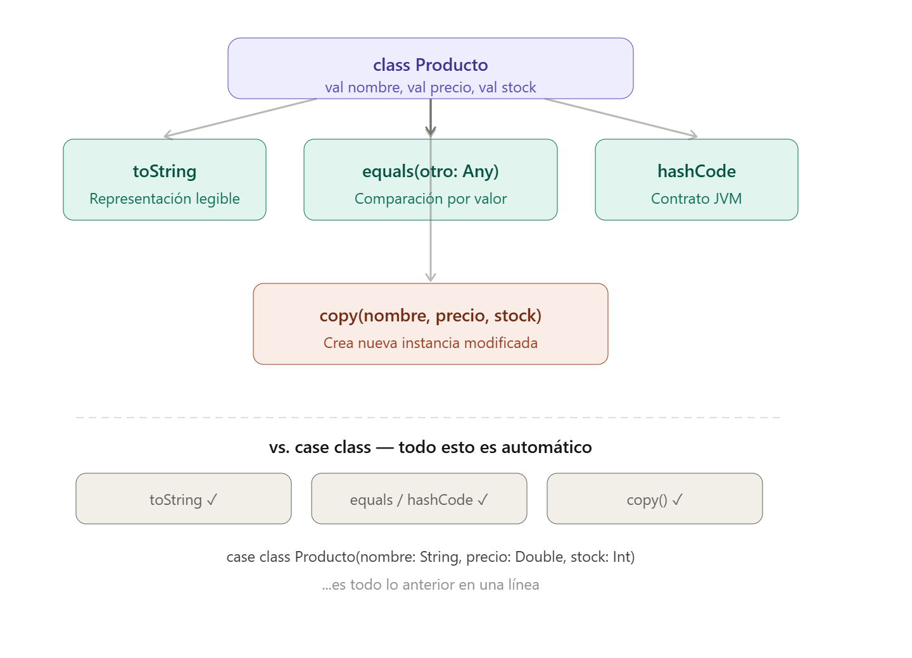

# 💻Clase 11 - case class, case object , sealed trait + pattern matching

---

# Agenda:

<aside>
💡

#### 9:00 - 9:50    →  case class, case object , sealed trait + pattern matching

#### 9:50 - 11:20   → Ejercicios

#### 11:40 - 12:40  → ¿Qué es un cluster de Big Data? Investigación

#### 12:40 - 14:00  → ¿Qué es un cluster de Big Data? Investigación

</aside>

## 1. ¿Qué es una `case class`?

Una **`case class`** es una clase especial de Scala diseñada para **modelar datos inmutables**. Con una sola línea, Scala genera automáticamente todo lo que normalmente habría que escribir a mano.

```scala
case class Punto(x: Double, y: Double)
```

Esta línea tan sencilla genera automáticamente:

| Lo que genera Scala | Para qué sirve |
| --- | --- |
| Constructor con todos los parámetros | Crear instancias sin `new` |
| `toString` | Representación legible: `Punto(3.0, 4.0)` |
| `equals` | Comparar por valor, no por referencia |
| `hashCode` | Uso seguro en colecciones como `Set` y `Map` |
| `copy(...)` | Crear una copia modificando solo algunos campos |
| Desestructuración | Usar en pattern matching directamente |

---

### Creación: sin `new`

```scala
val p1 = Punto(3.0, 4.0)   // no necesita new
val p2 = Punto(3.0, 4.0)
val p3 = Punto(0.0, 1.0)

println(p1)           // Punto(3.0,4.0)
println(p1 == p2)     // true  ← compara por VALOR
println(p1 == p3)     // false
```

> ⚠️ **Nota importante — Comparación por valor**
> 
> 
> Con una clase normal, `p1 == p2` devolvería `false` aunque tengan los mismos datos, porque Scala compararía las *posiciones en memoria* donde están guardados los objetos, no su contenido. Es como si dos gemelos idénticos fueran considerados personas distintas porque viven en habitaciones diferentes. Las `case class` comparan por *contenido*, que es lo que tiene sentido cuando trabajamos con datos.
> 

### 🔍 Comparativa — Sin `case class` vs Con `case class`

<aside>

El mismo problema resuelto de dos formas: primero con una clase normal, luego con una `case class`. El objetivo es que veas exactamente qué trabajo te ahorra Scala.

</aside>

---

> El problema
> 
> 
> Queremos representar un **producto de una tienda** con tres datos: nombre, precio y stock. Luego necesitamos:
> 
> 1. Mostrar el producto por pantalla.
> 2. Comparar dos productos para saber si son iguales.
> 3. Crear una versión rebajada del producto sin modificar el original.

---

## ❌ Versión SIN `case class` — clase normal

Con una clase ordinaria, tenemos que escribir todo a mano.

```scala
//  definición de la clase

class Producto(val nombre: String, val precio: Double, val stock: Int) {
// Define la clase con constructor primario. 
// Los tres parámetros llevan val, lo que los convierte automáticamente
// en campos inmutables de instancia 
// (equivalente a declarar val nombre: String dentro del cuerpo y asignarla en el constructor).
 
  override def toString: String =
    s"Producto($nombre, $precio, $stock)" // Sobreescribe el método toString heredado 
    // de java.lang.Object. Sin esto, println(p1) mostraría la referencia de memoria (Producto@6d06d69c)

  
  override def equals(otro: Any): Boolean = otro match {
  // Sobreescribe equals de java.lang.Object. 
  // El parámetro es Any (el supertipo de todo en Scala,
  // equivalente a Object en Java). Se usa pattern matching (match) para inspeccionar el tipo del argumento.
    case o: Producto => nombre == o.nombre && precio == o.precio && stock == o.stock
    // Si `otro` es una instancia de Producto, 
    // extrae la referencia como `o` y compara campo a campo.
    // Si los tres coinciden, devuelve true.
    case _           => false
    // El _ es el comodín: cubre cualquier otro caso (objeto nulo, tipo distinto, etc.) y devuelve false.
  }
  

  // Obligatorio cuando se redefine equals
  override def hashCode: Int =
    (nombre, precio, stock).##
    // Sobreescribe hashCode. En Scala/JVM existe
    // el contrato equals/hashCode: si dos objetos 
    // son iguales según equals, deben tener el mismo hashCode

  // No existe copy(), hay que crearlo a mano
  def copy(nombre: String = this.nombre,
           precio: Double  = this.precio,
           stock: Int      = this.stock): Producto =
    new Producto(nombre, precio, stock)
}
// Define un método copy con parámetros por defecto:
// si no se pasa un argumento, se reutiliza el 
// valor actual del campo correspondiente (this.nombre, etc.).
// Esto imita el copy que case class genera automáticamente.
```

```scala
// --- Celda 2: uso ---

val p1 = new Producto("Teclado", 49.99, 20)  // necesita new
val p2 = new Producto("Teclado", 49.99, 20)
val p3 = new Producto("Ratón",   29.99,  5)

println(p1)           // Producto(Teclado, 49.99, 20)
println(p1 == p2)     // true  (solo porque escribimos equals a mano)
println(p1 == p3)     // false

// Crear versión rebajada (solo porque escribimos copy a mano)
val p1Rebajado = p1.copy(precio = 39.99)
println(p1Rebajado)   // Producto(Teclado, 39.99, 20)
println(p1)           // Producto(Teclado, 49.99, 20)  ← original intacto
```

> ⚠️ **Nota:** Para que este código funcione correctamente hemos tenido que escribir manualmente `toString`, `equals`, `hashCode` y `copy`. Son **40 líneas de código** para un simple contenedor de datos. Y si añadimos un campo nuevo al producto, hay que acordarse de actualizar los cuatro métodos.
> 

---

## Versión sin Java. Sin métodos especiales heredados. Solo Scala puro.

```scala
// ---  definición ---

class Producto(val nombre: String, val precio: Double, val stock: Int)

// ---  crear productos ---

val p1 = new Producto("Teclado", 49.99, 20)
val p2 = new Producto("Teclado", 49.99, 20)
val p3 = new Producto("Ratón",   29.99,  5)

// ---  mostrar por pantalla ---

// println(p1) mostraría algo como:  ammonite.$sess.cmd0$Producto@4e9ba398
// No sabemos qué contiene. Hay que hacerlo a mano:

println(s"Producto(${p1.nombre}, ${p1.precio}, ${p1.stock})")
// Producto(Teclado, 49.99, 20)

// --- comparar ---

// p1 == p2 compara si son el MISMO objeto en memoria, no si tienen los mismos datos
println(p1 == p2)   // false  ← aunque tienen exactamente los mismos datos
println(p1 == p3)   // false

// Para comparar por contenido, tenemos que comparar campo a campo:
val sonIguales = p1.nombre == p2.nombre &&
                 p1.precio == p2.precio &&
                 p1.stock  == p2.stock

println(sonIguales)   // true  ← pero lo hemos tenido que escribir nosotros

// --- Celda 5: crear versión rebajada ---

// No existe copy(). Hay que construir un nuevo objeto a mano:
val p1Rebajado = new Producto(p1.nombre, 39.99, p1.stock)

println(s"Producto(${p1Rebajado.nombre}, ${p1Rebajado.precio}, ${p1Rebajado.stock})")
// Producto(Teclado, 39.99, 20)

println(s"Producto(${p1.nombre}, ${p1.precio}, ${p1.stock})")
// Producto(Teclado, 49.99, 20)  ← original intacto, pero lo hemos gestionado nosotros
```

---

## ✅ Versión CON `case class` — Scala lo genera todo

```scala
// --- definición ---

case class Producto(nombre: String, precio: Double, stock: Int)
// ← Una sola línea. Scala genera toString, equals, hashCode y copy automáticamente.
```

```scala
// --- uso (idéntico al anterior) ---

val p1 = Producto("Teclado", 49.99, 20)  // sin new
val p2 = Producto("Teclado", 49.99, 20)
val p3 = Producto("Ratón",   29.99,  5)

println(p1)           // Producto(Teclado,49.99,20)
println(p1 == p2)     // true  ← automático, compara por VALOR
println(p1 == p3)     // false

// copy viene incluido, sin escribir nada
val p1Rebajado = p1.copy(precio = 39.99)
println(p1Rebajado)   // Producto(Teclado,39.99,20)
println(p1)           // Producto(Teclado,49.99,20)  ← original intacto
```

---



## 📊 Tabla comparativa

| Capacidad | Clase normal | `case class` |
| --- | --- | --- |
| Crear sin `new` | ❌ Requiere `new` | ✅ Directo |
| `toString` legible | ❌ Hay que escribirlo | ✅ Automático |
| `equals` por valor | ❌ Hay que escribirlo | ✅ Automático |
| `hashCode` correcto | ❌ Hay que escribirlo | ✅ Automático |
| `copy(...)` | ❌ Hay que escribirlo | ✅ Automático |
| Uso en pattern matching | ❌ No directo | ✅ Nativo |
| Líneas de código | ~40 líneas | **1 línea** |

---

> 💡 **Conclusión**
> 
> 
> Una `case class` no añade nada que no se pueda hacer con una clase normal. Lo que hace es **eliminar código repetitivo** que siempre se escribe igual en cualquier contenedor de datos. En Big Data, donde modelamos cientos de estructuras de datos, esto marca una diferencia enorme en la legibilidad y el mantenimiento del código.
> 

---

### Inmutabilidad y `copy`

Los parámetros de una `case class` son `val` por defecto: no se pueden modificar directamente. Para "cambiar" un campo se usa `copy`, que crea un **nuevo objeto** con los cambios indicados, dejando el original intacto:

```scala
val pedido1 = Punto(3.0, 4.0)
val pedido2 = pedido1.copy(y = 10.0)   // copia con y modificado

println(pedido1)   // Punto(3.0,4.0)
println(pedido2)   // Punto(3.0,10.0)
```

> 📋 **Analogía — Formularios en papel**
> 
> 
> Imagina que tienes un formulario de pedido ya rellenado y archivado. No puedes borrar lo que está escrito (inmutabilidad), pero puedes sacar una fotocopia y corregir solo el campo del precio. El formulario original sigue igual en el archivo. Eso es exactamente lo que hace `copy`: te entrega una fotocopia modificada sin tocar el original.
> 

---

## 2. `case class` en la práctica

```scala
case class Producto(codigo: String, nombre: String, precio: Double, stock: Int)
```

```scala
val p1 = Producto("P001", "Teclado", 49.99, 20)
val p2 = Producto("P002", "Ratón",   29.99,  5)

// toString legible sin código extra
println(p1)
// Producto(P001,Teclado,49.99,20)

// copy para aplicar descuento
val p1Rebajado = p1.copy(precio = 39.99)
println(p1Rebajado)
// Producto(P001,Teclado,39.99,20)

// equals por valor
val p1Copia = Producto("P001", "Teclado", 49.99, 20)
println(p1 == p1Copia)   // true
```

> 🛒 **Analogía — El catálogo de una tienda online**
> 
> 
> Una `case class Producto` es como una ficha de artículo en el catálogo de una tienda: código de referencia, nombre, precio y unidades disponibles. Si hay una rebajas, no "rompes" la ficha original — generas una nueva ficha con el precio modificado (`copy`). Y si dos fichas tienen exactamente los mismos datos, el sistema las considera el mismo producto (`equals`), algo esencial para detectar duplicados en un inventario.
> 

---

## 3. `case object`

Un **`case object`** es a un `object` lo que una `case class` es a una `class`: un **singleton** (existe una única instancia en todo el programa) que también se puede usar en pattern matching y tiene `toString` automático.

<aside>

Repasar `object` de la clase 9

</aside>

Se usa habitualmente para representar **estados o valores constantes sin datos asociados**:

```scala
case object Activo
case object Inactivo
case object Pendiente
```

```scala
val estado = Activo
println(estado)   // Activo  (toString automático)
```

> 🚦 **Analogía — Los estados de un semáforo**
> 
> 
> Un semáforo solo puede estar en uno de tres estados: rojo, ámbar o verde. Ningún estado necesita "guardar" información adicional — solo importa *cuál* es. Un `case object` es exactamente eso: una etiqueta única y constante. No es un número, no es un texto que se pueda escribir mal — es un valor que el compilador conoce y puede vigilar. 
> 

# 🔍 Comparativa — `object` vs `case object`

El mismo problema resuelto con `object` normal y luego con `case object`. Verás exactamente qué ventajas añade `case`.

---

<aside>

## El problema

Queremos representar el **estado de un pedido**: Activo, Inactivo o Pendiente. Luego necesitamos:

1. Mostrar el estado por pantalla de forma legible.
2. Usarlo en un `match` para decidir qué hacer según el estado.
</aside>

---

## ❌ Versión con `object` normal

```scala
// --- definición ---

object Activo
object Inactivo
object Pendiente

// --- mostrar por pantalla ---

val estado = Activo

println(estado)
// ammonite.$sess.cmd0$Activo$@4d7e1886  ← muestra la dirección en memoria, no el nombre

// --- usar en un match ---

// Funciona, pero el compilador NO sabe cuántos estados existen.
// Si te olvidas un caso, no avisa. Silencio total.

def descripcion(e: Any): String = e match {
  case Activo    => "El pedido está activo"
  case Inactivo  => "El pedido está inactivo"
  // nos olvidamos Pendiente... el compilador no dice nada
  case _         => "Estado desconocido"  // sin esto, el programa fallaría en runtime
}

println(descripcion(Activo))     // El pedido está activo
println(descripcion(Pendiente))  // Estado desconocido  ← ha caído en el caso basura

```

> 
> 
> 
> ## Línea a línea
> 
> ```scala
> object Activo
> ```
> 
> Crea un objeto singleton llamado `Activo`. En Scala, `object` significa que existe **una única instancia** de ese "algo" en todo el programa — no puedes crear más con `new`.
> 
> Pero `object` a secas es una caja vacía sin etiqueta. Scala no sabe cómo llamarla si te preguntaran. Solo sabe dónde está guardada en la memoria del ordenador.
> 
> ```scala
> object Inactivo
> object Pendiente
> ```
> 
> Igual que arriba: dos cajas más, cada una en su propia dirección de memoria.
> 
> <aside>
> 
> > 📦 **Importante:** `Activo`, `Inactivo` y `Pendiente` son tres objetos **completamente independientes** para el compilador. No sabe que están relacionados. Es como tener tres cajas en tres habitaciones distintas sin ningún cartel que diga que pertenecen al mismo conjunto.
> > 
> </aside>
> 
> ```scala
> // --- mostrar por pantalla ---
> 
> val estado = Activo
> 
> println(estado)
> // ammonite.$sess.cmd0$Activo$@4d7e1886  ← muestra la dirección en memoria, no el nombre
> ```
> 
> Crea una variable `estado` que apunta al objeto `Activo` . No copia nada — simplemente `estado`  y `Activo` apuntan al mismo sitio en memoria.
> `println(estado)` : Aquí aparece el primer problema visible. Scala intenta mostrar `estado` como texto. Como `object Activo` no tiene ninguna instrucción sobre cómo describirse a sí mismo, Scala muestra la **dirección de memoria** donde está guardado: `@4d7e1886`. El prefijo `ammonite.$sess.cmd0$` es el nombre interno que Almond/Jupyter le asigna al bloque de código donde definiste el objeto. Aquí aparece el primer problema visible.
> 
> <aside>
> 
> **Analogía:** Es como preguntarle a alguien "¿quién eres?" y que te responda con su número de DNI y su código postal en lugar de su nombre. Técnicamente es información válida, pero completamente inútil para una persona.
> 
> </aside>
> 
> ```scala
> // --- usar en un match ---
> 
> // Funciona, pero el compilador NO sabe cuántos estados existen.
> // Si te olvidas un caso, no avisa. Silencio total.
> 
> def descripcion(e: Any): String = e match {
>   case Activo    => "El pedido está activo"
>   case Inactivo  => "El pedido está inactivo"
>   // nos olvidamos Pendiente... el compilador no dice nada
>   case _         => "Estado desconocido"  // sin esto, el programa fallaría en runtime
> }
> 
> println(descripcion(Activo))     // El pedido está activo
> println(descripcion(Pendiente))  // Estado desconocido  ← ha caído en el caso basura
> ```
> 
> ```scala
> def descripcion(e: Any): String = e match {
> ```
> 
> Define una función llamada `descripcion` que:
> 
> - Recibe un parámetro `e` de tipo `Any` — el tipo más genérico de Scala,
> significa "cualquier cosa".
> - Devuelve un `String`.
> - Usa `match` para decidir qué devolver según el valor de `e`.
> 
> Se usa `Any` porque `object Activo`, `object Inactivo` y `object Pendiente`no tienen ningún tipo en común que el compilador conozca. Son tres objetos sin parentesco declarado.
> 
> ### `case Activo => "El pedido está activo"`
> 
> ```scala
> case Activo => "El pedido está activo"
> ```
> 
> Si `e` es exactamente el objeto `Activo`, devuelve ese texto. Esto funciona porque Scala compara si `e` y `Activo` apuntan al **mismo objeto en memoria** — y como solo existe uno de cada (`object` es singleton), la comparación es fiable.
> 
> ### `case Inactivo => "El pedido está inactivo"`
> 
> ```scala
> case Inactivo => "El pedido está inactivo"
> ```
> 
> Igual: si `e` es el objeto `Inactivo`, devuelve ese texto. Fíjate que **`Pendiente` no está**. Lo hemos omitido a propósito para mostrar el problema. El compilador no dice nada. No avisa.
> No lanza ningún error. Silencio total.
> 
> ### `case _ => "Estado desconocido"`
> 
> ```scala
> case _ => "Estado desconocido"
> ```
> 
> El `_` es el **caso comodín**: captura cualquier valor que no haya encajado en los casos anteriores. Es obligatorio aquí porque el compilador no sabe cuántos posibles valores puede tener `e: Any`— podría ser un número, un texto, o en nuestro caso, `Pendiente`. Sin este `case _`, el programa compilaría igualmente pero fallaría en ejecución al recibir `Pendiente` con un error de tipo `MatchError`.
> 
> ⚠️ **El problema real:** el `case _` enmascara el error. `Pendiente` no es un "estado desconocido" — es un estado perfectamente válido que simplemente olvidamos cubrir. Pero el programa no se queja. El bug queda enterrado.
> 

---

> ⚠️ **Problemas con `object` normal:**
> 
> - `println(estado)` no muestra el nombre — muestra una dirección de memoria inútil.
> - El compilador no sabe que `Activo`, `Inactivo` y `Pendiente` están relacionados.
> - Si olvidas un caso en el `match`, el compilador no avisa. El error aparece en ejecución.
> - Necesitas un `case _` de seguridad o el programa puede fallar.

---

## ✅ Versión con `case object`

```scala
// --- Celda 1: definición ---

case object Activo
case object Inactivo
case object Pendiente

val estado = Activo
println(estado)

def descripcion(e: Any): String = e match {
  case Activo   => "El pedido está activo"
  case Inactivo => "El pedido está inactivo"
  case Pendiente => "El pedido está pendiente de confirmación"
}

println(descripcion(Activo))     // El pedido está activo
println(descripcion(Inactivo))   // El pedido está inactivo
println(descripcion(Pendiente))  // El pedido está pendiente de confirmación
```

---

## 📊 Tabla comparativa

| Situación | `object` | `case object` |
| --- | --- | --- |
| `println(estado)` | `Activo$@4d7e1886` (dirección de memoria) | `Activo` (el nombre) |
| Usar en `match` | Funciona, pero sin seguridad | Funciona |
| Olvidar un caso en `match` | El compilador no avisa ⚠️ | El compilador avisa ✅ (con `sealed`) |
| Necesitar `case _` de emergencia | Sí, obligatorio para no fallar | No necesario |

---

---

## 4. Pattern Matching avanzado

Ya conocemos el `match` básico. Ahora lo llevamos al siguiente nivel con tres nuevas capacidades: **desestructuración de case classes**, **matching sobre tipos**, y **guards** (condiciones adicionales).

---

### 4.1 Desestructuración de `case class`

La gran ventaja de las `case class` en un `match` es que podemos **extraer sus campos directamente** dentro del `case`, sin necesidad de acceder a ellos campo a campo:

```scala
case class Coordenada(x: Double, y: Double)

def cuadrante(c: Coordenada): String = c match {
  case Coordenada(0, 0)                    => "Origen"
  case Coordenada(x, y) if x > 0 && y > 0 => "Primer cuadrante"
  case Coordenada(x, y) if x < 0 && y > 0 => "Segundo cuadrante"
  case Coordenada(x, y) if x < 0 && y < 0 => "Tercer cuadrante"
  case Coordenada(x, y) if x > 0 && y < 0 => "Cuarto cuadrante"
  case _                                   => "Sobre un eje"
}

println(cuadrante(Coordenada(3.0, 2.0)))    // Primer cuadrante
println(cuadrante(Coordenada(-1.0, 4.0)))   // Segundo cuadrante
println(cuadrante(Coordenada(0, 0)))        // Origen
```

> 📦 **Analogía — Abrir un paquete y revisar su contenido**
> 
> 
> Imagina que recibes un paquete (la `Coordenada`). Con pattern matching, no tienes que abrir el paquete y luego buscar cada cosa: directamente dices "si dentro hay un `x` y un `y`, y además el `x` es mayor que cero y el `y` también, entonces es el primer cuadrante". Abres y clasificas en un solo gesto. Sin desestructuración tendrías que hacer `c.x` y `c.y` por separado; con ella, los valores te llegan con nombre directamente.
> 

---

### 4.2 Matching sobre tipos

Podemos hacer `match` sobre el **tipo real** de un valor. Esto es muy útil cuando una función recibe objetos de distintas clases y quiere tratarlos de forma diferente:

```scala
case class Circulo(radio: Double)
case class Rectangulo(base: Double, altura: Double)
case class Triangulo(base: Double, altura: Double)

def calcularArea(figura: Any): Double = figura match {
  case Circulo(r)       => scala.math.Pi * r * r
  case Rectangulo(b, h) => b * h
  case Triangulo(b, h)  => (b * h) / 2
  case _                => 0.0
}

println(f"Círculo r=5:        ${calcularArea(Circulo(5.0))}%.2f")
println(f"Rectángulo 4×6:     ${calcularArea(Rectangulo(4.0, 6.0))}%.2f")
println(f"Triángulo b=3 h=4:  ${calcularArea(Triangulo(3.0, 4.0))}%.2f")
```

**Salida esperada:**

```
Círculo r=5:        78.54
Rectángulo 4×6:     24.00
Triángulo b=3 h=4:  6.00
```

> 🔧 **Analogía — Un técnico de mantenimiento**
> 
> 
> Un técnico recibe órdenes de trabajo de distinto tipo: fontanería, electricidad, pintura. Dependiendo del tipo de trabajo, aplica herramientas y procedimientos distintos. El técnico no pregunta "¿qué tipo eres?" con un `if`; simplemente inspecciona la orden y actúa según lo que ve. Eso es el matching sobre tipos: la función `calcularArea` recibe una "figura" y sabe qué fórmula aplicar según de qué tipo sea, extrayendo los datos necesarios al mismo tiempo.
> 

---

### 4.3 Guards: condiciones adicionales en los casos

Los **guards** (la palabra `if` dentro de un `case`) permiten añadir condiciones sobre los valores extraídos. No basta con que el patrón encaje — también tiene que cumplirse la condición:

```scala
case class Pedido(id: Int, cliente: String, importe: Double, pagado: Boolean)

def clasificarPedido(p: Pedido): String = p match {
  case Pedido(_, _, _, false)                  => "⏳ Pendiente de pago"
  case Pedido(_, _, imp, true) if imp >= 500.0 => "⭐ VIP — Pedido grande pagado"
  case Pedido(_, _, imp, true) if imp >= 100.0 => "✅ Pedido normal pagado"
  case Pedido(_, _, _, true)                   => "📦 Pedido pequeño pagado"
}

val pedidos = List(
  Pedido(1, "Ana",    650.0, true),
  Pedido(2, "Luis",   120.0, true),
  Pedido(3, "Marta",   45.0, false),
  Pedido(4, "Carlos",  30.0, true)
)

for (p <- pedidos) {
  println(s"Pedido #${p.id} (${p.cliente}): ${clasificarPedido(p)}")
}
```

**Salida esperada:**

```
Pedido #1 (Ana): ⭐ VIP — Pedido grande pagado
Pedido #2 (Luis): ✅ Pedido normal pagado
Pedido #3 (Marta): ⏳ Pendiente de pago
Pedido #4 (Carlos): 📦 Pedido pequeño pagado
```

> 🏧 **Analogía — El cajero automático y los límites de retirada**
> 
> 
> Un cajero no solo comprueba si tienes tarjeta (el patrón); también comprueba el saldo y el límite diario (el guard). "Si tienes tarjeta válida Y además el importe es menor que tu límite, te doy el dinero". Sin el guard, el cajero solo sabría si tienes tarjeta o no. Con el guard, puede tomar decisiones más finas usando tanto el tipo de dato como su valor concreto.
> 

---

## 5. `sealed trait` + `case class`: Algebraic Data Types

Esta es la combinación más importante de esta sesión y uno de los patrones más usados en Scala profesional y en el código de Apache Spark.

---

### El problema: usar Strings para modelar estados

Imagina que modelamos los estados de un semáforo con `String`:

```scala
val estado: String = "verde"  // ¿Y si alguien escribe "Verde"? ¿O "amarilo"?
```

El compilador no puede ayudarnos. Cualquier cadena es válida y los errores aparecen solo cuando el programa ya está en marcha.

> 🗂️ **Analogía — Un formulario sin lista desplegable**
> 
> 
> Imagina un formulario en papel donde en el campo "País" puedes escribir lo que quieras. Alguien escribe "España", otro "Espana", otro "spain". Cada variante es un error potencial que hay que limpiar después. Ahora imagina que ese campo es una lista desplegable: solo puedes elegir valores válidos. Eso es lo que hace `sealed trait`: convierte un campo libre en una lista cerrada de opciones que el propio compilador conoce y vigila.
> 

---

### La solución: `sealed trait` + `case object` / `case class`

```scala
sealed trait EstadoSemaforo
case object Rojo     extends EstadoSemaforo
case object Amarillo extends EstadoSemaforo
case object Verde    extends EstadoSemaforo
```

La palabra clave **`sealed`** le dice al compilador que **todas las subclases de este trait están definidas en este mismo fichero**. Esto le permite verificar si el `match` es exhaustivo — es decir, si cubre todos los casos posibles:

```scala
def instruccion(e: EstadoSemaforo): String = e match {
  case Rojo     => "🔴 STOP — No puedes pasar"
  case Amarillo => "🟡 PRECAUCIÓN — Prepárate para parar"
  case Verde    => "🟢 ADELANTE — Puedes pasar"
}

println(instruccion(Verde))    // 🟢 ADELANTE — Puedes pasar
println(instruccion(Rojo))     // 🔴 STOP — No puedes pasar
```

> ⚠️ **Garantía del compilador**
> 
> 
> Si eliminas el caso `Amarillo` del `match`, el compilador lanza una advertencia: *"match may not be exhaustive, it would fail on: Amarillo"*. Con `String` esto nunca ocurriría — el compilador no sabe qué valores son válidos. Esta capacidad de advertir sobre casos olvidados es la ventaja principal de `sealed trait`.
> 

---

### `sealed trait` con `case class` que llevan datos

Los `case object` representan estados **sin datos**. Las `case class` representan variantes **con datos asociados**. Se pueden mezclar libremente bajo el mismo `sealed trait`:

```scala
sealed trait ResultadoOperacion
case class Exito(mensaje: String, valor: Double)   extends ResultadoOperacion
case class Error(codigo: Int, descripcion: String) extends ResultadoOperacion
case object Cancelado                              extends ResultadoOperacion
```

```scala
def procesarOperacion(op: ResultadoOperacion): Unit = op match {
  case Exito(msg, valor) =>
    println(f"✅ $msg — Resultado: $valor%.2f")
  case Error(cod, desc)  =>
    println(s"❌ Error $cod: $desc")
  case Cancelado         =>
    println("⚠️  Operación cancelada por el usuario")
}

val ops = List(
  Exito("Pago procesado", 149.99),
  Error(404, "Producto no encontrado"),
  Cancelado,
  Exito("Transferencia completada", 500.0)
)

for (op <- ops) procesarOperacion(op)
```

**Salida esperada:**

```
✅ Pago procesado — Resultado: 149.99
❌ Error 404: Producto no encontrado
⚠️  Operación cancelada por el usuario
✅ Transferencia completada — Resultado: 500.00
```

> 📬 **Analogía — El resultado de enviar una carta certificada**
> 
> 
> Cuando envías una carta certificada, el resultado puede ser: **entregada** (con el nombre de quien firmó y la fecha — `Exito` con datos), **devuelta por dirección incorrecta** (con el código de error postal — `Error` con datos), o **cancelada antes de salir** (sin más información — `Cancelado`, un simple estado). No existe ningún otro resultado posible. `sealed trait` es el sobre certificado con esas tres únicas opciones predefinidas.
> 

---

## 6. Conexión con Apache Spark

Este patrón `sealed trait` + `case class` no es solo teoría: es la base de cómo Spark representa internamente su árbol de operaciones, conocido como el **plan lógico**. Cada transformación que aplicas a un DataFrame — `filter`, `select`, `groupBy` — se modela como una `case class` dentro de una jerarquía `sealed`. Cuando Spark optimiza tu consulta, recorre ese árbol con pattern matching exactamente como lo hemos visto aquí.

> 🧩 **Analogía — El plan de obra de un arquitecto**
> 
> 
> Antes de construir un edificio, el arquitecto dibuja el plano completo: "primero los cimientos, luego las paredes, luego el tejado". Spark hace lo mismo con tus instrucciones de datos: las convierte en un árbol de pasos (`case class`) antes de ejecutar nada. Después optimiza ese árbol — cambia el orden, elimina pasos innecesarios — y solo entonces construye. El `sealed trait` garantiza que nadie puede colar un tipo de paso desconocido en el plan.
> 

---

## 🔑 Resumen

| Concepto | Sintaxis | Para qué sirve |
| --- | --- | --- |
| `case class` | `case class Nombre(campos)` | Modelar datos inmutables con `equals`, `copy` y `toString` automáticos |
| Sin `new` | `MiCaseClass(args)` | Crear instancias de forma concisa |
| `copy` | `obj.copy(campo = nuevoValor)` | Crear variante con un campo modificado, sin alterar el original |
| `case object` | `case object Nombre` | Singleton usable en pattern matching, sin datos asociados |
| Desestructuración | `case MiCC(a, b) =>` | Extraer campos directamente en el `match` |
| Guard | `case ... if condicion =>` | Añadir una condición extra dentro de un caso |
| `sealed trait` | `sealed trait T` | Cerrar la jerarquía para que el compilador detecte casos no cubiertos |
| ADT | `sealed trait` + `case class/object` | Modelar dominios con tipos seguros y exhaustivos |

---

## 💻 Práctica

---

### 🔹 Ejercicio 1 — Sistema de pedidos con `case class`

**Celda 2 — Code (definición):**

```scala
case class Cliente(id: Int, nombre: String, email: String)

case class LineaPedido(producto: String, cantidad: Int, precioUnitario: Double) {
  def subtotal(): Double = cantidad * precioUnitario
}

case class Pedido(numero: Int, cliente: Cliente, lineas: List[LineaPedido]) {
  def total(): Double = lineas.map(_.subtotal()).sum

  def resumen(): String = {
    val cab  = s"=== Pedido #$numero — ${cliente.nombre} ==="
    val body = lineas.map(l =>
      f"  ${l.producto}%-20s ${l.cantidad}%2d ud × ${l.precioUnitario}%7.2f € = ${l.subtotal()}%8.2f €"
    ).mkString("\n")
    val pie  = f"  ${"TOTAL"}%-20s ${""}%2s     ${""}%7s   ${total()}%8.2f €"
    s"$cab\n$body\n${"-" * 55}\n$pie"
  }
}
```

**Celda 3 — Code (uso):**

```scala
val cliente1 = Cliente(1, "Ana García", "ana@ejemplo.com")

val pedido1 = Pedido(
  numero  = 1001,
  cliente = cliente1,
  lineas  = List(
    LineaPedido("Teclado mecánico",  1, 79.99),
    LineaPedido("Ratón inalámbrico", 2, 29.99),
    LineaPedido("Alfombrilla",       1, 12.50)
  )
)

println(pedido1.resumen())
```

**Salida esperada:**

```
=== Pedido #1001 — Ana García ===
  Teclado mecánico      1 ud ×   79.99 € =    79.99 €
  Ratón inalámbrico     2 ud ×   29.99 € =    59.98 €
  Alfombrilla           1 ud ×   12.50 € =    12.50 €
-------------------------------------------------------
  TOTAL                                  =   152.47 €
```

**Celda 4 — Code (copy para modificar):**

```scala
// Aplicar descuento del 10% en el precio del teclado con copy
val tecladoRebajado  = pedido1.lineas.head.copy(precioUnitario = 71.99)
val pedido1Rebajado  = pedido1.copy(
  lineas = tecladoRebajado :: pedido1.lineas.tail
)

println(pedido1Rebajado.resumen())
println(s"\nAhorro: ${f"${pedido1.total() - pedido1Rebajado.total()}%.2f"} €")
```

---

### 🔹 Ejercicio 2 — Pattern matching sobre una jerarquía `sealed trait`

**Celda 2 — Code (jerarquía):**

```scala
sealed trait EstadoEnvio

case object Preparando                                          extends EstadoEnvio
case class  EnTransito(transportista: String, ubicacion: String) extends EstadoEnvio
case class  Entregado(firma: String)                            extends EstadoEnvio
case class  Incidencia(motivo: String)                          extends EstadoEnvio
case object Devuelto                                            extends EstadoEnvio
```

**Celda 3 — Code (función con match exhaustivo):**

```scala
def descripcionEstado(estado: EstadoEnvio): String = estado match {
  case Preparando              => "📦 El paquete está siendo preparado en el almacén"
  case EnTransito(trans, ubic) => s"🚚 En tránsito con $trans — Última ubicación: $ubic"
  case Entregado(firma)        => s"✅ Entregado y firmado por: $firma"
  case Incidencia(motivo)      => s"⚠️  Incidencia: $motivo"
  case Devuelto                => "↩️  El paquete ha sido devuelto al remitente"
}
```

**Celda 4 — Code (simulación de seguimiento):**

```scala
val historial: List[(String, EstadoEnvio)] = List(
  ("10:00", Preparando),
  ("14:30", EnTransito("MRW", "Madrid - Centro de clasificación")),
  ("18:00", EnTransito("MRW", "Barcelona - Almacén local")),
  ("09:15", Entregado("L. Martínez"))
)

println("=== Seguimiento de envío #ES123456 ===")
for ((hora, estado) <- historial) {
  println(s"  [$hora] ${descripcionEstado(estado)}")
}
```

**Salida esperada:**

```
=== Seguimiento de envío #ES123456 ===
  [10:00] 📦 El paquete está siendo preparado en el almacén
  [14:30] 🚚 En tránsito con MRW — Última ubicación: Madrid - Centro de clasificación
  [18:00] 🚚 En tránsito con MRW — Última ubicación: Barcelona - Almacén local
  [09:15] ✅ Entregado y firmado por: L. Martínez
```

---

### 🔹 Ejercicio 3 — Calculadora con pattern matching

**Celda 2 — Code (modelo de operaciones):**

```scala
sealed trait Operacion
case class Sumar(a: Double, b: Double)        extends Operacion
case class Restar(a: Double, b: Double)       extends Operacion
case class Multiplicar(a: Double, b: Double)  extends Operacion
case class Dividir(a: Double, b: Double)      extends Operacion
case class Potencia(base: Double, exp: Int)   extends Operacion
```

**Celda 3 — Code (función de cálculo):**

```scala
def calcular(op: Operacion): String = op match {
  case Sumar(a, b)          => f"$a + $b = ${a + b}%.4f"
  case Restar(a, b)         => f"$a - $b = ${a - b}%.4f"
  case Multiplicar(a, b)    => f"$a × $b = ${a * b}%.4f"
  case Dividir(_, 0)        => "❌ Error: división por cero"
  case Dividir(a, b)        => f"$a ÷ $b = ${a / b}%.4f"
  case Potencia(base, exp)  =>
    val resultado = Math.pow(base, exp)
    f"$base ^ $exp = $resultado%.4f"
}

val operaciones = List(
  Sumar(15.0, 7.5),
  Restar(100.0, 43.25),
  Multiplicar(4.0, 3.5),
  Dividir(22.0, 7.0),
  Dividir(5.0, 0.0),
  Potencia(2.0, 10)
)

println("=== Calculadora Scala ===")
for (op <- operaciones) println(s"  ${calcular(op)}")
```

**Salida esperada:**

```
=== Calculadora Scala ===
  15.0 + 7.5 = 22.5000
  100.0 - 43.25 = 56.7500
  4.0 × 3.5 = 14.0000
  22.0 ÷ 7.0 = 3.1429
  ❌ Error: división por cero
  2.0 ^ 10 = 1024.0000
```

---

### 🔹 Ejercicio 4 — Sistema de notificaciones

**Celda 2 — Code (modelo de dominio):**

```scala
case class Usuario(id: Int, nombre: String, email: String)

sealed trait Notificacion
case class Email(destinatario: Usuario,
                 asunto: String,
                 cuerpo: String)         extends Notificacion
case class SMS(telefono: String,
               mensaje: String)          extends Notificacion
case class Push(dispositivo: String,
                titulo: String,
                texto: String)           extends Notificacion
case object SinNotificacion              extends Notificacion
```

**Celda 3 — Code (procesador de notificaciones):**

```scala
def enviarNotificacion(n: Notificacion): String = n match {
  case Email(user, asunto, cuerpo) =>
    s"📧 EMAIL → ${user.email}\n   Asunto: $asunto\n   Cuerpo: ${cuerpo.take(40)}..."
  case SMS(tel, msg) =>
    s"📱 SMS → $tel\n   Mensaje: ${msg.take(50)}"
  case Push(disp, titulo, texto) =>
    s"🔔 PUSH → $disp\n   $titulo: $texto"
  case SinNotificacion =>
    "🔕 Sin notificación configurada"
}

def prioridad(n: Notificacion): Int = n match {
  case Email(_, _, _)  => 3
  case SMS(_, _)       => 2
  case Push(_, _, _)   => 1
  case SinNotificacion => 0
}
```

**Celda 4 — Code (simulación):**

```scala
val usuario1 = Usuario(1, "Ana López",   "ana@ejemplo.com")
val usuario2 = Usuario(2, "Carlos Ruiz", "carlos@ejemplo.com")

val notificaciones: List[Notificacion] = List(
  Email(usuario1, "Confirmación de pedido",
        "Tu pedido #1001 ha sido confirmado y está siendo preparado."),
  SMS("+34 600 123 456",
      "Tu paquete llegará mañana entre las 9h y las 14h."),
  Push("iPhone-Carlos", "Nueva oferta",
       "30% de descuento en tecnología este fin de semana"),
  SinNotificacion
)

println("=== Centro de notificaciones ===\n")
for (n <- notificaciones.sortBy(-prioridad(_))) {
  println(enviarNotificacion(n))
  println()
}
```

**Salida esperada:**

```
=== Centro de notificaciones ===

📧 EMAIL → ana@ejemplo.com
   Asunto: Confirmación de pedido
   Cuerpo: Tu pedido #1001 ha sido confirmado y...

📱 SMS → +34 600 123 456
   Mensaje: Tu paquete llegará mañana entre las 9h y las 14h.

🔔 PUSH → iPhone-Carlos
   Nueva oferta: 30% de descuento en tecnología este fin de semana

🔕 Sin notificación configurada
```

# Ejercicios propuestos:

<aside>

Crea un ejemplo propio de cada sección tratada en este tema y explica linea por linea cada uno de tus ejemplos

</aside>