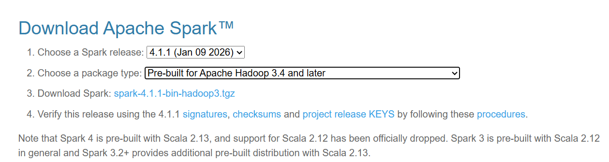

# 💻Clase 12 - Introducción a Spark

---

# Agenda:

<aside>
💡

#### 9:00 - 9:50    →  Instalación de Spark 4.1.1 con Scala 2.13.17 en Windows.

#### 9:50 - 11:20   → Introducción a Spark

#### 11:40 - 12:40  → Ejercicios propuestos

#### 12:40 - 14:00  → Ejercicios propuestos

</aside>

# Instalación de Spark 4.1.1 con Scala 2.13.17 en Windows.

<aside>

Aquellos que estáis trabajando con contenedores de Docker no es necesario hacer esta instalación. Seguramente dicho contenedor trae por defecto instalado spark. Verificar la versión.  

</aside>

Esta guía documenta la configuración paso a paso de un entorno de Big Data utilizando Spark 4.1.1, Java 17 y Visual Studio Code (Kernel Almond).

## 1. Descarga de Archivos Necesarios

### 1.1. Apache Spark

1. Ve a la página oficial: [spark.apache.org](https://spark.apache.org/downloads.html).
2. Selecciona:
    - **Spark Release:** 4.1.1.
    - **Package type:** Pre-built for Apache Hadoop 3.4 and later.
3. Descarga el archivo `.tgz`.



### 1.2. Winutils (Hadoop para Windows)

Spark necesita estos binarios para gestionar permisos de archivos en Windows.

1. Ve al repositorio: [cdarlint/winutils (Hadoop 3.3.5)](https://github.com/cdarlint/winutils/tree/master/hadoop-3.3.5/bin).
2. Descarga los archivos `winutils.exe` y `hadoop.dll`.
    
    
    
    
    

---

## 2. Organización de Carpetas

Para evitar errores de rutas con espacios, instala todo en la raíz del disco `C:`.

1. **Directorio de Spark:**
    - Descomprime el archivo `.tgz` en `C:\spark`.
    - Verifica que dentro de `C:\spark` veas las carpetas `bin`, `jars`, `data`.
2. **Directorio de Hadoop:**
    - Crea la carpeta `C:\hadoop\bin`.
    - Pega allí los archivos `winutils.exe` y `hadoop.dll`.

---

## 3. Configuración de Variables de Entorno

1. Abre el buscador de Windows y escribe **"Variables de entorno"**.
    
    
    
    
    
2. En **Variables de Usuario**, haz clic en "Nueva":
    
    
    
    - Nombre: `SPARK_HOME` | Valor: `C:\spark`
        
        
        
        Pulsar en Aceptar
        
    - Nombre: `HADOOP_HOME` | Valor: `C:\hadoop`
        
        
        
3. En la misma sección, busca la variable **Path**, selecciónala y dale a **Editar**:
    
    
    
    - Añade una nueva línea: `C:\spark\bin`
        
        
        
    - Añadir otra línea: `C:\hadoop\bin`
        
        
        
4. **Opcional** Usa el botón "Subir" para mover estas rutas al principio de la lista.

---

## 4. Verificación en la Terminal

Abre una terminal nueva (PowerShell o CMD) y ejecuta:

```powershell
spark-shell --version
```

Si ves el logo de Spark y la confirmación de la versión 4.1.1, el motor está listo:


## 5. Configuración en Jupyter Notebook (VS Code)

Utiliza el kernel **Almond (Scala 2.13)**. La primera celda de tu notebook debe inicializar la sesión:

#### 5.1. Cargar dependencias de Spark SQL

```scala
import $ivy.`org.apache.spark::spark-sql:4.1.1`

import org.apache.spark.sql.SparkSession

```


#### 5.2. Crear la sesión configurada para modo local

```scala
val spark = SparkSession.builder()
  .appName("MiPrimeraClaseSpark")
  .master("local[*]")
  .getOrCreate()

println(s"Sesión de Spark iniciada. Versión: ${spark.version}")
```


#### 3. Prueba rápida: Crear un DataFrame

```scala
val df = spark.createDataFrame(Seq(
  (1, "Scala"), 
  (2, "Spark"), 
  (3, "Jupyter")
)).toDF("id", "herramienta")

df.show()
```


## 6. Consejos

- **Warnings:** Es normal ver avisos de "Illegal access" en Java 17. No afectan la ejecución.
- **Spark UI:** Mientras el notebook esté corriendo, visita `http://localhost:4040` para ver el plan de ejecución.
    
    
    

## Introducción a Spark

---

---


## 💻 BLOQUE PRÁCTICO  - Primeros pasos

---

### Celda 1 — Añadir la dependencia de Spark con `$ivy`

<aside>

En Almond, las dependencias se añaden con la directiva `$ivy` en lugar de `build.sbt`. Esto es específico del entorno notebook; en proyectos sbt seguiríamos usando `libraryDependencies`.

</aside>

```scala
// Añadimos Apache Spark Core y SQL para Scala 2.13
// El sufijo _2.13 es gestionado automáticamente por $ivy cuando usamos %%
import $ivy.`org.apache.spark::spark-core:4.1.1`
import $ivy.`org.apache.spark::spark-sql:4.1.1`

println("✅ Dependencias de Spark cargadas correctamente")
```

> ⏳ **La primera ejecución de esta celda tardará entre 1 y 3 minutos.** Almond descarga los JARs de Spark desde Maven Central. Es completamente normal. Las ejecuciones posteriores (en la misma sesión) son instantáneas porque los JARs quedan en caché.
> 

Salida esperada:

```
✅ Dependencias de Spark cargadas correctamente
```

> ⚙️ **Versión Spark:** Apache Spark **4.1.1** · Scala **2.13** (Spark 4.x ya solo compila para `_2.13`; el soporte para `_2.12` fue eliminado en Spark 4.0)
> 

---

### Celda 2 — Silenciar los logs de Spark (importante)

<aside>

Spark es muy verboso por defecto: imprime decenas de líneas de logs INFO que dificultan ver el output real. Silenciamos todo lo que no sea errores:

</aside>

```scala
import org.apache.log4j.{Level, Logger}

// Silenciamos los logs de Spark para que el output sea legible
Logger.getLogger("org").setLevel(Level.ERROR)
Logger.getLogger("akka").setLevel(Level.ERROR)

println("✅ Logs de Spark configurados (solo se mostrarán errores)")
```

Salida esperada:

```
✅ Logs de Spark configurados (solo se mostrarán errores)
```

---

### Celda 3 — Crear la SparkSession

<aside>

La `SparkSession` es el punto de entrada unificado de Spark desde la versión 2.0. Reemplaza al antiguo `SparkContext` y al `SQLContext`. En la práctica, siempre empezarás creando una.

</aside>

```scala
import org.apache.spark.sql.SparkSession

// Creamos la SparkSession en modo local
// "local[*]" significa: usa todos los núcleos de CPU disponibles
val spark = SparkSession.builder()
  .appName("IntroSpark")   // nombre visible en el Spark UI
  .master("local[*]")                    // modo local, todos los núcleos
  .config("spark.ui.showConsoleProgress", "false")  // sin barras de progreso
  .getOrCreate()

// Obtenemos el SparkContext desde la sesión
val sc = spark.sparkContext

println(s"✅ SparkSession creada correctamente")
println(s"   Versión de Spark: ${spark.version}")
println(s"   Nombre de la app: ${sc.appName}")
println(s"   Master:           ${sc.master}")
println(s"   Spark UI:         http://localhost:4040")
```

Salida esperada:

```
✅ SparkSession creada correctamente
   Versión de Spark: 4.1.1
   Nombre de la app: Dia11-Sesion1-IntroSpark
   Master:           local[*]
   Spark UI:         http://localhost:4040
```

> 🌐 **Ahora mismo ya puedes abrir `http://localhost:4040` en tu navegador** para ver el Spark UI. Está vacío porque todavía no hemos ejecutado ningún job, pero el servidor ya está corriendo.
> 

---

### Celda 4 — Crear el primer RDD

<aside>

Un RDD se puede crear de dos formas: **paralelizando una colección existente** en memoria (como haremos ahora, ideal para aprender) o **leyendo datos de una fuente externa** como ficheros de texto, HDFS o S3 (lo haremos en sesiones posteriores).

</aside>

```scala
// Creamos un RDD a partir de una lista de Scala
// parallelize() distribuye la colección en particiones
val numeros = sc.parallelize(List(1, 2, 3, 4, 5, 6, 7, 8, 9, 10))

// Inspeccionamos el RDD (esto NO es una acción todavía)
println(s"Tipo del RDD:       ${numeros.getClass.getSimpleName}")
println(s"Número de partes:   ${numeros.getNumPartitions}")
println(s"¿Se ha ejecutado?:  No — solo hemos definido el plan")
```

Salida esperada:

```
Tipo del RDD:       ParallelCollectionRDD
Número de partes:   8   (varía según los núcleos de tu CPU)
¿Se ha ejecutado?:  No — solo hemos definido el plan
```

> 💡 El número de particiones por defecto en modo local es igual al número de núcleos de tu CPU. Si tienes 4 núcleos lógicos, verás 4 particiones; si tienes 8, verás 8. Cada partición puede procesarse en paralelo por un executor diferente.
> 

---

### Celda 5 — Primera transformación: `filter` y `map`

<aside>

Ahora aplicamos transformaciones. Recuerda: **estas líneas no calculan nada todavía**, solo construyen el plan de ejecución.

</aside>

```scala
// Transformación 1: filtrar solo los números pares
// Esta línea NO ejecuta nada — solo define el plan
val pares = numeros.filter(n => n % 2 == 0)

// Transformación 2: calcular el cuadrado de cada número par
// Tampoco ejecuta nada — extiende el plan anterior
val cuadradosDePares = pares.map(n => n * n)

println("Transformaciones definidas (plan listo, pero aún sin ejecutar):")
println(s"  numeros            → ${numeros.toDebugString.split('\n').head}")
println(s"  pares              → filtrar pares")
println(s"  cuadradosDePares   → elevar al cuadrado")
println()
println("Para ejecutar el plan, necesitamos una ACCIÓN...")
```

---

### Celda 6 — Primera acción: `collect()`

<aside>

Aquí es donde ocurre la magia. Al llamar a `collect()`, Spark optimiza el plan completo, lo distribuye entre los executors y devuelve el resultado al Driver.

</aside>

```scala
// collect() es una ACCIÓN — aquí sí se ejecuta todo el plan
// ⚠️ En producción, collect() solo se usa con datasets pequeños
//    porque trae todos los datos al Driver (memoria del notebook)
val resultado = cuadradosDePares.collect()

println("✅ Acción collect() ejecutada — el job ha terminado")
println(s"Cuadrados de los números pares del 1 al 10:")
println(resultado.mkString(", "))
```

Salida esperada:

```
✅ Acción collect() ejecutada — el job ha terminado
Cuadrados de los números pares del 1 al 10:
4, 16, 36, 64, 100
```

> 🌐 **Ahora ve a `http://localhost:4040`** y observa que aparece un Job completado. Haz clic en él para ver las Stages y las Tasks. Verás que el trabajo se dividió en tantas tareas como particiones tiene el RDD.
> 

---

### Celda 7 — Acciones de agregación: `count`, `sum`, `reduce`

<aside>

Practicamos las acciones de agregación más comunes:

</aside>

```scala
val datos = sc.parallelize(List(10, 20, 30, 40, 50, 60, 70, 80, 90, 100))

// count() devuelve el número de elementos (una acción)
val total = datos.count()

// sum() calcula la suma de todos los elementos
val suma = datos.sum()

// reduce() aplica una función binaria de forma distribuida
// Aquí calculamos el máximo: de dos elementos, quedamos con el mayor
val maximo = datos.reduce((a, b) => if (a > b) a else b)

// first() devuelve el primer elemento (sin traer todo al Driver)
val primero = datos.first()

println(s"Número de elementos: $total")
println(s"Suma total:          $suma")
println(s"Valor máximo:        $maximo")
println(s"Primer elemento:     $primero")
```

Salida esperada:

```
Número de elementos: 10
Suma total:          550.0
Valor máximo:        100
Primer elemento:     10
```

---

### Celda 8 — Transformaciones sobre texto: el WordCount clásico

<aside>

El "Hola Mundo" de Spark es el WordCount: contar cuántas veces aparece cada palabra en un texto. Es sencillo pero ilustra perfectamente el modelo map-reduce distribuido.

</aside>

```scala
// Datos de ejemplo: un RDD de líneas de texto
val lineas = sc.parallelize(List(
  "apache spark es un motor de procesamiento distribuido",
  "spark procesa datos en memoria de forma muy eficiente",
  "scala es el lenguaje nativo de apache spark",
  "spark tiene apis en scala python java y r"
))

// Paso 1: dividir cada línea en palabras (flatMap aplana la lista de listas)
val palabras = lineas.flatMap(linea => linea.split(" "))

// Paso 2: convertir cada palabra en un par (palabra, 1)
// Los pares (K, V) son la base del modelo MapReduce
val pares = palabras.map(palabra => (palabra, 1))

// Paso 3: sumar los valores agrupados por clave (palabra)
// reduceByKey aplica la función a todos los valores con la misma clave
val conteo = pares.reduceByKey((a, b) => a + b)

// Paso 4: ordenar por conteo descendente (acción implícita en sortBy)
val ordenado = conteo.sortBy({ case (_, count) => count }, ascending = false)

// Acción: traer los resultados al Driver
val top10 = ordenado.take(10)  // take(N) es más eficiente que collect() para los primeros N

println("Top 10 palabras más frecuentes:")
println("─" * 35)
top10.foreach { case (palabra, count) =>
  println(f"  $palabra%-30s → $count veces")
}
```

Salida esperada:

```
Top 10 palabras más frecuentes:
───────────────────────────────────
  spark                          → 4 veces
  apache                         → 2 veces
  de                             → 2 veces
  en                             → 2 veces
  es                             → 2 veces
  scala                          → 2 veces
  ...
```

---

### Celda 9 — Caché: guardando resultados en memoria

<aside>

Una de las grandes ventajas de Spark sobre MapReduce es la capacidad de **guardar un RDD en memoria** para reutilizarlo sin recalcularlo. Esto es especialmente útil cuando el mismo RDD se usa en múltiples acciones.

</aside>

```scala
import org.apache.spark.storage.StorageLevel

// RDD que simula un dataset de ventas con procesamiento costoso
val ventas = sc.parallelize(1 to 1_000_000)
  .map(id => (id, scala.util.Random.nextInt(1000), scala.util.Random.nextInt(50)))
  // (id, importe, region_id)

// Indicamos a Spark que guarde este RDD en memoria cuando se calcule por primera vez
// MEMORY_AND_DISK: si no cabe en RAM, desborda a disco (más seguro)
ventas.persist(StorageLevel.MEMORY_AND_DISK)

// Primera acción: Spark calcula el RDD y lo guarda en caché
val totalVentas = ventas.count()
println(s"Total de ventas: $totalVentas")

// Segunda acción: Spark REUTILIZA el RDD cacheado (mucho más rápido)
val importeTotal = ventas.map { case (_, importe, _) => importe }.sum()
println(f"Importe total: $importeTotal%.0f")

// Cuando ya no necesitamos el RDD, liberamos la memoria
ventas.unpersist()
println("✅ Caché liberado")
```

> 🌐 **Vuelve al Spark UI** (`http://localhost:4040`) y haz clic en la pestaña "Storage". Verás el RDD listado como "Cached" durante el tiempo que está en memoria.
> 

---

### Celda 10 — El DAG: visualizando el plan de ejecución

<aside>

Spark organiza el trabajo en un **DAG** (Directed Acyclic Graph, Grafo Acíclico Dirigido). Cada transformación añade un nodo al grafo; cada acción dispara la ejecución del subgrafo completo. El método `toDebugString()` muestra el linaje de un RDD:

</aside>

```scala
// Construimos un pipeline de varias transformaciones
val pipeline = sc.parallelize(1 to 20)
  .filter(_ % 2 == 0)           // solo pares
  .map(n => n * n)              // elevar al cuadrado
  .filter(_ > 50)               // solo los mayores que 50
  .map(n => s"resultado: $n")   // convertir a string

// toDebugString muestra el grafo de dependencias (linaje del RDD)
println("Linaje del RDD (de abajo a arriba = del origen al resultado):")
println("─" * 60)
println(pipeline.toDebugString)
println("─" * 60)
println()

// Ejecutamos la acción para ver el resultado
val resultados = pipeline.collect()
println(s"Resultados (${resultados.length} elementos):")
resultados.foreach(println)
```

Salida esperada:

```
Linaje del RDD (de abajo a arriba = del origen al resultado):
────────────────────────────────────────────────────────────
(8) MapPartitionsRDD[...] at map at ...
 |  FilteredRDD[...] at filter at ...
 |  MapPartitionsRDD[...] at map at ...
 |  FilteredRDD[...] at filter at ...
 |  ParallelCollectionRDD[...] at parallelize at ...
────────────────────────────────────────────────────────────

Resultados (5 elementos):
resultado: 64
resultado: 100
resultado: 144
resultado: 196
resultado: 256
```

---

### Celda 11 — Cerrar la SparkSession

<aside>

Es buena práctica cerrar la `SparkSession` al terminar. Al cerrarla, el Spark UI (puerto 4040) también se apaga.

</aside>

```scala
spark.stop()
println("✅ SparkSession cerrada correctamente")
println("   El Spark UI (localhost:4040) ya no está disponible")
```

---

### 🔖 Resumen

| Concepto | Descripción breve |
| --- | --- |
| `SparkSession` | Punto de entrada unificado. Se crea con `.builder.master(...).getOrCreate()` |
| `SparkContext` | Motor de bajo nivel. Se obtiene con `spark.sparkContext` |
| `local[*]` | Modo local usando todos los núcleos de la CPU |
| RDD | Colección distribuida, inmutable y tolerante a fallos |
| Transformación | Operación perezosa que devuelve otro RDD (`filter`, `map`, `flatMap`) |
| Acción | Dispara la ejecución y devuelve un resultado (`collect`, `count`, `reduce`) |
| `persist()` / `cache()` | Guarda un RDD en memoria para reutilizarlo |
| `$ivy` | Directiva de Almond para añadir dependencias en notebooks |
| Spark UI | Interfaz web en `localhost:4040` para monitorizar jobs |

---

# Ejercicios propuestos:

> 📌 Todos los ejercicios se resuelven en el mismo notebook. Recuerda cargar las dependencias y crear la `SparkSession` en las primeras celdas antes de empezar. La `SparkSession` solo necesitas crearla una vez por sesión de notebook.
> 

---

## ⚙️ Celda de configuración inicial (ejecutar antes de los ejercicios)

```scala
import $ivy.`org.apache.spark::spark-core:4.1.1`
import $ivy.`org.apache.spark::spark-sql:4.1.1`

import org.apache.log4j.{Level, Logger}
Logger.getLogger("org").setLevel(Level.ERROR)
Logger.getLogger("akka").setLevel(Level.ERROR)

import org.apache.spark.sql.SparkSession

val spark = SparkSession.builder()
  .appName("Ejercicios")
  .master("local[*]")
  .config("spark.ui.showConsoleProgress", "false")
  .getOrCreate()

val sc = spark.sparkContext
println(s"✅ Entorno listo — Spark ${spark.version}")
```

---

## 📝 Ejercicios

---

### Ejercicio 1 — Crear y explorar un RDD de temperaturas

Crea un RDD a partir de la siguiente lista de temperaturas en grados Celsius registradas durante una semana en distintas ciudades. Luego imprime cuántas particiones tiene el RDD y confirma de qué tipo es usando `getClass.getSimpleName`.

```scala
val temperaturas = List(22.5, 18.0, 35.1, 12.3, 28.7, 9.4, 31.0, 25.5, 17.2, 33.8)
// Tu código aquí
```

**Salida esperada:**

```
Tipo del RDD: ParallelCollectionRDD
Número de particiones: (depende de los núcleos de tu CPU)
```

---

### Ejercicio 2 — Filtrar temperaturas extremas

Usando el RDD del ejercicio anterior, aplica dos transformaciones encadenadas: primero filtra las temperaturas **superiores a 20 grados**, y sobre ese resultado filtra de nuevo las que sean **inferiores a 30 grados**. Recoge el resultado con `collect()` e imprímelo.

```scala
// Tu código aquí
```

**Salida esperada:**

```
Temperaturas entre 20 y 30 grados: List(22.5, 28.7, 25.5)
```

---

### Ejercicio 3 — Transformación de unidades

A partir del mismo RDD de temperaturas, crea un nuevo RDD que convierta cada valor de Celsius a Fahrenheit usando la fórmula `F = C * 9/5 + 32`. Recoge el resultado e imprímelo redondeado a un decimal.

```scala
// La fórmula: fahrenheit = celsius * 9.0 / 5.0 + 32.0
// Tu código aquí
```

**Salida esperada:**

```
Temperaturas en Fahrenheit:
72.5, 64.4, 95.2, 54.1, 83.7, 48.9, 87.8, 77.9, 63.0, 92.8
```

---

### Ejercicio 4 — Acciones de estadística básica

Crea un RDD con los precios de los siguientes artículos de una tienda online y calcula, usando las acciones de Spark, el número total de artículos, el precio más alto y el precio más bajo. No uses `collect()` para esto: encuentra las acciones específicas que devuelven cada valor directamente.

```scala
val precios = sc.parallelize(List(49.99, 12.50, 199.00, 7.99, 89.90, 34.99, 149.95, 22.00))
// Tu código aquí
```

**Salida esperada:**

```
Número de artículos: 8
Precio más alto:  199.0
Precio más bajo:  7.99
```

---

### Ejercicio 5 — Entender la lazy evaluation

Este ejercicio es conceptual y de observación. Ejecuta las siguientes dos celdas **por separado** y observa en qué momento aparece actividad en el Spark UI (`http://localhost:4040`).

**Celda A** — solo transformaciones:

```scala
val numeros = sc.parallelize(1 to 100)
val multiplosde7 = numeros.filter(n => n % 7 == 0)
val dobles = multiplosde7.map(n => n * 2)
println("Celda A ejecutada — ¿Hay un nuevo job en el Spark UI?")
```

**Celda B** — la acción:

```scala
val resultado = dobles.collect()
println("Celda B ejecutada — ¿Y ahora en el Spark UI?")
println(s"Resultado: ${resultado.mkString(", ")}")
```

**Salida esperada de la Celda B:**

```
Celda B ejecutada — ¿Y ahora en el Spark UI?
Resultado: 14, 28, 42, 56, 70, 84, 98, 112, 126, 140, 154, 168, 182, 196
```

> 💭 **Reflexiona:** ¿En qué celda apareció el job en el Spark UI? ¿Qué nos dice eso sobre cuándo Spark realmente trabaja?
> 

---

### Ejercicio 6 — Pipeline de transformaciones sobre nombres

Crea un RDD a partir de la siguiente lista de nombres de empleados. Aplica en cadena estas tres transformaciones: convierte cada nombre a mayúsculas, filtra solo los que empiecen por la letra `"A"`, y luego ordénalos alfabéticamente. Usa `collect()` y muestra el resultado.

```scala
val empleados = sc.parallelize(List(
  "ana garcía", "pedro López", "alba martínez", "carlos ruiz",
  "adriana vega", "beatriz soler", "antonio mora", "sara jiménez"
))
// Tu código aquí
```

**Salida esperada:**

```
Empleados cuyo nombre empieza por A (en mayúsculas):
ANA GARCÍA
ADRIANA VEGA
ANTONIO MORA
```

---

### Ejercicio 7 — `flatMap` sobre líneas de texto

Dado el siguiente RDD de frases sobre tecnología, usa `flatMap` para obtener un RDD con **todas las palabras individuales** de todas las frases. Luego cuenta cuántas palabras hay en total usando una acción.

```scala
val frases = sc.parallelize(List(
  "spark procesa datos a gran velocidad",
  "scala es el lenguaje nativo de spark",
  "los datos se procesan en memoria ram",
  "hadoop almacena datos en disco hdfs"
))
// Tu código aquí
```

**Salida esperada:**

```
Total de palabras en todas las frases: 28
```

---

### Ejercicio 8 — `reduce` para encontrar el máximo sin usar `max()`

Crea un RDD con los siguientes valores de ventas diarias (en euros) y usa `reduce()` para encontrar el valor más alto. **No está permitido usar los métodos `max()` ni `sum()` de Spark**: el cálculo debe hacerse con una función lambda dentro de `reduce`.

```scala
val ventasDiarias = sc.parallelize(List(1520.0, 890.5, 2340.0, 670.0, 1890.75, 3100.0, 450.25))
// Tu código aquí — usa reduce con una función lambda
```

**Salida esperada:**

```
Venta diaria más alta: 3100.0 €
```

---

### Ejercicio 9 — Contar elementos que cumplen una condición

A partir de un RDD con las edades de los visitantes de una web, calcula cuántos visitantes son **mayores de edad** (18 años o más) usando una combinación de `filter` y `count()`. Luego calcula también el porcentaje que representan sobre el total.

```scala
val edades = sc.parallelize(List(
  14, 23, 17, 35, 16, 28, 42, 15, 19, 31, 13, 25, 18, 22, 16, 45, 20, 12
))
// Tu código aquí
```

**Salida esperada:**

```
Total visitantes:    18
Mayores de edad:     11
Porcentaje:          61.1%
```

---

### Ejercicio 10 — WordCount de hashtags

Tienes el siguiente RDD con publicaciones de redes sociales. Usa `flatMap`, `map` y `reduceByKey` para contar cuántas veces aparece cada **hashtag** (palabras que empiezan por `#`). Muestra los resultados ordenados de mayor a menor frecuencia.

```scala
val publicaciones = sc.parallelize(List(
  "hoy aprendemos #spark con #scala en clase",
  "me encanta #scala es un lenguaje potente",
  "procesando big data con #spark y #hadoop",
  "#spark es más rápido que #hadoop en memoria",
  "aprendiendo #scala y #spark juntos hoy"
))
// Pista: después de flatMap, filtra solo las palabras que empiecen por "#"
// Tu código aquí
```

**Salida esperada:**

```
Frecuencia de hashtags:
  #spark   → 4 veces
  #scala   → 3 veces
  #hadoop  → 2 veces
```

---

### Ejercicio 11 — Verificar el linaje con `toDebugString`

Construye el siguiente pipeline de transformaciones y usa `toDebugString` para imprimir su linaje **antes** de ejecutar ninguna acción. Luego ejecuta `collect()` y comprueba que el resultado es correcto.

```scala
val notas = sc.parallelize(List(4.5, 7.0, 3.2, 9.1, 5.5, 8.8, 2.0, 6.3, 7.7, 4.9))
// Paso 1: filtra las notas aprobadas (>= 5.0)
// Paso 2: multiplica cada nota por 10 para obtener la puntuación sobre 100
// Paso 3: filtra las que sean mayores o iguales a 70 (notable o superior)
// Tu código aquí — imprime toDebugString antes de collect()
```

**Salida esperada:**

```
Linaje del RDD:
(N) MapPartitionsRDD...
 |  FilteredRDD...
 |  MapPartitionsRDD...
 |  FilteredRDD...
 |  ParallelCollectionRDD...

Puntuaciones de notable o superior: List(70.0, 91.0, 88.0, 77.0)
```

---

### Ejercicio 12 — `take` vs `collect`

Crea un RDD con los números del 1 al 1000 y aplica una transformación que calcule el cubo de cada número (`n * n * n`). Luego usa `take(5)` para mostrar solo los cinco primeros resultados **sin traer los 1000 elementos al Driver**. Como segundo paso, usa `count()` para confirmar cuántos elementos tiene el RDD resultante.

```scala
val rango = sc.parallelize(1 to 1000)
// Tu código aquí
```

**Salida esperada:**

```
Primeros 5 cubos (con take): 1, 8, 27, 64, 125
Total de elementos en el RDD: 1000
```

---

### Ejercicio 13 — Cachear un RDD reutilizado

Crea un RDD con los números del 1 al 500.000. Aplica un `filter` que se quede solo con los múltiplos de 3. **Persiste ese RDD en memoria** antes de ejecutar ninguna acción. Luego realiza dos acciones consecutivas sobre él: `count()` y `sum()`. Finalmente, libera el caché con `unpersist()`.

El objetivo es observar en el Spark UI que la segunda acción reutiliza el RDD cacheado en lugar de recalcularlo.

```scala
val granRdd = sc.parallelize(1 to 500000)
// Tu código aquí:
// 1. Crea el RDD de múltiplos de 3
// 2. Persiste el RDD
// 3. count() — primera acción
// 4. sum()   — segunda acción (debe usar el caché)
// 5. unpersist()
```

**Salida esperada:**

```
Múltiplos de 3 entre 1 y 500000:
  Cantidad:  166666
  Suma total: 41666916666.0
✅ Caché liberado
```

---

### Ejercicio 14 — Crear y nombrar correctamente la SparkSession

Sin cerrar la sesión que ya tienes abierta, observa el comportamiento de `getOrCreate()` cuando la sesión ya existe. Intenta crear una segunda `SparkSession` con un `appName` diferente y comprueba qué nombre devuelve en realidad.

```scala
// Intenta crear una SEGUNDA SparkSession con otro nombre
val spark2 = SparkSession.builder()
  .appName("SesionNueva-Que-No-Existira")
  .master("local[*]")
  .getOrCreate()

// ¿Cuál es el nombre real de spark2?
println(s"Nombre de spark2: ${spark2.sparkContext.appName}")
println(s"¿spark y spark2 son la misma sesión?: ${spark eq spark2}")
```

> 💭 **Reflexiona:** `getOrCreate()` devuelve siempre la sesión ya activa si existe una. ¿Por qué crees que es esto una decisión de diseño importante en un entorno distribuido?
> 

---

### Ejercicio 15 — Pipeline completo: de datos en bruto a resumen

Este ejercicio integra todo lo visto en la sesión. Tienes el siguiente RDD con registros de accesos a un servidor web (formato: `"IP MÉTODO RUTA CÓDIGO_HTTP"`). Construye un pipeline que:

1. Filtre solo los registros con código HTTP `404` (página no encontrada).
2. Extraiga únicamente la ruta de cada registro fallido.
3. Cuente cuántas veces aparece cada ruta con `reduceByKey`.
4. Ordene las rutas por número de accesos fallidos de mayor a menor.
5. Muestre el resultado con `take(5)`.

```scala
val logs = sc.parallelize(List(
  "192.168.1.1 GET /inicio 200",
  "192.168.1.2 GET /productos 404",
  "192.168.1.3 POST /login 200",
  "192.168.1.4 GET /productos 404",
  "192.168.1.5 GET /contacto 404",
  "192.168.1.6 GET /inicio 200",
  "192.168.1.7 GET /productos 404",
  "192.168.1.8 GET /blog 404",
  "192.168.1.9 GET /contacto 404",
  "192.168.1.10 GET /productos 404"
))

// Pista: cada línea se puede dividir con .split(" ")
// El código HTTP es el último elemento del array resultante (índice 3)
// La ruta es el tercer elemento (índice 2)
// Tu código aquí
```

**Salida esperada:**

```
Rutas con más errores 404:
  /productos → 4 accesos fallidos
  /contacto  → 2 accesos fallidos
  /blog      → 1 accesos fallidos
```

---

# 🏢 Caso de Empresa

---

## 🎬 Contexto: MediaStream España, S.L.

**MediaStream España** es una plataforma de streaming de vídeo con sede en Madrid que opera en España, Portugal y México. La plataforma tiene actualmente **2,3 millones de suscriptores activos** y un catálogo de más de 8.000 títulos entre series, películas y documentales.

El equipo de tecnología ha estado trabajando durante meses con hojas de cálculo Excel para analizar el comportamiento de sus usuarios. El problema es evidente: cuando el fichero de reproducciones supera unas pocas decenas de miles de filas, Excel se congela, los análisis tardan horas y los analistas no pueden trabajar en tiempo razonable. El departamento de datos ha decidido dar el salto a Apache Spark.

Tú has sido contratado como practicante Junior en Big Data y esta es tu primera semana. Tu responsable, Carmen Delgado, te ha asignado una tarea de iniciación: procesar un conjunto de datos de reproducciones del último día y extraer métricas básicas de negocio. Los datos ya están preparados y cargados en memoria. Ahora necesitas el motor de cómputo.

> 💬 *"No espero que resuelvas todo el problema de Big Data de la empresa en un día"*, te dice Carmen antes de salir a una reunión. *"Lo que necesito es que configures el entorno de Spark, que demuestres que puedes extraer información útil de los datos con operaciones básicas, y que el código esté limpio y comentado. El equipo directivo quiere ver resultados esta tarde."*
> 

---

## 📋 Los datos

El equipo de ingeniería te ha proporcionado los datos del **último día de actividad** en formato de lista Scala. Cada elemento representa una reproducción y contiene: el identificador del usuario, el título del contenido, el género y la duración visualizada en minutos.

El formato de cada registro es una tupla de cuatro campos:
`(usuario_id, titulo, genero, minutos_vistos)`

```scala
val reproducciones = List(
  ("U001", "La Casa de Papel",         "Serie",        47),
  ("U002", "Dune: Parte Dos",          "Película",     95),
  ("U003", "Cosmos: Mundos Posibles",  "Documental",   42),
  ("U001", "Dune: Parte Dos",          "Película",    107),
  ("U004", "La Casa de Papel",         "Serie",        52),
  ("U005", "El Problema de los 3 Cuerpos", "Serie",   58),
  ("U002", "Cosmos: Mundos Posibles",  "Documental",   38),
  ("U006", "La Casa de Papel",         "Serie",        49),
  ("U003", "El Problema de los 3 Cuerpos", "Serie",   61),
  ("U007", "Dune: Parte Dos",          "Película",     88),
  ("U005", "La Casa de Papel",         "Serie",        44),
  ("U008", "Cosmos: Mundos Posibles",  "Documental",   55),
  ("U004", "El Problema de los 3 Cuerpos", "Serie",   63),
  ("U009", "Dune: Parte Dos",          "Película",    112),
  ("U006", "Cosmos: Mundos Posibles",  "Documental",   29),
  ("U010", "La Casa de Papel",         "Serie",        51),
  ("U007", "El Problema de los 3 Cuerpos", "Serie",   57),
  ("U008", "La Casa de Papel",         "Serie",        46),
  ("U001", "Cosmos: Mundos Posibles",  "Documental",   33),
  ("U009", "La Casa de Papel",         "Serie",        48),
  ("U010", "Dune: Parte Dos",          "Película",    102),
  ("U002", "El Problema de los 3 Cuerpos", "Serie",   60),
  ("U003", "Dune: Parte Dos",          "Película",     91),
  ("U011", "Cosmos: Mundos Posibles",  "Documental",   47),
  ("U012", "La Casa de Papel",         "Serie",        53)
)
```

---

## 🎯 Tu misión: cuatro análisis para el informe de Carmen

Carmen necesita cuatro métricas concretas para su informe de tarde. Cada una es una tarea independiente que puedes resolver con lo que has aprendido hoy. Léelas todas antes de empezar para planificar el notebook.

---

### Tarea 1 — Preparar el entorno y cargar los datos como RDD

Antes de poder analizar nada, necesitas poner en marcha el motor. Configura el entorno Spark completo: añade las dependencias con `$ivy`, silencia los logs, crea la `SparkSession` en modo local con un nombre de aplicación que identifique claramente el proyecto (`"MediaStream-Analisis-Dia1"`), y paraleliza la lista de reproducciones para convertirla en un RDD.

Una vez tengas el RDD, imprime su número de particiones y confirma la versión de Spark en uso. Carmen quiere ver que el entorno arrancó correctamente antes de confiar en los resultados.

**Salida esperada al final de esta tarea:**

```
✅ Entorno MediaStream listo
   Spark version : 4.1.1
   App name      : MediaStream-Analisis-Dia1
   Particiones   : (depende de tu CPU)
   Registros     : 25
```

---

### Tarea 2 — ¿Cuántas reproducciones completas hubo ayer?

El equipo de producto define una "reproducción completa" como aquella en la que el usuario vio **más de 45 minutos**. Carmen quiere saber cuántas reproducciones del día anterior cumplen ese criterio y qué porcentaje representan sobre el total.

Utiliza una transformación `filter` seguida de la acción `count()` para obtener el dato. Calcula el porcentaje haciendo la división entre el conteo filtrado y el total de registros.

**Salida esperada:**

```
── Reproducciones completas (> 45 min) ──
Total de reproducciones ayer : 25
Reproducciones completas     : 18
Porcentaje completadas       : 72.0%
```

---

### Tarea 3 — ¿Qué género consumió más minutos en total?

El departamento de contenidos necesita saber en qué género se concentró el consumo del día para tomar decisiones de inversión. Necesitas calcular el total de minutos vistos agrupado por género.

Para lograrlo, transforma el RDD en pares `(genero, minutos)` y luego usa `reduceByKey` para sumar los minutos de cada género. Ordena el resultado de mayor a menor consumo y recógelo con `collect()` para mostrarlo.

**Salida esperada:**

```
── Minutos totales por género ──
Serie       → 748 minutos
Película    → 595 minutos
Documental  → 244 minutos
```

---

### Tarea 4 — ¿Cuál es el contenido más visto y cuántos usuarios únicos lo vieron?

Carmen quiere saber qué título acumuló más reproducciones durante el día y, de ese título, cuántos usuarios distintos lo vieron. Son dos preguntas relacionadas que puedes resolver en secuencia sobre el mismo RDD. 

Para la primera parte, transforma el RDD en pares `(titulo, 1)` y usa `reduceByKey` para contar el número de reproducciones por título. Usa `reduce` sobre ese resultado para quedarte con el par que tenga el conteo más alto.

Para la segunda parte, filtra el RDD original para quedarte solo con las reproducciones del título más visto, extrae los identificadores de usuario con `map`, elimina los duplicados con `distinct()` y cuenta el resultado.

**Salida esperada:**

```
── Contenido más popular ──
Título más visto    : La Casa de Papel
Número de reproducciones : 8
Usuarios únicos que lo vieron : 7
```

---

## 🚀 Pregunta adicional

Carmen tiene una petición extra: identifica qué usuario individual acumuló **más minutos totales de visualización** en el día. Necesitarás transformar el RDD en pares `(usuario_id, minutos)`, sumar los minutos por usuario con `reduceByKey`, y luego usar `reduce` para encontrar el par con el valor más alto.

**Salida esperada del reto:**

```
── Usuario más activo del día ──
Usuario : U001
Minutos totales vistos : 187
```