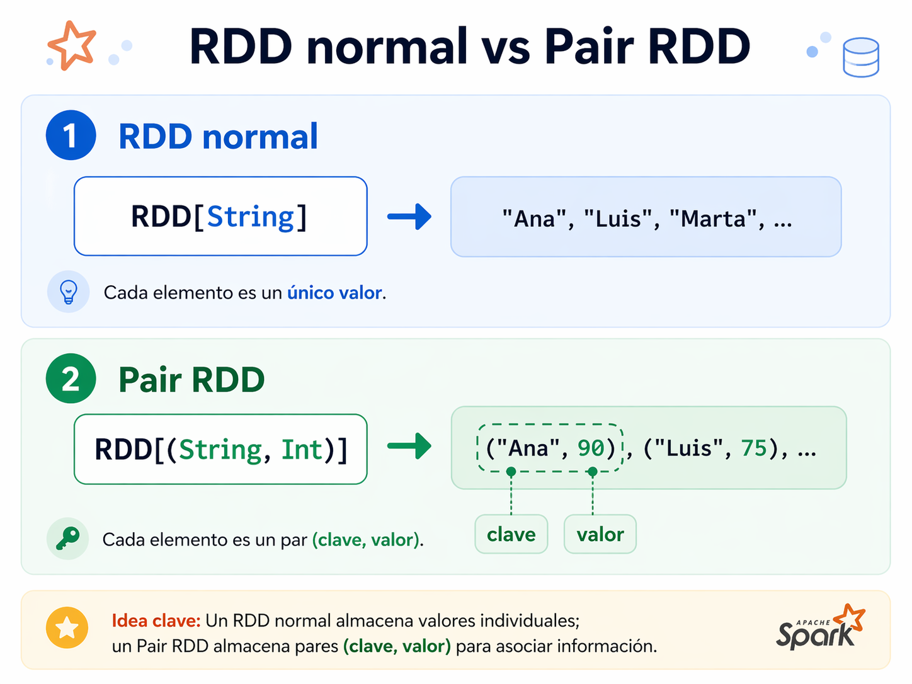

# 💻Clase 15 - Ops clave valor e Intro a Dataframes

---

# Agenda:

<aside>
💡

#### 9:00 - 9:50    →  Sesión 1  - Pair RDDs y operaciones clave-valor

#### 9:50 - 11:20   → Ejercicios y caso de uso

#### 11:40 - 12:40  → Sesión 2 - Spark DataFrames I: Introducción

#### 12:40 - 14:00  → Ejercicios y caso de uso

</aside>

# Sesión 1 : Pair RDDs y operaciones clave-valor

---

---

# 🧠 Teoría

## 1. ¿Qué son los Pair RDDs?

Hasta ahora hemos trabajado con RDDs que contienen valores simples: números, cadenas de texto, objetos. Un **Pair RDD** es simplemente un RDD cuyos elementos son **tuplas de dos elementos**: una clave y un valor.



La estructura `(clave, valor)` permite a Spark **agrupar, combinar y agregar datos** de forma distribuida, de manera muy similar a cómo funciona un `GROUP BY` en SQL.

---

## 2. Crear un Pair RDD

La forma más común es usar `.map` para transformar un RDD existente en tuplas:

```scala
import org.apache.spark.sql.SparkSession

val spark = SparkSession.builder()
  .appName("PairRDDs")
  .master("local[*]")
  .getOrCreate()

val sc = spark.sparkContext

// RDD de ventas como cadenas: "producto,región,importe"
val ventas = sc.parallelize(List(
  "Laptop,Norte,1200",
  "Teclado,Sur,45",
  "Monitor,Norte,350",
  "Laptop,Sur,1200",
  "Ratón,Norte,25",
  "Monitor,Sur,350",
  "Teclado,Norte,45"
))

// Convertimos a Pair RDD: (región, importe)
val ventasPorRegion = ventas.map { linea =>
  val campos = linea.split(",")
  val region  = campos(1)
  val importe = campos(2).toDouble
  (region, importe)   // ← tupla (clave, valor)
}

ventasPorRegion.collect().foreach(println)
// (Norte,1200.0)
// (Sur,45.0)
// (Norte,350.0)
// (Sur,1200.0)
// (Norte,25.0)
// (Sur,350.0)
// (Norte,45.0)
```

---

## 3. Operaciones básicas sobre Pair RDDs

### 3.1 `keys` y `values` — extraer un lado

```scala
val regiones = ventasPorRegion.keys
// RDD: "Norte", "Sur", "Norte", "Sur", ...

val importes = ventasPorRegion.values
// RDD: 1200.0, 45.0, 350.0, ...

println("Regiones distintas:")
regiones.distinct().collect().foreach(println)
// Norte
// Sur
```

### 3.2 `mapValues` — transformar sólo el valor

`mapValues` aplica una función **únicamente al valor** de cada par, dejando la clave intacta. Es más eficiente que `map` cuando no necesitamos tocar la clave, porque Spark puede preservar el particionado.

```scala
// Aplicar IVA (21%) solo al valor, sin tocar la clave
val ventasConIVA = ventasPorRegion.mapValues(importe => importe * 1.21)

ventasConIVA.collect().foreach(println)
// (Norte,1452.0)
// (Sur,54.45)
// (Norte,423.5)
// (Sur,1452.0)
// (Norte,30.25)
// (Sur,423.5)
// (Norte,54.45)
```

> 💡 **Regla práctica:** usa `mapValues` cuando la transformación afecta solo al valor. Usa `map` cuando necesitas cambiar también la clave o recalcular la estructura entera de la tupla.
> 

### 3.3 `flatMapValues` — expandir valores en múltiples filas

> `flatMapValues` transforma un valor en una colección de valores, generando **un par por cada elemento** de esa colección.
> 

```scala
// Datos: (cliente, "producto1|producto2|producto3")
val pedidos = sc.parallelize(List(
  ("Ana",  "Laptop|Ratón"),
  ("Luis", "Teclado|Monitor|Altavoces"),
  ("Marta","Laptop")
))

// Expande cada pedido en filas individuales por producto
val productosPorCliente = pedidos.flatMapValues(productos => productos.split("\\|"))

productosPorCliente.collect().foreach(println)
// (Ana,Laptop)
// (Ana,Ratón)
// (Luis,Teclado)
// (Luis,Monitor)
// (Luis,Altavoces)
// (Marta,Laptop)
```

---

## 4. Agregaciones sobre Pair RDDs

### 4.1 `reduceByKey` — la más sencilla

Agrupa por clave y combina los valores con una función asociativa. Ya la vimos el día anterior; la repasamos aquí como punto de partida.

```scala
// Total de ventas por región
val totalPorRegion = ventasPorRegion.reduceByKey(_ + _)

totalPorRegion.collect().foreach(println)
// (Norte,1620.0)
// (Sur,1595.0)
```

### 4.2 `aggregateByKey` — agregación con acumulador separado

`aggregateByKey` es más flexible que `reduceByKey` porque permite usar un **tipo de acumulador diferente** al tipo de los valores.

Recibe tres argumentos:

1. **Valor inicial del acumulador** (por partición)
2. **Función de combinación dentro de una partición** `(acumulador, valor) => nuevoAcumulador`
3. **Función de combinación entre particiones** `(acumulador1, acumulador2) => acumuladorFinal`

```scala
// Queremos: (región → (suma de importes, número de ventas))
// Acumulador: (Double, Int) — tipo distinto al valor original Double

val resumenPorRegion = ventasPorRegion.aggregateByKey(
  (0.0, 0)                                    // valor inicial: (suma=0.0, count=0)
)(
  (acc, valor) => (acc._1 + valor, acc._2 + 1),   // combinar dentro de partición
  (acc1, acc2) => (acc1._1 + acc2._1, acc1._2 + acc2._2) // combinar entre particiones
)

resumenPorRegion.collect().foreach { case (region, (suma, count)) =>
  val media = suma / count
  println(f"$region: total=$suma%.2f, ventas=$count, media=$media%.2f")
}
// Norte: total=1620.00, ventas=4, media=405.00
// Sur:   total=1595.00, ventas=3, media=531.67
```

### 4.3 `combineByKey` — la operación más general

`combineByKey` es la base sobre la que se construyen `reduceByKey` y `aggregateByKey`. Ofrece control total sobre tres fases:

| Fase | Función | Cuándo se ejecuta |
| --- | --- | --- |
| **createCombiner** | `V => C` | Primer valor de una clave en la partición |
| **mergeValue** | `(C, V) => C` | Siguientes valores de esa clave en la misma partición |
| **mergeCombiners** | `(C, C) => C` | Combinar resultados de diferentes particiones |

```scala
// Objetivo: para cada región → List con todos los importes
val importesPorRegion = ventasPorRegion.combineByKey(
  (v: Double) => List(v),                       // createCombiner: primer valor → List
  (acc: List[Double], v: Double) => acc :+ v,   // mergeValue: añadir al List
  (acc1: List[Double], acc2: List[Double]) => acc1 ++ acc2 // mergeCombiners: unir Lists
)

importesPorRegion.collect().foreach { case (region, lista) =>
  println(s"$region → $lista")
}
// Norte → List(1200.0, 350.0, 25.0, 45.0)
// Sur   → List(45.0, 1200.0, 350.0)
```

> 💡 **¿Cuándo usar cada uno?**
> 
> - `reduceByKey` → agregación simple, mismo tipo entrada y salida (suma, producto, max)
> - `aggregateByKey` → tipo de acumulador diferente al tipo de valor (ej: `(suma, count)`)
> - `combineByKey` → control total del proceso de combinación (estructuras complejas)

---

## 5. `groupByKey` — y por qué evitarlo

`groupByKey` agrupa todos los valores de cada clave en una colección:

```scala
val gruposPorRegion = ventasPorRegion.groupByKey()

gruposPorRegion.collect().foreach { case (region, valores) =>
  println(s"$region → ${valores.toList}")
}
// Norte → List(1200.0, 350.0, 25.0, 45.0)
// Sur   → List(45.0, 1200.0, 350.0)
```

El resultado parece el mismo que `combineByKey`, pero hay una diferencia crítica de rendimiento:

|  | `groupByKey` | `reduceByKey` / `combineByKey` |
| --- | --- | --- |
| ¿Reduce datos antes del shuffle? | ❌ No | ✅ Sí (combina en cada partición) |
| Datos transferidos por la red | Todos los valores | Solo los acumuladores parciales |
| Riesgo de OOM (Out Of Memory) | Alto con datos grandes | Bajo |

> ⚠️ **Regla de oro:** evita `groupByKey` siempre que puedas usar `reduceByKey`, `aggregateByKey` o `combineByKey`. En producción con millones de filas, la diferencia de rendimiento puede ser de minutos.
> 

---

## 6. Particionado de Pair RDDs

El particionado controla **en qué nodo del clúster** vive cada clave. Spark ofrece dos estrategias principales:

### 6.1 `HashPartitioner` — por defecto

Asigna cada clave a una partición según su código hash:

```
partición = hash(clave) % numParticiones
```

```scala
import org.apache.spark.HashPartitioner

// Reparticionar en 2 particiones con hash de la clave
val ventasParticionadas = ventasPorRegion.partitionBy(new HashPartitioner(2))

println(s"Número de particiones: ${ventasParticionadas.getNumPartitions}")
// Número de particiones: 2

// Ver qué hay en cada partición
ventasParticionadas.mapPartitionsWithIndex { (idx, iter) =>
  iter.map(par => s"Partición $idx: $par")
}.collect().foreach(println)
```

### 6.2 `RangePartitioner` — para datos ordenables

Distribuye las claves en rangos ordenados. Útil cuando la clave es numérica o se puede ordenar:

```scala
import org.apache.spark.RangePartitioner

// RDD con clave numérica: (año, ventas)
val ventasAnuales = sc.parallelize(List(
  (2020, 15000.0), (2021, 18500.0), (2022, 22000.0),
  (2023, 19000.0), (2024, 25000.0), (2019, 12000.0)
))

val rangePartitioner = new RangePartitioner(3, ventasAnuales)
val ventasRango = ventasAnuales.partitionBy(rangePartitioner)

ventasRango.mapPartitionsWithIndex { (idx, iter) =>
  iter.map(par => s"Partición $idx: $par")
}.collect().sorted.foreach(println)
// Partición 0: (2019,12000.0)
// Partición 0: (2020,15000.0)
// Partición 1: (2021,18500.0)
// Partición 1: (2022,22000.0)
// Partición 2: (2023,19000.0)
// Partición 2: (2024,25000.0)
```

> 💡 **¿Cuándo importa el particionado?**
Si vas a hacer múltiples `join` o `groupBy` sobre el mismo Pair RDD, persiste el RDD tras el `partitionBy`. Spark reutilizará el particionado existente y evitará hacer un shuffle innecesario en cada operación.
> 

---

## 📊 Resumen de operaciones sobre Pair RDDs

| Operación | Qué hace | Cuándo usarla |
| --- | --- | --- |
| `mapValues(f)` | Transforma solo el valor | La clave no cambia |
| `flatMapValues(f)` | Un valor → múltiples valores | Expandir colecciones anidadas |
| `keys` / `values` | Extrae claves o valores | Obtener un lado del par |
| `reduceByKey(f)` | Agrega por clave, mismo tipo | Sumas, máximos, conteos |
| `aggregateByKey(z)(f, g)` | Agrega con acumulador distinto | Medias, (suma, count) |
| `combineByKey(c, m, mc)` | Control total de combinación | Estructuras complejas |
| `groupByKey()` | Agrupa todos los valores | Evitar salvo que sea imprescindible |
| `partitionBy(p)` | Redistribuye por particionador | Optimizar joins repetidos |

---

---

# 💻 Práctica -

---

## 🔧 Celda de inicialización (ejecutar siempre primero)

**Celda 1 — Code:**

```scala
import $ivy.`org.apache.spark::spark-core:3.5.0`
import $ivy.`org.apache.spark::spark-sql:3.5.0`

import org.apache.spark.sql.SparkSession
import org.apache.spark.HashPartitioner
import org.apache.spark.RangePartitioner

val spark = SparkSession.builder()
  .appName("Dia13S2_PairRDDs")
  .master("local[*]")
  .config("spark.ui.showConsoleProgress", "false")
  .getOrCreate()

val sc = spark.sparkContext
sc.setLogLevel("ERROR")

println(s"✅ Spark ${spark.version} listo")
```

**Salida esperada:**

```
✅ Spark 3.5.0 listo
```

---

## 🔹 Ejercicio 1 — Análisis de ventas por región

Trabajarás con un dataset simulado de ventas de una empresa distribuidora con tres regiones: Norte, Centro y Sur.

**Datos:**

```scala
// Dataset de ventas: (producto, región, importe, unidades)
val datosVentas = sc.parallelize(List(
  ("Laptop",    "Norte",  1200.0, 3),
  ("Teclado",   "Sur",      45.0, 10),
  ("Monitor",   "Norte",   350.0, 5),
  ("Laptop",    "Sur",    1200.0, 2),
  ("Ratón",     "Norte",    25.0, 20),
  ("Monitor",   "Centro",  350.0, 4),
  ("Teclado",   "Norte",    45.0, 8),
  ("Laptop",    "Centro", 1200.0, 1),
  ("Auriculares","Sur",     80.0, 6),
  ("Ratón",     "Centro",   25.0, 15),
  ("Auriculares","Norte",   80.0, 9),
  ("Teclado",   "Centro",   45.0, 12)
))

println(s"Total registros: ${datosVentas.count()}")
```

**Paso 1: importe total por región**

```scala
// Paso 1: crear Pair RDD (región, importe_total_línea)
// El importe de cada línea es: importe_unitario * unidades
val importesPorRegion = datosVentas.map { case (producto, region, precio, uds) =>
  (region, precio * uds)
}

// Paso 2: sumar importes por región
val totalPorRegion = importesPorRegion.reduceByKey(_ + _)

println("=== Total de ventas por región ===")
totalPorRegion.sortBy(_._2, ascending = false).collect().foreach {
  case (region, total) => println(f"  $region%-10s → $total%,.2f €")
}
```

**Salida esperada:**

```
=== Total de ventas por región ===
  Norte      → 5,105.00 €
  Sur        → 3,290.00 €
  Centro     → 2,125.00 €
```

**Paso 2: media de importe por región**

```scala
// Usamos aggregateByKey para calcular (suma, count) y luego la media
val mediasPorRegion = importesPorRegion.aggregateByKey(
  (0.0, 0)
)(
  (acc, v) => (acc._1 + v, acc._2 + 1),
  (a, b)   => (a._1 + b._1, a._2 + b._2)
)

println("=== Media de importe por venta y región ===")
mediasPorRegion.collect().foreach { case (region, (suma, count)) =>
  val media = suma / count
  println(f"  $region%-10s → media $media%,.2f € (sobre $count transacciones)")
}
```

**Salida esperada:**

```
=== Media de importe por venta y región ===
  Norte      → media 1,021.00 € (sobre 5 transacciones)
  Sur        → media 823.33 € (sobre 4 transacciones)  (aprox.)
  Centro     → media 531.25 € (sobre 4 transacciones)
```

> 💡 Los valores exactos pueden variar ligeramente por el orden del procesamiento distribuido, pero las sumas deben coincidir exactamente.
> 

**Paso 3: lista de productos por región**

```scala
// Usamos combineByKey para obtener la lista de productos por región
val productosPorRegion = datosVentas.map { case (producto, region, _, _) =>
  (region, producto)
}.combineByKey(
  (v: String) => List(v),
  (acc: List[String], v: String) => (acc :+ v).distinct,
  (acc1: List[String], acc2: List[String]) => (acc1 ++ acc2).distinct
)

println("=== Catálogo de productos por región ===")
productosPorRegion.collect().foreach { case (region, productos) =>
  println(s"  $region → ${productos.sorted.mkString(", ")}")
}
```

**Salida esperada:**

```
=== Catálogo de productos por región ===
  Norte  → Auriculares, Laptop, Monitor, Ratón, Teclado
  Sur    → Auriculares, Laptop, Teclado
  Centro → Laptop, Monitor, Ratón, Teclado
```

---

## 🔹 Ejercicio 2 — Medias por categoría con `combineByKey`

Tienes un log de puntuaciones de estudiantes en distintos módulos. Calcula la nota media, la nota máxima y el número de evaluaciones por módulo.

**Datos:**

```scala
// (módulo, nota)
val notasEstudiantes = sc.parallelize(List(
  ("Scala",  8.5), ("Spark",  7.0), ("Scala",  9.0),
  ("BigData",6.5), ("Spark",  8.5), ("Scala",  7.5),
  ("BigData",9.0), ("Spark",  6.0), ("Scala",  8.0),
  ("BigData",7.5), ("Spark",  9.5), ("BigData",8.0),
  ("Scala",  9.5), ("Spark",  7.5), ("BigData",5.5)
))

println(s"Total evaluaciones: ${notasEstudiantes.count()}")
```

**`combineByKey` para estadísticas:**

```scala
// Acumulador: (suma, máximo, count)
// Tipo de combinación: (Double, Double, Int)

val estadisticasPorModulo = notasEstudiantes.combineByKey(
  // createCombiner: primer valor → (suma, max, count=1)
  (nota: Double) => (nota, nota, 1),

  // mergeValue: actualizar acumulador con un nuevo valor
  (acc: (Double, Double, Int), nota: Double) =>
    (acc._1 + nota, scala.math.max(acc._2, nota), acc._3 + 1),

  // mergeCombiners: unir dos acumuladores de distintas particiones
  (a: (Double, Double, Int), b: (Double, Double, Int)) =>
    (a._1 + b._1, scala.math.max(a._2, b._2), a._3 + b._3)
)

println("=== Estadísticas por módulo ===")
println(f"${"Módulo"}%-12s ${"Media"}%8s ${"Máximo"}%8s ${"Evaluc."}%8s")
println("-" * 42)

estadisticasPorModulo.collect().sortBy(_._1).foreach {
  case (modulo, (suma, maximo, count)) =>
    val media = suma / count
    println(f"$modulo%-12s $media%8.2f $maximo%8.1f $count%8d")
}
```

**Salida esperada:**

```
=== Estadísticas por módulo ===
Módulo          Media   Máximo  Evaluc.
------------------------------------------
BigData          7.30      9.0        5
Scala            8.50      9.5        5
Spark            7.70      9.5        5
```

---

## 🔹 Ejercicio 3 — Contar clics por usuario en un log simulado

Tienes un log de eventos de una plataforma web. Cada línea registra: usuario, sección visitada y duración en segundos. Extrae métricas por usuario.

**Datos del log:**

```scala
// Log de eventos: "usuario,sección,segundos"
val logEventos = sc.parallelize(List(
  "u001,inicio,12",    "u002,cursos,45",   "u001,cursos,120",
  "u003,inicio,8",     "u001,video,300",   "u002,video,250",
  "u003,cursos,90",    "u004,inicio,5",    "u002,inicio,15",
  "u001,foro,60",      "u003,video,180",   "u004,cursos,75",
  "u002,foro,40",      "u003,foro,30",     "u004,video,200",
  "u001,cursos,95",    "u004,foro,55",     "u003,inicio,10",
  "u002,cursos,110",   "u001,inicio,20"
))

println(s"Total eventos en el log: ${logEventos.count()}")
```

**Métricas por usuario:**

```scala
// Paso 1: convertir a Pair RDD (usuario, segundos)
val clicsPorUsuario = logEventos.map { linea =>
  val campos  = linea.split(",")
  val usuario = campos(0)
  val segundos = campos(2).toInt
  (usuario, segundos)
}

// Paso 2: aggregateByKey para (total_segundos, num_clics, max_sesion)
val metricasPorUsuario = clicsPorUsuario.aggregateByKey(
  (0, 0, 0)   // (total_seg, clics, max_seg)
)(
  (acc, seg) => (acc._1 + seg, acc._2 + 1, scala.math.max(acc._3, seg)),
  (a, b)     => (a._1 + b._1, a._2 + b._2, scala.math.max(a._3, b._3))
)

println("=== Métricas de actividad por usuario ===")
println(f"${"Usuario"}%-10s ${"Clics"}%7s ${"Total(s)"}%10s ${"Max(s)"}%8s ${"Media(s)"}%10s")
println("-" * 50)

metricasPorUsuario.collect().sortBy(_._1).foreach {
  case (usuario, (total, clics, maxSeg)) =>
    val media = total.toDouble / clics
    println(f"$usuario%-10s $clics%7d $total%10d $maxSeg%8d $media%10.1f")
}
```

**Salida esperada:**

```
=== Métricas de actividad por usuario ===
Usuario      Clics   Total(s)   Max(s)   Media(s)
--------------------------------------------------
u001             6        607      300      101.2
u002             5        460      250       92.0
u003             5        318      180       63.6
u004             4        335      200       83.8
```

**Ranking de usuarios por tiempo total:**

```scala
// Crear Pair RDD (usuario, total_segundos) y ordenar
val rankingUsuarios = metricasPorUsuario.mapValues { case (total, _, _) => total }

println("=== Ranking de usuarios por tiempo en plataforma ===")
rankingUsuarios
  .sortBy(_._2, ascending = false)
  .collect()
  .zipWithIndex
  .foreach { case ((usuario, total), idx) =>
    val minutos = total / 60
    val segs    = total % 60
    println(f"  ${idx + 1}. $usuario%-8s → ${total}s (${minutos}m ${segs}s)")
  }
```

**Salida esperada:**

```
=== Ranking de usuarios por tiempo en plataforma ===
  1. u001     → 607s (10m 7s)
  2. u002     → 460s (7m 40s)
  3. u004     → 335s (5m 35s)
  4. u003     → 318s (5m 18s)
```

**`flatMapValues`: expandir secciones visitadas:**

```scala
// Objetivo: obtener todos los pares (usuario, sección) del log
val seccionesPorUsuario = logEventos.map { linea =>
  val campos = linea.split(",")
  (campos(0), campos(1))   // (usuario, sección)
}

// Secciones únicas visitadas por cada usuario
val seccionesUnicas = seccionesPorUsuario
  .groupByKey()
  .mapValues(secciones => secciones.toSet.toList.sorted)

println("=== Secciones visitadas por usuario ===")
seccionesUnicas.collect().sortBy(_._1).foreach { case (usuario, secciones) =>
  println(s"  $usuario → ${secciones.mkString(", ")}")
}
```

**Salida esperada:**

```
=== Secciones visitadas por usuario ===
  u001 → cursos, foro, inicio, video
  u002 → cursos, foro, inicio, video
  u003 → cursos, foro, inicio, video
  u004 → cursos, foro, inicio, video
```

> 💡 Aquí sí es razonable usar `groupByKey` porque lo que queremos es exactamente la colección completa de secciones para eliminar duplicados. El conjunto resultante por usuario es pequeño, por lo que el riesgo de desbordamiento de memoria es mínimo.
> 

---

## 🔹 Ejercicio 4 — `mapValues` vs `map` con particionado

```scala
// Demostración: mapValues preserva el particionador, map no
val rddParticionado = ventasPorRegion
  .partitionBy(new HashPartitioner(4))

println(s"Particionador original: ${rddParticionado.partitioner}")
// Some(org.apache.spark.HashPartitioner@4)

val conMapValues = rddParticionado.mapValues(_ * 1.1)
println(s"Particionador tras mapValues: ${conMapValues.partitioner}")
// Some(org.apache.spark.HashPartitioner@4)   ← ✅ Se preserva

val conMap = rddParticionado.map { case (k, v) => (k, v * 1.1) }
println(s"Particionador tras map: ${conMap.partitioner}")
// None   ← ⚠️ Se pierde el particionado

println("""
  Conclusión:
  - mapValues preserva el particionador → menos shuffles en operaciones posteriores
  - map destruye el particionador → puede causar shuffles innecesarios
""")
```

---

# 🏢 Caso de Estudio Propuesto 1: MusicStream Analytics

---

## 🎯 Contexto del caso

**MusicStream** es una plataforma de streaming musical con presencia en cuatro países: España, México, Argentina y Colombia. El equipo de datos ha recopilado un log de reproducciones del último fin de semana y necesita extraer métricas de negocio para el informe semanal.

El archivo de log tiene el siguiente formato por línea:

```
usuario_id,pais,genero,cancion_id,duracion_segundos,completada
```

Donde:

- `usuario_id` — identificador del oyente
- `pais` — país desde donde se reproduce
- `genero` — género musical (Pop, Rock, Reggaeton, Jazz, Electronica)
- `cancion_id` — identificador de la canción (formato `"artista|titulo"`)
- `duracion_segundos` — duración de la reproducción en segundos
- `completada` — `"S"` si escuchó la canción completa, `"N"` si la saltó

El equipo de negocio ha formulado **cinco preguntas concretas** que el análisis debe responder. Tu tarea es resolverlas con Pair RDDs usando exclusivamente las herramientas vistas en clase.

---

## 📦 Datos del caso

```scala
// Dataset de reproducciones del fin de semana
val logReproducciones = sc.parallelize(List(
  "u001,España,Pop,Rosalía|Malamente,210,S",
  "u002,México,Reggaeton,BadBunny|Tití,185,S",
  "u001,España,Rock,Vetusta|Cable,240,S",
  "u003,Argentina,Jazz,MilesDavis|So What,320,S",
  "u004,Colombia,Reggaeton,BadBunny|Tití,185,N",
  "u002,México,Pop,Rosalía|Malamente,210,S",
  "u005,España,Electronica,Daft Punk|Harder,224,S",
  "u003,Argentina,Pop,Shakira|Waka,198,N",
  "u006,Colombia,Jazz,ColtraneJ|Giant Steps,280,S",
  "u001,España,Electronica,Daft Punk|Harder,224,N",
  "u007,México,Rock,Mägo|Oro,195,S",
  "u004,Colombia,Pop,Shakira|Waka,198,S",
  "u002,México,Jazz,MilesDavis|So What,320,S",
  "u005,España,Reggaeton,BadBunny|Tití,185,S",
  "u008,Argentina,Rock,Soda|De Música,212,S",
  "u006,Colombia,Electronica,Daft Punk|Harder,224,N",
  "u003,Argentina,Reggaeton,BadBunny|Tití,185,S",
  "u007,México,Pop,Rosalía|Malamente,210,N",
  "u009,España,Jazz,ColtraneJ|Giant Steps,280,S",
  "u008,Argentina,Pop,Rosalía|Malamente,210,S",
  "u010,Colombia,Rock,Mägo|Oro,195,S",
  "u001,España,Reggaeton,J Balvin|Mi Gente,178,S",
  "u009,España,Pop,Shakira|Waka,198,S",
  "u005,España,Rock,Vetusta|Cable,240,S",
  "u010,Colombia,Reggaeton,J Balvin|Mi Gente,178,S",
  "u006,Colombia,Pop,Rosalía|Malamente,210,S",
  "u007,México,Electronica,Daft Punk|Harder,224,S",
  "u002,México,Rock,Soda|De Música,212,S",
  "u008,Argentina,Jazz,MilesDavis|So What,320,N",
  "u004,Colombia,Electronica,Daft Punk|Harder,224,S"
))
```

---

## ❓ Preguntas de negocio

### Pregunta 1 — ¿Cuántos minutos totales se han escuchado por país?

El equipo de marketing quiere saber qué países generan más tiempo de escucha total para orientar las campañas publicitarias.

**Operaciones necesarias:** crear Pair RDD con `.map`, agregar con `reduceByKey`, ordenar el resultado.

**Pistas:**

- La clave será el país
- El valor será la duración en segundos de cada reproducción
- Convierte a minutos al mostrar el resultado (`/ 60.0`)

**Resultado esperado:**

```
=== Minutos escuchados por país ===
España      → 329.2 min
México      → 260.3 min
Colombia    → 235.7 min
Argentina   → 207.5 min
```

---

### Pregunta 2 — ¿Cuál es la tasa de canciones completadas por género?

El equipo de producto necesita saber qué géneros consiguen que los oyentes escuchen las canciones hasta el final. Una tasa baja puede indicar que las canciones de ese género no enganchan.

**Operaciones necesarias:** `map` para crear pares `(genero, (completadas, total))`, `aggregateByKey` con acumulador `(Int, Int)`.

**Pistas:**

- La clave será el género
- El acumulador acumula `(num_completadas, num_total)`
- Al final calcula `tasa = completadas.toDouble / total * 100`

**Resultado esperado:**

```
=== Tasa de compleción por género ===
Jazz         → 80.0%  (4/5  reproducciones)
Pop          → 72.7%  (8/11 reproducciones)
Rock         → 100.0% (6/6  reproducciones)
Reggaeton    → 83.3%  (5/6  reproducciones)
Electronica  → 60.0%  (3/5  reproducciones)
```

---

### Pregunta 3 — ¿Qué géneros escucha cada usuario?

El equipo de recomendaciones quiere saber el catálogo de géneros que ha explorado cada usuario durante el fin de semana, para construir su perfil musical.

**Operaciones necesarias:** `map` para obtener `(usuario, genero)`, `flatMapValues` si partes de un formato agrupado, `combineByKey` para acumular la lista de géneros únicos por usuario.

**Pistas:**

- Usa `combineByKey` con `createCombiner = (g: String) => List(g)`
- En `mergeValue` añade el género si no está ya en la lista: `if (!acc.contains(v)) acc :+ v else acc`
- En `mergeCombiners` une las dos listas y elimina duplicados con `.distinct`

**Resultado esperado:**

```
=== Géneros explorados por usuario ===
u001 → Electronica, Pop, Reggaeton, Rock
u002 → Jazz, Pop, Reggaeton, Rock
u003 → Argentina (Jazz, Pop, Reggaeton)
...
```

---

### Pregunta 4 — Estadísticas de escucha por país: total, media y máximo

El informe ejecutivo necesita una tabla resumen por país con tres métricas simultáneas: tiempo total escuchado, duración media por reproducción y la reproducción más larga registrada.

**Operaciones necesarias:** `aggregateByKey` o `combineByKey` con acumulador triple `(suma, max, count)` de tipo `(Int, Int, Int)`.

**Pistas:**

- El acumulador inicial es `(0, 0, 0)` → `(suma_seg, max_seg, num_reproducciones)`
- Usa `scala.math.max(acc._2, seg)` para actualizar el máximo
- Al final calcula `media = suma.toDouble / count`

**Resultado esperado:**

```
=== Resumen de escucha por país ===
País          Total     Media     Máximo    Reproduc.
------------------------------------------------------
Argentina     1245 s    207.5 s   320 s     6
Colombia      1414 s    235.7 s   280 s     6
España        1975 s    219.4 s   320 s     9
México        1562 s    217.8 s   320 s     7
```

> ⚠️ Los valores exactos pueden variar ligeramente según el orden de procesamiento distribuido. Lo importante es que la lógica del acumulador sea correcta.
> 

---

### Pregunta 5 — ¿Cuántas canciones distintas se han reproducido por género?

El equipo de licencias necesita saber cuántos títulos únicos se han reproducido por género para calcular los derechos de autor a pagar a cada sello discográfico.

**Operaciones necesarias:** `map` para obtener `(genero, cancion_id)`, `combineByKey` para acumular el `Set` de canciones únicas, `mapValues` para contar el tamaño del set.

**Pistas:**

- Usa `Set[String]` como acumulador en `combineByKey`
- `createCombiner = (c: String) => Set(c)`
- `mergeValue = (acc: Set[String], c: String) => acc + c`
- `mergeCombiners = (a: Set[String], b: Set[String]) => a ++ b`
- Al final aplica `mapValues(_.size)` para obtener el conteo

**Resultado esperado:**

```
=== Canciones únicas por género ===
Jazz         → 2 canciones únicas
Pop          → 3 canciones únicas
Rock         → 3 canciones únicas
Reggaeton    → 2 canciones únicas
Electronica  → 1 canción única
```

---

### Pregunta 6:  Guía de operaciones

 Completa esta tabla:

| Pregunta | Operación principal | ¿Por qué esa y no `groupByKey`? |
| --- | --- | --- |
| 1 — Minutos por país | `reduceByKey` |  |
| 2 — Tasa de compleción | `aggregateByKey` |  |
| 3 — Géneros por usuario | `combineByKey` |  |
| 4 — Estadísticas por país | `aggregateByKey` o `combineByKey` |  |
| 5 — Canciones únicas | `combineByKey` + `mapValues` |  |

---

<aside>

## 💡 Consejo final

Antes de escribir una sola línea de código, hazte esta pregunta:

> *¿Necesito un acumulador del mismo tipo que el valor de entrada, o de un tipo diferente?*
> 
- Si la respuesta es **mismo tipo** → `reduceByKey`
- Si la respuesta es **tipo diferente** (ej: acumular `(suma, count)` a partir de `Double`) → `aggregateByKey`
- Si necesitas **control total** sobre cómo se inicializa, fusiona y combina → `combineByKey`
</aside>

# Sesión 2 - Spark DataFrames I: Introducción

---

# 🧠 Teoría

## 1. Limitaciones de los RDDs: por qué surgieron los DataFrames

En clases anteriores hemos usado RDDs para procesar datos. Los RDDs son potentes y flexibles, pero tienen un problema importante: **Spark no sabe nada sobre los datos que contienen**. Cuando escribes `rdd.map(linea => linea.split(","))`, Spark solo ve que tiene un RDD de cadenas y que le aplicas una función. No sabe qué hay dentro de esas cadenas, si son números o texto, si algunas columnas son nulas, ni cómo está estructurado el dato. Esto impide cualquier tipo de optimización automática.

| Problema en RDDs | Consecuencia |
| --- | --- |
| Sin conocimiento de la estructura | Spark no puede optimizar el plan de ejecución |
| Sin tipos de columna | No detecta errores hasta el momento de ejecutar |
| Sin nombres de campo | El código usa índices numéricos: `campos(0)`, `campos(2)` |
| Sin estadísticas de columna | No puede elegir el join más eficiente |

Los **DataFrames** nacen en Spark 1.3 para resolver exactamente estos problemas. Son la evolución natural de los RDDs para trabajo con datos estructurados.

> 💡 **Analogía:** un RDD es como una caja de cartón llena de papeles: sabes que hay papeles, pero no qué pone en ellos. Un DataFrame es como una hoja de cálculo con cabecera: cada columna tiene nombre, tipo y Spark puede consultarla, filtrarla y optimizarla sin que tú lo indiques.
> 

---

## 2. ¿Qué es un DataFrame en Spark?

Un **DataFrame** es una colección distribuida de datos organizada en **columnas con nombre y tipo definido**, similar conceptualmente a una tabla de base de datos relacional o a una hoja de cálculo.

```
+------+---------+------+----------+
|  id  | nombre  | edad | ciudad   |
+------+---------+------+----------+
|  1   | Ana     |  28  | Madrid   |
|  2   | Luis    |  34  | Barcelona|
|  3   | Marta   |  22  | Sevilla  |
+------+---------+------+----------+
```

Características clave:

- **Distribuido:** los datos están repartidos entre los nodos del clúster, igual que un RDD.
- **Inmutable:** cada transformación produce un nuevo DataFrame; el original no cambia.
- **Lazy:** las transformaciones no se ejecutan hasta que se llama a una acción.
- **Con schema:** cada columna tiene un nombre y un tipo de dato conocido por Spark.
- **Optimizado:** el motor Catalyst de Spark optimiza automáticamente el plan de ejecución.

### ¿Cómo se relaciona con los RDDs?

Un DataFrame es, internamente, un `RDD[Row]` con un schema adjunto. La diferencia es que Spark sí puede inspeccionar ese schema y generar código optimizado a partir de él.

```
DataFrame  =  RDD[Row]  +  Schema
                              ↓
                    Spark puede optimizar
```

---

## 3. `SparkSession`: el punto de entrada unificado

Para trabajar con DataFrames necesitamos una `SparkSession`. Es el objeto principal desde el que creamos DataFrames, ejecutamos SQL y accedemos a la configuración de Spark. En versiones anteriores de Spark existían `SparkContext`, `SQLContext` y `HiveContext` por separado. A partir de Spark 2.0, `SparkSession` los unifica a todos.

```scala
import org.apache.spark.sql.SparkSession

val spark = SparkSession.builder()
  .appName("DataFrames_Dia14")   // nombre visible en la Spark UI
  .master("local[*]")            // modo local, todos los cores disponibles
  .getOrCreate()                 // crea o reutiliza una sesión existente

// Desde SparkSession podemos acceder al SparkContext si lo necesitamos
val sc = spark.sparkContext

println(s"Spark ${spark.version} listo")
```

> 💡 `.getOrCreate()` es importante: si ya existe una `SparkSession` activa en el proceso (por ejemplo, en la celda anterior del notebook), la reutiliza en lugar de crear una nueva. Esto evita errores por sesiones duplicadas.
> 

### Accesos frecuentes desde `spark`

| Expresión | Qué devuelve |
| --- | --- |
| `spark.sparkContext` | El `SparkContext` subyacente (para RDDs) |
| `spark.version` | Versión de Spark en uso |
| `spark.read` | `DataFrameReader` para cargar datos |
| `spark.sql("SELECT ...")` | Ejecutar SQL directamente |
| `spark.catalog` | Acceso a tablas y vistas registradas |

---

## 4. Crear DataFrames

Hay varias formas de crear un DataFrame según el origen de los datos.

### 4.1 Desde una colección en memoria

La más sencilla para pruebas y aprendizaje. Usamos `createDataFrame` con una secuencia de tuplas y le damos nombres a las columnas con `.toDF(...)`.

```scala
// Forma 1: Seq de tuplas + toDF con nombres de columna
val dfEmpleados = Seq(
  (1, "Ana García",    28, "Ingeniería"),
  (2, "Luis Martínez", 34, "Marketing"),
  (3, "Marta López",   22, "Ingeniería"),
  (4, "Pedro Ruiz",    41, "Dirección")
).toDF("id", "nombre", "edad", "departamento")

dfEmpleados.show()
// +---+-------------+----+------------+
// | id|       nombre|edad|departamento|
// +---+-------------+----+------------+
// |  1|   Ana García|  28|  Ingeniería|
// |  2|Luis Martínez|  34|   Marketing|
// |  3|  Marta López|  22|  Ingeniería|
// |  4|   Pedro Ruiz|  41|   Dirección|
// +---+-------------+----+------------+
```

> ⚠️ **Nota importante para el entorno Almond:** para usar `.toDF(...)` necesitas importar las implicits de Spark. Añade esta línea después de crear la sesión:
> 
> 
> ```scala
> import spark.implicits._
> ```
> 
> Sin este import, el compilador no encontrará el método `.toDF`.
> 

### 4.2 Desde un fichero CSV

```scala
val dfVentas = spark.read
  .option("header", "true")       // primera fila como nombres de columna
  .option("inferSchema", "true")  // detectar tipos automáticamente
  .csv("C:/Curso-Scala/datos/ventas.csv")

dfVentas.show(5)         // muestra las primeras 5 filas
dfVentas.printSchema()   // muestra la estructura con tipos
```

### 4.3 Desde un fichero JSON

```scala
val dfClientes = spark.read
  .option("multiline", "true")    // para JSON con objetos multilínea
  .json("C:/Curso-Scala/datos/clientes.json")

dfClientes.show()
dfClientes.printSchema()
```

### 4.4 Desde un fichero Parquet

```scala
// Parquet lleva el schema integrado en el propio fichero
val dfParquet = spark.read
  .parquet("C:/Curso-Scala/datos/pedidos.parquet")

dfParquet.show()
```

> 💡Empezaremos con CSV y JSON. El formato Parquet lo veremos en profundidad en el Día 17.
> 

---

## 5. Schema: la estructura del DataFrame

El **schema** describe las columnas del DataFrame: sus nombres, tipos de dato y si admiten valores nulos. Es la información que hace que Spark pueda optimizar las operaciones.

### 5.1 Inspeccionar el schema con `printSchema()`

```scala
dfEmpleados.printSchema()
// root
//  |-- id: integer (nullable = true)
//  |-- nombre: string (nullable = true)
//  |-- edad: integer (nullable = true)
//  |-- departamento: string (nullable = true)
```

La salida muestra un árbol con:

- **Nombre** de cada columna
- **Tipo de dato** (`integer`, `string`, `double`, `boolean`, `date`, ...)
- **nullable:** si la columna puede contener valores nulos (`true` = sí puede)

### 5.2 Schema por inferencia vs. schema manual

Cuando usamos `inferSchema = true`, Spark lee una muestra del fichero y adivina los tipos. Es cómodo pero tiene dos inconvenientes: es más lento (tiene que leer los datos dos veces) y puede equivocarse con columnas ambiguas (por ejemplo, un código postal "01234" podría inferirse como `integer` y perder el cero inicial).

La alternativa es definir el schema **manualmente** con `StructType` y `StructField`:

```scala
import org.apache.spark.sql.types._

val schemaPedidos = StructType(List(
  StructField("id_pedido",   IntegerType, nullable = false),
  StructField("id_cliente",  IntegerType, nullable = false),
  StructField("fecha",       StringType,  nullable = true),
  StructField("importe",     DoubleType,  nullable = true),
  StructField("completado",  BooleanType, nullable = true)
))

val dfPedidos = spark.read
  .option("header", "true")
  .schema(schemaPedidos)          // usamos el schema manual
  .csv("C:/Curso-Scala/datos/pedidos.csv")

dfPedidos.printSchema()
// root
//  |-- id_pedido: integer (nullable = false)
//  |-- id_cliente: integer (nullable = false)
//  |-- fecha: string (nullable = true)
//  |-- importe: double (nullable = true)
//  |-- completado: boolean (nullable = true)
```

### Tipos de dato más habituales en Spark

| Tipo Spark | Clase Scala equivalente | Ejemplo de valor |
| --- | --- | --- |
| `IntegerType` | `Int` | `42` |
| `LongType` | `Long` | `1234567890L` |
| `DoubleType` | `Double` | `3.14` |
| `StringType` | `String` | `"hola"` |
| `BooleanType` | `Boolean` | `true` |
| `DateType` | `java.sql.Date` | `"2024-03-15"` |
| `TimestampType` | `java.sql.Timestamp` | `"2024-03-15 10:30:00"` |

---

## 6. Explorar un DataFrame recién cargado

Antes de transformar datos, siempre conviene explorar el DataFrame con estas operaciones básicas:

### `show(n)` — ver filas

```scala
df.show()        // primeras 20 filas (por defecto)
df.show(5)       // primeras 5 filas
df.show(5, truncate = false)  // sin truncar textos largos
```

### `printSchema()` — ver estructura

```scala
df.printSchema()
// root
//  |-- nombre: string (nullable = true)
//  |-- edad: integer (nullable = true)
```

### `count()` — número de filas

```scala
val total = df.count()
println(s"Total de registros: $total")
```

### `columns` — nombres de columnas

```scala
df.columns.foreach(println)
// id
// nombre
// edad
// departamento
```

### `describe()` — estadísticas descriptivas

Calcula automáticamente count, media, desviación estándar, mínimo y máximo para las columnas numéricas:

```scala
df.describe().show()
// +-------+------------------+------+
// |summary|              edad|    id|
// +-------+------------------+------+
// |  count|                 4|     4|
// |   mean|             31.25|   2.5|
// | stddev|  8.26...         |  1.29|
// |    min|                22|     1|
// |    max|                41|     4|
// +-------+------------------+------+

// También puedes limitar a columnas concretas:
df.describe("edad", "id").show()
```

### `dtypes` — tipos de columnas como array

```scala
df.dtypes.foreach { case (nombre, tipo) =>
  println(s"$nombre → $tipo")
}
// id → IntegerType
// nombre → StringType
// edad → IntegerType
// departamento → StringType
```

---

## 📊 Resumen de la sesión

| Concepto | Qué es | Cómo se usa |
| --- | --- | --- |
| `DataFrame` | Tabla distribuida con schema | Principal estructura de Spark para datos estructurados |
| `SparkSession` | Punto de entrada unificado | `SparkSession.builder().appName(...).master(...).getOrCreate()` |
| `spark.read.csv(...)` | Carga desde CSV | Con opciones `header`, `inferSchema`, `schema` |
| `spark.read.json(...)` | Carga desde JSON | Con opción `multiline` si hace falta |
| `StructType` / `StructField` | Schema manual | Más robusto y rápido que `inferSchema` |
| `show()` | Ver filas | `show()`, `show(n)`, `show(n, false)` |
| `printSchema()` | Ver estructura | Árbol con nombres, tipos y nullable |
| `describe()` | Estadísticas | count, mean, stddev, min, max por columna |

---

# 💻 Práctica

---

## 🗂️ Paso previo: crear los ficheros de datos

Antes de empezar con el notebook, crea los ficheros de datos que usaremos. Abre el **Bloc de notas** o cualquier editor de texto como VsCode y guarda los siguientes ficheros en `C:\Curso-Scala\datos\` (crea la carpeta si no existe).

---

### Fichero 1 — `empleados.csv`

```
id,nombre,edad,departamento,salario,activo
1,Ana García,28,Ingeniería,42000,true
2,Luis Martínez,34,Marketing,38000,true
3,Marta López,22,Ingeniería,35000,true
4,Pedro Ruiz,41,Dirección,75000,true
5,Carmen Díaz,29,Marketing,36500,true
6,Jorge Santos,38,Ingeniería,48000,false
7,Elena Vega,31,RRHH,33000,true
8,Tomás Gil,45,Dirección,82000,true
9,Laura Prieto,26,Ingeniería,39000,true
10,Andrés Mora,33,Marketing,41000,false
```

---

### Fichero 2 — `productos.json`

```json
[
  {"id": 101, "nombre": "Laptop Pro", "categoria": "Informatica", "precio": 1299.99, "stock": 45},
  {"id": 102, "nombre": "Teclado Inalámbrico", "categoria": "Perifericos", "precio": 59.90, "stock": 120},
  {"id": 103, "nombre": "Monitor 27\"", "categoria": "Monitores", "precio": 349.00, "stock": 30},
  {"id": 104, "nombre": "Ratón Óptico", "categoria": "Perifericos", "precio": 24.95, "stock": 200},
  {"id": 105, "nombre": "Auriculares USB", "categoria": "Audio", "precio": 89.50, "stock": 75},
  {"id": 106, "nombre": "Webcam HD", "categoria": "Perifericos", "precio": 79.00, "stock": 60},
  {"id": 107, "nombre": "Disco SSD 1TB", "categoria": "Almacenamiento", "precio": 119.99, "stock": 90},
  {"id": 108, "nombre": "Hub USB-C", "categoria": "Perifericos", "precio": 44.90, "stock": 150}
]
```

---

## 🔧 Celda de inicialización

```scala
import $ivy.`org.apache.spark::spark-core:4.1.1`
import $ivy.`org.apache.spark::spark-sql:4.1.1`

import org.apache.spark.sql.SparkSession
import org.apache.spark.sql.types._

val spark = SparkSession.builder()
  .appName("Dia14S1_DataFrames")
  .master("local[*]")
  .config("spark.ui.showConsoleProgress", "false")
  .getOrCreate()

import spark.implicits._   // necesario para .toDF() y otras conversiones

spark.sparkContext.setLogLevel("ERROR")

println(s"✅ Spark ${spark.version} listo")
```

---

## 🔹 Ejercicio 1 — DataFrame desde colección en memoria

Crea tu primer DataFrame desde datos en el propio notebook y practica los métodos de exploración.

```scala
// Crear DataFrame desde una secuencia de tuplas
val dfCursos = Seq(
  (1, "Big Data con Scala", "Avanzado",  140, 4.8),
  (2, "Python para Datos",  "Intermedio", 80, 4.6),
  (3, "SQL Empresarial",    "Básico",     40, 4.9),
  (4, "Machine Learning",   "Avanzado",  120, 4.7),
  (5, "Power BI",           "Básico",     60, 4.5)
).toDF("id", "titulo", "nivel", "horas", "valoracion")

// Ver las filas
println("=== Contenido del DataFrame ===")
dfCursos.show()

// Ver la estructura
println("=== Schema del DataFrame ===")
dfCursos.printSchema()

// Número de filas y columnas
println(s"Filas: ${dfCursos.count()}")
println(s"Columnas: ${dfCursos.columns.length}")
println(s"Nombres de columnas: ${dfCursos.columns.mkString(", ")}")
```

**Salida esperada:**

```
=== Contenido del DataFrame ===
+---+------------------+-----------+-----+----------+
| id|            titulo|      nivel|horas|valoracion|
+---+------------------+-----------+-----+----------+
|  1|Big Data con Scala|   Avanzado|  140|       4.8|
|  2| Python para Datos|Intermedio |   80|       4.6|
|  3|   SQL Empresarial|     Básico|   40|       4.9|
|  4|  Machine Learning|   Avanzado|  120|       4.7|
|  5|          Power BI|     Básico|   60|       4.5|
+---+------------------+-----------+-----+----------+

=== Schema del DataFrame ===
root
 |-- id: integer (nullable = false)
 |-- titulo: string (nullable = true)
 |-- nivel: string (nullable = true)
 |-- horas: integer (nullable = false)
 |-- valoracion: double (nullable = false)

Filas: 5
Columnas: 5
Nombres de columnas: id, titulo, nivel, horas, valoracion
```

**Estadísticas:**

```scala
// Estadísticas descriptivas de columnas numéricas
println("=== Estadísticas descriptivas ===")
dfCursos.describe("horas", "valoracion").show()
```

**Salida esperada:**

```
=== Estadísticas descriptivas ===
+-------+------------------+------------------+
|summary|             horas|        valoracion|
+-------+------------------+------------------+
|  count|                 5|                 5|
|   mean|              88.0|              4.70|
| stddev|  38.47...        |  0.152...        |
|    min|                40|               4.5|
|    max|               140|               4.9|
+-------+------------------+------------------+
```

---

## 🔹 Ejercicio 2 — Cargar un CSV con inferencia de schema

**Carga con inferSchema:**

```scala
val dfEmpleados = spark.read
  .option("header", "true")
  .option("inferSchema", "true")
  .csv("C:/Curso-Scala/datos/empleados.csv")

println("=== Primeras filas ===")
dfEmpleados.show()

println("=== Schema inferido ===")
dfEmpleados.printSchema()
```

**Salida esperada:**

```
=== Primeras filas ===
+---+-------------+----+------------+-------+------+
| id|       nombre|edad|departamento|salario|activo|
+---+-------------+----+------------+-------+------+
|  1|   Ana García|  28|  Ingeniería|  42000|  true|
|  2|Luis Martínez|  34|   Marketing|  38000|  true|
...
+---+-------------+----+------------+-------+------+

=== Schema inferido ===
root
 |-- id: integer (nullable = true)
 |-- nombre: string (nullable = true)
 |-- edad: integer (nullable = true)
 |-- departamento: string (nullable = true)
 |-- salario: integer (nullable = true)
 |-- activo: boolean (nullable = true)
```

**schema manual para comparar:**

```scala
// Ahora definimos el schema manualmente
val schemaEmpleados = StructType(List(
  StructField("id",           IntegerType, nullable = false),
  StructField("nombre",       StringType,  nullable = true),
  StructField("edad",         IntegerType, nullable = true),
  StructField("departamento", StringType,  nullable = true),
  StructField("salario",      DoubleType,  nullable = true),  // Double en vez de Int
  StructField("activo",       BooleanType, nullable = true)
))

val dfEmpleadosTyped = spark.read
  .option("header", "true")
  .schema(schemaEmpleados)
  .csv("C:/Curso-Scala/datos/empleados.csv")

println("=== Schema manual aplicado ===")
dfEmpleadosTyped.printSchema()

// Diferencia: el campo salario ahora es DoubleType
// Útil si luego vamos a calcular medias o porcentajes
```

**Exploración con dtypes:**

```scala
println("=== Tipos de cada columna ===")
dfEmpleadosTyped.dtypes.foreach { case (col, tipo) =>
  println(f"  $col%-15s → $tipo")
}

println(s"\nTotal empleados: ${dfEmpleadosTyped.count()}")

println("\n=== Estadísticas de edad y salario ===")
dfEmpleadosTyped.describe("edad", "salario").show()
```

**Salida esperada:**

```
=== Tipos de cada columna ===
  id              → IntegerType
  nombre          → StringType
  edad            → IntegerType
  departamento    → StringType
  salario         → DoubleType
  activo          → BooleanType

Total empleados: 10

=== Estadísticas de edad y salario ===
+-------+------------------+------------------+
|summary|              edad|           salario|
+-------+------------------+------------------+
|  count|                10|                10|
|   mean|              32.7|           47050.0|
| stddev|   6.94...        |   17156.7...     |
|    min|                22|           33000.0|
|    max|                45|           82000.0|
+-------+------------------+------------------+
```

---

## 🔹 Ejercicio 3 — Cargar y explorar un fichero JSON

```scala
val dfProductos = spark.read
  .option("multiline", "true")
  .json("C:/Curso-Scala/datos/productos.json")

println("=== Productos cargados ===")
dfProductos.show(truncate = false)

println("=== Schema del JSON ===")
dfProductos.printSchema()
```

**Salida esperada:**

```
=== Productos cargados ===
+---+-------------------+--------------+-------+-----+
| id|             nombre|     categoria| precio|stock|
+---+-------------------+--------------+-------+-----+
|101|         Laptop Pro|   Informatica|1299.99|   45|
|102|Teclado Inalámbrico|   Perifericos|  59.90|  120|
|103|        Monitor 27"|     Monitores| 349.00|   30|
...
+---+-------------------+--------------+-------+-----+

=== Schema del JSON ===
root
 |-- id: long (nullable = true)
 |-- nombre: string (nullable = true)
 |-- categoria: string (nullable = true)
 |-- precio: double (nullable = true)
 |-- stock: long (nullable = true)
```

> 💡 Fíjate en que Spark ha inferido `id` y `stock` como `LongType` (entero de 64 bits) en el JSON, mientras que en el CSV los infería como `IntegerType`. Esto es normal: el formato JSON no distingue entre `Int` y `Long`, y Spark elige el tipo más amplio por seguridad. En producción, un schema manual resuelve esta ambigüedad.
> 

**Exploración de columnas y estadísticas:**

```scala
println(s"Total de productos: ${dfProductos.count()}")

println("\n=== Categorías disponibles ===")
dfProductos.select("categoria").distinct().show()

println("=== Rango de precios ===")
dfProductos.describe("precio", "stock").show()
```

**Salida esperada:**

```
Total de productos: 8

=== Categorías disponibles ===
+--------------+
|     categoria|
+--------------+
|   Informatica|
|   Perifericos|
|     Monitores|
|         Audio|
|Almacenamiento|
+--------------+

=== Rango de precios ===
+-------+------------------+------------------+
|summary|            precio|             stock|
+-------+------------------+------------------+
|  count|                 8|                 8|
|   mean|         258.40375|            96.25 |
| stddev|   411.0...       |    55.9...       |
|    min|             24.95|              30.0|
|    max|           1299.99|             200.0|
+-------+------------------+------------------+
```

---

## 🔹 Ejercicio 4 — Comparar inferencia vs. schema manual en JSON

```scala
// Schema manual: controlamos que id y stock sean Int, no Long
val schemaProductos = StructType(List(
  StructField("id",        IntegerType, nullable = false),
  StructField("nombre",    StringType,  nullable = true),
  StructField("categoria", StringType,  nullable = true),
  StructField("precio",    DoubleType,  nullable = true),
  StructField("stock",     IntegerType, nullable = true)
))

val dfProductosTyped = spark.read
  .option("multiline", "true")
  .schema(schemaProductos)
  .json("C:/Curso-Scala/datos/productos.json")

println("=== Schema controlado ===")
dfProductosTyped.printSchema()

println("\n=== Comparación de tipos ===")
println("Con inferSchema:")
dfProductos.dtypes.foreach { case (c, t) => println(s"  $c → $t") }

println("\nCon schema manual:")
dfProductosTyped.dtypes.foreach { case (c, t) => println(s"  $c → $t") }
```

**Salida esperada:**

```
=== Schema controlado ===
root
 |-- id: integer (nullable = true)
 |-- nombre: string (nullable = true)
 |-- categoria: string (nullable = true)
 |-- precio: double (nullable = true)
 |-- stock: integer (nullable = true)

=== Comparación de tipos ===
Con inferSchema:
  id → LongType
  nombre → StringType
  categoria → StringType
  precio → DoubleType
  stock → LongType

Con schema manual:
  id → IntegerType
  nombre → StringType
  categoria → StringType
  precio → DoubleType
  stock → IntegerType
```

---

## 🔹 Ejercicio 5 — `show` con opciones avanzadas

```scala
// show() tiene tres variantes útiles
println("show() por defecto — 20 filas, textos truncados a 20 chars:")
dfEmpleados.show()

println("show(3) — solo las primeras 3 filas:")
dfEmpleados.show(3)

println("show(3, truncate = false) — 3 filas, textos completos:")
dfEmpleados.show(3, truncate = false)

// columns devuelve un Array[String]
println(s"\nColumnas del DataFrame de empleados:")
println(dfEmpleados.columns.mkString(" | "))
// id | nombre | edad | departamento | salario | activo
```

---

# 🏢 Caso de Estudio Propuesto 2 : AgroData Cooperativa

---

## 🌾 Contexto del caso

**AgroData Cooperativa** es una organización agrícola que agrupa a productores de frutas y verduras de cinco provincias españolas. Hasta ahora, cada delegación provincial guardaba sus datos en hojas de cálculo independientes. El nuevo responsable de datos ha decidido centralizar toda la información en un sistema de análisis distribuido con Apache Spark.

El departamento de datos ha exportado la información existente en dos formatos:

- Un fichero **CSV** con el registro de todas las **parcelas** productivas de la cooperativa.
- Un fichero **JSON** con el catálogo de **productos** cultivados y sus características de mercado.

Tu tarea es ser el analista de datos que ingiere estos ficheros en Spark por primera vez, verifica que los datos han cargado correctamente, examina su estructura y extrae un primer informe de situación para la dirección.

---

## 📦 Datos del caso

Crea los siguientes ficheros en `C:\Curso-Scala\datos\agrodata\` antes de abrir el notebook.

---

### Fichero 1 — `parcelas.csv`

```
id_parcela,provincia,municipio,superficie_ha,cultivo,año_alta,en_produccion,rendimiento_kg_ha
P001,Sevilla,Carmona,12.5,Naranja,2015,true,28000
P002,Huelva,Lepe,8.3,Fresa,2018,true,45000
P003,Almería,Níjar,25.0,Tomate,2012,true,85000
P004,Sevilla,Écija,6.7,Aceituna,2009,false,3200
P005,Murcia,Totana,15.2,Limón,2016,true,22000
P006,Almería,El Ejido,30.1,Pimiento,2014,true,62000
P007,Huelva,Moguer,9.8,Fresa,2020,true,41000
P008,Murcia,Lorca,18.4,Melocotón,2011,false,9500
P009,Sevilla,Utrera,22.0,Naranja,2013,true,31000
P010,Almería,Vícar,11.6,Pepino,2019,true,74000
P011,Murcia,Alhama,7.9,Limón,2017,true,20500
P012,Huelva,Cartaya,14.3,Fresa,2015,true,43000
P013,Sevilla,Marchena,5.2,Aceituna,2010,false,2900
P014,Almería,Roquetas,28.7,Tomate,2011,true,88000
P015,Murcia,Mazarrón,16.5,Pimiento,2018,true,58000
```

---

### Fichero 2 — `productos.json`

```json
[
  {
    "codigo": "NAR",
    "nombre": "Naranja",
    "familia": "Citrico",
    "precio_mercado_euro_kg": 0.45,
    "demanda_exportacion": "Alta",
    "certificacion_eco": false
  },
  {
    "codigo": "FRE",
    "nombre": "Fresa",
    "familia": "Baya",
    "precio_mercado_euro_kg": 2.10,
    "demanda_exportacion": "Muy Alta",
    "certificacion_eco": true
  },
  {
    "codigo": "TOM",
    "nombre": "Tomate",
    "familia": "Hortaliza",
    "precio_mercado_euro_kg": 0.85,
    "demanda_exportacion": "Alta",
    "certificacion_eco": false
  },
  {
    "codigo": "ACE",
    "nombre": "Aceituna",
    "familia": "Oleaginosa",
    "precio_mercado_euro_kg": 0.60,
    "demanda_exportacion": "Media",
    "certificacion_eco": true
  },
  {
    "codigo": "LIM",
    "nombre": "Limón",
    "familia": "Citrico",
    "precio_mercado_euro_kg": 0.55,
    "demanda_exportacion": "Alta",
    "certificacion_eco": false
  },
  {
    "codigo": "PIM",
    "nombre": "Pimiento",
    "familia": "Hortaliza",
    "precio_mercado_euro_kg": 1.20,
    "demanda_exportacion": "Muy Alta",
    "certificacion_eco": true
  },
  {
    "codigo": "PEP",
    "nombre": "Pepino",
    "familia": "Hortaliza",
    "precio_mercado_euro_kg": 0.70,
    "demanda_exportacion": "Media",
    "certificacion_eco": false
  },
  {
    "codigo": "MEL",
    "nombre": "Melocotón",
    "familia": "Drupa",
    "precio_mercado_euro_kg": 1.35,
    "demanda_exportacion": "Media",
    "certificacion_eco": false
  }
]
```

---

## ❓ Tareas del analista

### Tarea 1 — Inicialización del entorno

Prepara la sesión de Spark. Es el primer paso obligatorio antes de cualquier otra tarea.

**Lo que debes hacer:**

- Importar las dependencias de Spark 4.1.1 con `$ivy`
- Crear la `SparkSession` con `appName` `"AgroData_Analisis"` en modo `local[*]`
- Importar `spark.implicits._` y `org.apache.spark.sql.types._`
- Configurar el nivel de log a `ERROR`
- Imprimir un mensaje de confirmación con la versión de Spark

**Salida esperada:**

```
✅ AgroData Analytics iniciado — Spark 4.1.1
```

---

### Tarea 2 — Carga del CSV de parcelas con `inferSchema`

El responsable de datos quiere ver rápidamente cómo ha inferido Spark los tipos de cada columna antes de decidir si necesita un schema manual.

**Lo que debes hacer:**

- Cargar `parcelas.csv` con `header = true` e `inferSchema = true`
- Mostrar las primeras 5 filas con `show(5)`
- Imprimir el schema completo con `printSchema()`
- Imprimir el número total de parcelas registradas con `count()`
- Listar los nombres de todas las columnas con `columns`

**Salida esperada (parcial):**

```
=== Primeras 5 parcelas ===
+----------+---------+--------+-------------+-------+--------+-------------+------------------+
|id_parcela|provincia|municipio|superficie_ha|cultivo|año_alta|en_produccion|rendimiento_kg_ha|
+----------+---------+--------+-------------+-------+--------+-------------+------------------+
|      P001|  Sevilla| Carmona|         12.5| Naranja|    2015|         true|             28000|
...

=== Schema inferido ===
root
 |-- id_parcela: string (nullable = true)
 |-- provincia: string (nullable = true)
 |-- municipio: string (nullable = true)
 |-- superficie_ha: double (nullable = true)
 |-- cultivo: string (nullable = true)
 |-- año_alta: integer (nullable = true)
 |-- en_produccion: boolean (nullable = true)
 |-- rendimiento_kg_ha: integer (nullable = true)

Total de parcelas registradas: 15
Columnas: id_parcela | provincia | municipio | superficie_ha | cultivo | año_alta | en_produccion | rendimiento_kg_ha
```

---

### Tarea 3 — Definir el schema manualmente y recargar

El responsable ha revisado el schema inferido y señala dos problemas:

1. `superficie_ha` debería ser `DoubleType` — ✅ correcto tal cual
2. `rendimiento_kg_ha` debería ser `DoubleType` (no `IntegerType`) para poder hacer cálculos de medias con decimales
3. `año_alta` debería ser `IntegerType` — ✅ correcto tal cual
4. `id_parcela` es un código alfanumérico que nunca debería ser nulo: `nullable = false`

**Lo que debes hacer:**

- Definir un `StructType` con los ocho campos corrigiendo los puntos anteriores
- Recargar el CSV usando `.schema(...)` en lugar de `inferSchema`
- Imprimir el nuevo schema con `printSchema()`
- Imprimir los tipos con `dtypes` en formato `columna → tipo` para que la dirección pueda comparar fácilmente

**Salida esperada:**

```
=== Schema manual aplicado ===
root
 |-- id_parcela: string (nullable = false)
 |-- provincia: string (nullable = true)
 |-- municipio: string (nullable = true)
 |-- superficie_ha: double (nullable = true)
 |-- cultivo: string (nullable = true)
 |-- año_alta: integer (nullable = true)
 |-- en_produccion: boolean (nullable = true)
 |-- rendimiento_kg_ha: double (nullable = true)

=== Tipos por columna ===
  id_parcela        → StringType
  provincia         → StringType
  municipio         → StringType
  superficie_ha     → DoubleType
  cultivo           → StringType
  año_alta          → IntegerType
  en_produccion     → BooleanType
  rendimiento_kg_ha → DoubleType
```

---

### Tarea 4 — Primer informe estadístico de las parcelas

La directora de operaciones necesita un resumen numérico rápido de las parcelas para la reunión de mañana.

**Lo que debes hacer:**

- Usar `describe()` sobre las columnas `superficie_ha` y `rendimiento_kg_ha`
- Usar `describe()` también sobre `año_alta`
- Imprimir los resultados con un título descriptivo

**Salida esperada:**

```
=== Estadísticas de superficie y rendimiento ===
+-------+------------------+------------------+
|summary|     superficie_ha| rendimiento_kg_ha|
+-------+------------------+------------------+
|  count|                15|                15|
|   mean|   15.546666...   |        40313.3...|
| stddev|    7.54...       |        26371.4...|
|    min|               5.2|            2900.0|
|    max|              30.1|           88000.0|
+-------+------------------+------------------+

=== Rango de años de alta ===
+-------+--------+
|summary|año_alta|
+-------+--------+
|  count|      15|
|   mean|  2014.6|
| stddev|   3.26..|
|    min|    2009|
|    max|    2020|
+-------+--------+
```

---

### Tarea 5 — Carga del catálogo de productos en JSON

El equipo comercial ha entregado el catálogo de productos en formato JSON. Hay que ingerirlo y verificar que Spark lo interpreta correctamente.

**Lo que debes hacer:**

- Cargar `productos.json` con la opción `multiline = true`
- Mostrar todos los productos con `show(truncate = false)`
- Imprimir el schema con `printSchema()`
- Anotar en un comentario del código qué tipo ha inferido Spark para `precio_mercado_euro_kg` y para `certificacion_eco`, y si te parecen correctos

**Salida esperada:**

```
=== Catálogo de productos ===
+------+---------+----------+-----------------------+-------------------+----------------+
|codigo|  nombre |  familia |precio_mercado_euro_kg |demanda_exportacion|certificacion_eco|
+------+---------+----------+-----------------------+-------------------+----------------+
|   NAR|  Naranja|   Citrico|                   0.45|               Alta|           false|
|   FRE|    Fresa|      Baya|                   2.10|           Muy Alta|            true|
...
+------+---------+----------+-----------------------+-------------------+----------------+

=== Schema del JSON ===
root
 |-- certificacion_eco: boolean (nullable = true)
 |-- codigo: string (nullable = true)
 |-- demanda_exportacion: string (nullable = true)
 |-- familia: string (nullable = true)
 |-- nombre: string (nullable = true)
 |-- precio_mercado_euro_kg: double (nullable = true)
```

> ⚠️ **Atención:** observa que Spark ordena las columnas del JSON alfabéticamente, no en el orden en que aparecen en el fichero. Esto es comportamiento normal del lector JSON de Spark.
> 

---

### Tarea 6 — Schema manual para el catálogo de productos

El equipo comercial indica que `codigo` nunca debería ser nulo (es la clave del producto) y que `precio_mercado_euro_kg` debe ser siempre `DoubleType` con `nullable = false`.

**Lo que debes hacer:**

- Definir un `StructType` para los seis campos del JSON respetando las restricciones anteriores
- Recargar el JSON con el schema manual
- Comparar los tipos resultantes con los de la carga por inferencia usando `dtypes`

---

### Tarea 7 — DataFrame de resumen desde colección en memoria

El director general ha pedido que se incluya en el informe una pequeña tabla resumen creada a mano con los datos más importantes de cada provincia, antes de tener el análisis completo automatizado.

**Lo que debes hacer:**

- Crear el siguiente DataFrame **desde una colección Scala** usando `.toDF(...)`:

| provincia | num_parcelas | superficie_total_ha | parcelas_activas |
| --- | --- | --- | --- |
| Almería | 4 | 95.4 | 4 |
| Huelva | 3 | 32.4 | 3 |
| Murcia | 4 | 58.0 | 3 |
| Sevilla | 4 | 46.4 | 2 |
- Mostrar el DataFrame con `show()`
- Imprimir su schema con `printSchema()`
- Confirmar que Spark ha inferido los tipos correctamente para cada columna
- Imprimir el número de filas con `count()` y los nombres de columnas con `columns`

**Salida esperada del schema:**

```
root
 |-- provincia: string (nullable = true)
 |-- num_parcelas: integer (nullable = false)
 |-- superficie_total_ha: double (nullable = false)
 |-- parcelas_activas: integer (nullable = false)
```

---

## 🗺️ Guía de herramientas → tareas

| Tarea | Herramientas principales |
| --- | --- |
| 1 — Inicialización | `SparkSession.builder`, `$ivy`, `import spark.implicits._` |
| 2 — CSV con inferSchema | `spark.read.option(...).csv(...)`, `show`, `printSchema`, `count`, `columns` |
| 3 — Schema manual CSV | `StructType`, `StructField`, `DoubleType`, `BooleanType`, `.schema(...)`, `dtypes` |
| 4 — Estadísticas | `describe(...)` |
| 5 — JSON con inferSchema | `spark.read.option("multiline","true").json(...)`, `show(truncate=false)`, `printSchema` |
| 6 — Schema manual JSON | `StructType`, `StructField`, `.schema(...)`, `dtypes` |
| 7 — Colección en memoria | `Seq(...).toDF(...)`, `show`, `printSchema`, `count`, `columns` |

---

<aside>

## 💡 Consejo final

En este caso no hay transformaciones ni filtros: el objetivo es **conocer los datos antes de tocarlos**. En la práctica profesional, el primer trabajo de un analista al recibir un fichero nuevo siempre es:

1. Cargarlo
2. Revisar el schema
3. Contar filas
4. Ver estadísticas básicas
5. Anotar anomalías (tipos inesperados, nulos, rangos extraños)

Todo lo que has practicado hoy es exactamente ese flujo. Las transformaciones vienen después. 

</aside>