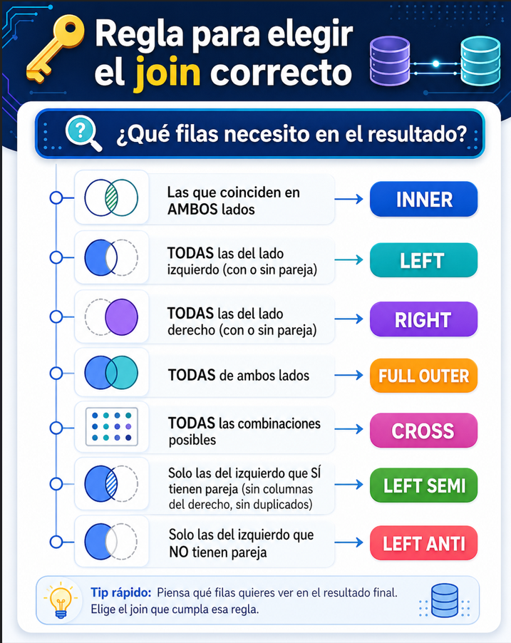

# 💻Clase 18 - Dataframes: Joins y SparkSQL

---

# Agenda:

<aside>
💡

#### 9:00 - 9:50    →  Sesión 1  - DataFrames: Joins y Uniones

#### 9:50 - 11:20   → Ejercicios y caso de uso

#### **11:20 - 11:40 → Descanso**

#### 11:40 - 12:40  → Sesión 2 - Spark SQL

#### 12:40 - 14:00  → Ejercicios y caso de uso

</aside>

# Sesión 1 : Dataframes:

---

## 🧠 Teoría — Joins y Uniones en Spark DataFrames

### 1. ¿Qué es un Join?

Un **join** combina filas de dos DataFrames en base a una condición, generalmente la igualdad de una o varias columnas clave. Es una de las operaciones más habituales en el análisis de datos y una de las más costosas en entornos distribuidos, porque puede provocar un **shuffle** (reordenación de datos entre nodos).

```
DataFrame A (clientes)       DataFrame B (pedidos)
+----+----------+            +-----+----------+---------+
| id | nombre   |            | ped | clienteId| importe |
+----+----------+            +-----+----------+---------+
|  1 | Ana      |     JOIN   |  P1 |    1     |  200.0  |
|  2 | Borja    |   ======>  |  P2 |    1     |   80.0  |
|  3 | Carmen   |            |  P3 |    2     |  350.0  |
+----+----------+            +-----+----------+---------+
```

En Spark, los joins se realizan con el método `.join()`:

```scala
val resultado = dfA.join(dfB, condicion, tipoDeJoin)
```

---

### 2. Tipos de Join

Spark soporta **7 tipos de join**. La tabla siguiente resume cuándo usar cada uno:

| Tipo | Filas del resultado | Caso de uso típico |
| --- | --- | --- |
| `inner` | Solo las que coinciden en ambos lados | Relación directa: pedidos con cliente válido |
| `left` | Todas las de la izquierda + coincidencias de la derecha (`null` si no hay) | Clientes aunque no tengan pedidos |
| `right` | Todas las de la derecha + coincidencias de la izquierda (`null` si no hay) | Pedidos aunque el cliente no exista en el maestro |
| `full` | Todas de ambos lados (`null` donde no hay coincidencia) | Detectar registros huérfanos en ambos lados |
| `cross` | Producto cartesiano: todas × todas | Generar combinaciones (usar con precaución) |
| `semi` | Solo filas de la izquierda que tienen coincidencia | Filtrar clientes que SÍ han pedido |
| `anti` | Solo filas de la izquierda que NO tienen coincidencia | Encontrar clientes que NUNCA han pedido |

## Ejemplos

## Inicialización:

```scala
import $ivy.`org.apache.spark::spark-sql:4.1.1`

import org.apache.spark.sql.SparkSession
import org.apache.spark.sql.functions._

val spark = SparkSession.builder()
  .appName("Joins-Ejemplos")
  .master("local[*]")
  .config("spark.sql.shuffle.partitions", "4")
  .config("spark.sql.crossJoin.enabled", "true")
  .getOrCreate()

spark.sparkContext.setLogLevel("ERROR")
import spark.implicits._

println(s"Spark ${spark.version} — Scala ${scala.util.Properties.versionString} ✅")
```

## Dataframes:

```scala
// DataFrame A — clientes
val clientes = Seq(
  (1, "Ana"),
  (2, "Borja"),
  (3, "Carmen")
).toDF("id", "nombre")

// DataFrame B — pedidos
val pedidos = Seq(
  ("P1", 1, 200.0),
  ("P2", 1,  80.0),
  ("P3", 2, 350.0)
).toDF("ped", "clienteId", "importe")

println("=== DataFrame A: clientes ===")
clientes.show()

println("=== DataFrame B: pedidos ===")
pedidos.show()
```

### ¿Qué clientes han realizado al menos un pedido?

> **Técnica:** `INNER JOIN` — devuelve únicamente las filas que tienen coincidencia en ambos DataFrames.
> 

```scala

// INNER JOIN
val inner = clientes.join(pedidos, clientes("id") === pedidos("clienteId"), "inner")

println("=== INNER JOIN ===")
inner.show()
println(s"Filas: ${inner.count()}")
```

```scala
=== INNER JOIN ===
+---+------+---+---------+-------+
| id|nombre|ped|clienteId|importe|
+---+------+---+---------+-------+
|  1|   Ana| P1|        1|  200.0|
|  1|   Ana| P2|        1|   80.0|
|  2| Borja| P3|        2|  350.0|
+---+------+---+---------+-------+
Filas: 3
```

### ¿Cuáles son todos nuestros clientes y sus pedidos, incluyendo los que aún no han comprado?

> **Técnica:** `LEFT JOIN` — devuelve todas las filas del DataFrame izquierdo (`clientes`) y las coincidencias del derecho (`pedidos`). Donde no hay coincidencia, rellena con `null`.
> 

```scala
// LEFT JOIN
val left = clientes.join(pedidos, clientes("id") === pedidos("clienteId"), "left")

println("=== LEFT JOIN ===")
left.show()
println(s"Filas: ${left.count()}")
```

```scala
=== LEFT JOIN ===
+---+------+----+---------+-------+
| id|nombre| ped|clienteId|importe|
+---+------+----+---------+-------+
|  1|   Ana|  P1|        1|  200.0|
|  1|   Ana|  P2|        1|   80.0|
|  2| Borja|  P3|        2|  350.0|
|  3|Carmen|null|     null|   null|
+---+------+----+---------+-------+
Filas: 4
```

### ¿Existen pedidos cuyo cliente no está registrado en nuestro sistema?

> **Técnica:** `RIGHT JOIN` — devuelve todas las filas del DataFrame derecho (`pedidos`) y las coincidencias del izquierdo (`clientes`). Donde no hay coincidencia, rellena con `null`.
> 

```scala
// RIGHT JOIN
val right = clientes.join(pedidos, clientes("id") === pedidos("clienteId"), "right")

println("=== RIGHT JOIN ===")
right.show()
println(s"Filas: ${right.count()}")
```

```scala
=== RIGHT JOIN ===
+----+------+---+---------+-------+
|  id|nombre|ped|clienteId|importe|
+----+------+---+---------+-------+
|   1|   Ana| P1|        1|  200.0|
|   1|   Ana| P2|        1|   80.0|
|   2| Borja| P3|        2|  350.0|
+----+------+---+---------+-------+
Filas: 3
```

### ¿Hay clientes sin pedidos O pedidos sin cliente registrado? Necesitamos detectar ambos casos a la vez.

> **Técnica:** `FULL OUTER JOIN` — devuelve todas las filas de ambos DataFrames. Donde no hay coincidencia en ninguno de los dos lados, rellena con `null`.
> 

```scala
// FULL OUTER JOIN
val full = clientes.join(pedidos, clientes("id") === pedidos("clienteId"), "full")

println("=== FULL OUTER JOIN ===")
full.show()
println(s"Filas: ${full.count()}")
```

```scala
=== FULL OUTER JOIN ===
+----+------+----+---------+-------+
|  id|nombre| ped|clienteId|importe|
+----+------+----+---------+-------+
|   1|   Ana|  P1|        1|  200.0|
|   1|   Ana|  P2|        1|   80.0|
|   2| Borja|  P3|        2|  350.0|
|   3|Carmen|null|     null|   null|
+----+------+----+---------+-------+
Filas: 4
```

### ¿Cuánto pagaría cada cliente si comprara cada uno de los pedidos existentes? Genera todas las combinaciones posibles.

> **Técnica:** `CROSS JOIN` — genera el producto cartesiano: cada fila del primer DataFrame combinada con cada fila del segundo. Requiere `spark.sql.crossJoin.enabled = true` en Spark 4.x.
> 

```scala
// CROSS JOIN — en Spark 4.x se usa el tipo "cross" dentro de .join()
// Requiere spark.sql.crossJoin.enabled = true
// En Spark 4.x el cross join se expresa con lit(true) como condición y tipo "cross"
// La configuración spark.sql.crossJoin.enabled = true ya está activada en la Celda 1
val cross = clientes.join(pedidos, lit(true), "cross")

println("=== CROSS JOIN ===")
cross.show()
println(s"Filas: ${cross.count()} (${clientes.count()} clientes × ${pedidos.count()} pedidos)")
```

```scala
=== CROSS JOIN ===
+---+------+---+---------+-------+
| id|nombre|ped|clienteId|importe|
+---+------+---+---------+-------+
|  1|   Ana| P1|        1|  200.0|
|  1|   Ana| P2|        1|   80.0|
|  1|   Ana| P3|        2|  350.0|
|  2| Borja| P1|        1|  200.0|
|  2| Borja| P2|        1|   80.0|
|  2| Borja| P3|        2|  350.0|
|  3|Carmen| P1|        1|  200.0|
|  3|Carmen| P2|        1|   80.0|
|  3|Carmen| P3|        2|  350.0|
+---+------+---+---------+-------+
Filas: 9 (3 clientes × 3 pedidos)
```

### ¿Qué clientes han realizado al menos un pedido? Solo necesito sus datos, no los del pedido.

> **Técnica:** `LEFT SEMI JOIN` — devuelve solo las filas del DataFrame izquierdo (`clientes`) que tienen al menos una coincidencia en el derecho (`pedidos`). No añade columnas del lado derecho ni duplica filas.
> 

```scala
// LEFT SEMI JOIN
val semi = clientes.join(pedidos, clientes("id") === pedidos("clienteId"), "semi")

println("=== LEFT SEMI JOIN ===")
semi.show()
println(s"Filas: ${semi.count()}")
```

```scala
=== LEFT SEMI JOIN ===
+---+------+
| id|nombre|
+---+------+
|  1|   Ana|
|  2| Borja|
+---+------+
Filas: 2
```

### ¿Qué clientes no han realizado ningún pedido todavía?

> **Técnica:** `LEFT ANTI JOIN` — devuelve solo las filas del DataFrame izquierdo (`clientes`) que **no tienen ninguna coincidencia** en el derecho (`pedidos`). Es el complemento exacto del SEMI JOIN.
> 

```scala
// LEFT ANTI JOIN
val anti = clientes.join(pedidos, clientes("id") === pedidos("clienteId"), "anti")

println("=== LEFT ANTI JOIN ===")
anti.show()
println(s"Filas: ${anti.count()}")
```

```scala
=== LEFT ANTI JOIN ===
+---+------+
| id|nombre|
+---+------+
|  3|Carmen|
+---+------+
Filas: 1
```

> 💡 **El tipo `"inner"` es el valor por defecto** si omites el tercer argumento. Escríbelo siempre explícitamente para que el código sea legible.
> 

> ⚠️ **Nota Spark 4.x:** en versiones anteriores existía el método `.crossJoin(df)` como atajo. En Spark 4.1.1 la forma recomendada es `.join(df, lit(true), "cross")`, y además es necesario configurar `spark.sql.crossJoin.enabled = true` en la sesión.
> 



---

### 3. Columnas Ambiguas tras un Join

<aside>

Cuando ambos DataFrames tienen una columna con el **mismo nombre**, Spark no puede saber a cuál te refieres después del join. El resultado tendrá dos columnas homónimas y cualquier referencia a ellas dará un error de análisis.

</aside>

### Dataframes para hacer los ejemplos:

```scala
// DataFrame A — clientes
// Columnas: id, nombre
val clientes = Seq(
  (1, "Ana"),
  (2, "Borja"),
  (3, "Carmen")
).toDF("id", "nombre")

// DataFrame B — pedidos
// Columnas: id, clienteId, importe
// ATENCIÓN: también tiene una columna llamada "id" (el id del pedido)
val pedidos = Seq(
  (101, 1, 200.0),
  (102, 1,  80.0),
  (103, 2, 350.0)
).toDF("id", "clienteId", "importe")

println("=== DataFrame A: clientes ===")
clientes.show()
println("Columnas de clientes: " + clientes.columns.mkString(", "))

println("\n=== DataFrame B: pedidos ===")
pedidos.show()
println("Columnas de pedidos: " + pedidos.columns.mkString(", "))

println("\n⚠️  CONFLICTO: ambos DataFrames tienen una columna llamada 'id'")
```

```scala
=== DataFrame A: clientes ===
+---+------+
| id|nombre|
+---+------+
|  1|   Ana|
|  2| Borja|
|  3|Carmen|
+---+------+
Columnas de clientes: id, nombre

=== DataFrame B: pedidos ===
+---+---------+-------+
| id|clienteId|importe|
+---+---------+-------+
|101|        1|  200.0|
|102|        1|   80.0|
|103|        2|  350.0|
+---+---------+-------+
Columnas de pedidos: id, clienteId, importe

⚠️  CONFLICTO: ambos DataFrames tienen una columna llamada 'id'
```

<aside>

### ¿Qué ocurre si hacemos el join sin resolver el conflicto de nombres?

Cuando dos DataFrames tienen una columna con el mismo nombre y hacemos un join, Spark crea un resultado con **dos columnas llamadas `"id"`**. Si después intentamos referenciar `"id"` por nombre, Spark no sabe a cuál de las dos nos referimos y lanza un error de análisis.

La celda siguiente **provoca el error intencionadamente** para que veas exactamente qué mensaje produce Spark. Es importante conocerlo para identificarlo cuando aparezca en tus propios proyectos.

</aside>

### Hacemos el join sin resolver el conflicto

```scala
// Hacemos el join sin resolver el conflicto
val resultado = clientes.join(pedidos, clientes("id") === pedidos("clienteId"))

// Inspeccionamos el schema del resultado: veremos DOS columnas llamadas "id"
println("=== Schema tras el join (sin resolver el conflicto) ===")
resultado.printSchema()
println("Columnas del resultado: " + resultado.columns.mkString(", "))
println()

// Mostramos los datos — esto funciona porque show() no selecciona por nombre
println("=== Datos (show funciona porque no selecciona por nombre) ===")
resultado.show()
```

```scala
=== Schema tras el join (sin resolver el conflicto) ===
root
 |-- id: integer (nullable = false)        ← id de clientes
 |-- nombre: string (nullable = true)
 |-- id: integer (nullable = false)        ← id de pedidos (¡mismo nombre!)
 |-- clienteId: integer (nullable = false)
 |-- importe: double (nullable = false)

Columnas del resultado: id, nombre, id, clienteId, importe

=== Datos (show funciona porque no selecciona por nombre) ===
+---+------+---+---------+-------+
| id|nombre| id|clienteId|importe|
+---+------+---+---------+-------+
|  1|   Ana|101|        1|  200.0|
|  1|   Ana|102|        1|   80.0|
|  2| Borja|103|        2|  350.0|
+---+------+---+---------+-------+
```

### Intentamos seleccionar "id" por nombre → ESTO PROVOCA EL ERROR

```scala
// Intentamos seleccionar "id" por nombre → ESTO PROVOCA EL ERROR
// Ejecuta esta celda para ver el mensaje de error de Spark
try {
  resultado.select("id").show()
} catch {
  case e: Exception =>
    println("❌ ERROR CAPTURADO:")
    println(e.getMessage.split("\n").head)
}
```

```scala
❌ ERROR CAPTURADO:
[AMBIGUOUS_REFERENCE] Reference `id` is ambiguous, could be: [`id`, `id`].
```

**Tres soluciones:**

**Opción A — Referenciar la columna con su DataFrame de origen:**

> 
> 
> 
> En lugar de usar el nombre como `String`, usamos la **referencia directa al DataFrame** con la sintaxis `dataFrame("columna")`. Spark sabe exactamente de cuál de los dos DataFrames originales viene cada columna.
> 
> **Cuándo usarla:** cuando ya tienes el join hecho y quieres hacer un `select` puntual. No resuelve el problema en toda la pipeline, solo en esa operación concreta.
> 

```scala
// Opción A: referenciar la columna con su DataFrame de origen
val opcionA = resultado.select(
  clientes("id"),        // el "id" de clientes (1, 2, 3)
  pedidos("id"),         // el "id" de pedidos  (101, 102, 103)
  col("nombre"),
  pedidos("clienteId"),
  pedidos("importe")
)

println("=== Opción A: referencia con DataFrame de origen ===")
opcionA.show()
opcionA.printSchema()
```

```scala
=== Opción A: referencia con DataFrame de origen ===
+---+---+------+---------+-------+
| id| id|nombre|clienteId|importe|
+---+---+------+---------+-------+
|  1|101|   Ana|        1|  200.0|
|  1|102|   Ana|        1|   80.0|
|  2|103| Borja|        2|  350.0|
+---+---+------+---------+-------+

root
 |-- id: integer (nullable = false)    ← id del cliente
 |-- id: integer (nullable = false)    ← id del pedido
 |-- nombre: string (nullable = true)
 |-- clienteId: integer (nullable = false)
 |-- importe: double (nullable = false)
```

**Opción B — Eliminar la columna duplicada con `drop`:**

> 
> 
> 
> Después del join, eliminamos una de las dos columnas duplicadas con `.drop()`. Al pasarle la **referencia al DataFrame** (`pedidos("clienteId")`), Spark sabe exactamente qué columna eliminar sin ambigüedad.
> 
> **Cuándo usarla:** cuando solo necesitas conservar una de las dos versiones de la columna duplicada y quieres limpiar el schema antes de continuar con la pipeline.
> 

```scala
// Opción B: eliminar la columna duplicada con drop
// Pasamos la referencia al DataFrame para que Spark sepa cuál eliminar
val limpio = clientes
  .join(pedidos, clientes("id") === pedidos("clienteId"))
  .drop(pedidos("id"))   // eliminamos el "id" de pedidos, conservamos el de clientes

println("=== Opción B: drop de la columna duplicada ===")
limpio.show()
limpio.printSchema()

println("\n✅ Ahora podemos seleccionar 'id' sin ambigüedad:")
limpio.select("id", "nombre", "importe").show()
```

```scala
=== Opción B: drop de la columna duplicada ===
+---+------+---------+-------+
| id|nombre|clienteId|importe|
+---+------+---------+-------+
|  1|   Ana|        1|  200.0|
|  1|   Ana|        1|   80.0|
|  2| Borja|        2|  350.0|
+---+------+---------+-------+

root
 |-- id: integer (nullable = false)       ← solo queda el id de clientes
 |-- nombre: string (nullable = true)
 |-- clienteId: integer (nullable = false)
 |-- importe: double (nullable = false)

✅ Ahora podemos seleccionar 'id' sin ambigüedad:
+---+------+-------+
| id|nombre|importe|
+---+------+-------+
|  1|   Ana|  200.0|
|  1|   Ana|   80.0|
|  2| Borja|  350.0|
+---+------+-------+
```

**Opción C —** ✅**Renombrar antes del join** ✅ **:**

> 
> 
> 
> Antes de hacer el join, renombramos la columna conflictiva en uno de los DataFrames con `.withColumnRenamed()`. De esta forma el join se ejecuta **sin columnas duplicadas desde el principio** y toda la pipeline posterior trabaja con nombres únicos y descriptivos.
> 
> **Cuándo usarla:** siempre que sea posible. Es la más limpia porque el problema se previene antes de que ocurra. El nombre `"pedido_clienteId"` describe exactamente qué contiene la columna, lo que facilita la lectura del código semanas después.
> 

```scala
// Opción C: renombrar ANTES del join (recomendada)
// Renombramos "clienteId" en pedidos para que no colisione con "id" de clientes
// También renombramos "id" de pedidos para que sea descriptivo
val pedidosRen = pedidos
  .withColumnRenamed("id",        "pedido_id")
  .withColumnRenamed("clienteId", "pedido_clienteId")

println("=== pedidos renombrados (antes del join) ===")
pedidosRen.show()
println("Columnas de pedidosRen: " + pedidosRen.columns.mkString(", "))

// Ahora el join no genera ninguna columna duplicada
val resultado_c = clientes.join(
  pedidosRen,
  col("id") === col("pedido_clienteId")
)

println("\n=== Opción C: resultado del join sin ambigüedad ===")
resultado_c.show()
resultado_c.printSchema()

println("\n✅ Select directo por nombre sin ningún error:")
resultado_c.select("id", "nombre", "pedido_id", "importe").show()
```

```scala
=== pedidos renombrados (antes del join) ===
+---------+----------------+-------+
|pedido_id|pedido_clienteId|importe|
+---------+----------------+-------+
|      101|               1|  200.0|
|      102|               1|   80.0|
|      103|               2|  350.0|
+---------+----------------+-------+
Columnas de pedidosRen: pedido_id, pedido_clienteId, importe

=== Opción C: resultado del join sin ambigüedad ===
+---+------+---------+----------------+-------+
| id|nombre|pedido_id|pedido_clienteId|importe|
+---+------+---------+----------------+-------+
|  1|   Ana|      101|               1|  200.0|
|  1|   Ana|      102|               1|   80.0|
|  2| Borja|      103|               2|  350.0|
+---+------+---------+----------------+-------+

root
 |-- id: integer (nullable = false)
 |-- nombre: string (nullable = true)
 |-- pedido_id: integer (nullable = false)
 |-- pedido_clienteId: integer (nullable = false)
 |-- importe: double (nullable = false)

✅ Select directo por nombre sin ningún error:
+---+------+---------+-------+
| id|nombre|pedido_id|importe|
+---+------+---------+-------+
|  1|   Ana|      101|  200.0|
|  1|   Ana|      102|   80.0|
|  2| Borja|      103|  350.0|
+---+------+---------+-------+
```

<aside>

🔍 **Observa el schema:** todos los nombres son únicos y descriptivos desde el inicio. `pedido_id` identifica el pedido, `id` identifica al cliente. No hay ambigüedad posible en ninguna operación posterior.

</aside>

> 💡 La **Opción C** es la más limpia. Renombrar antes del join hace el código autoexplicativo y evita errores silenciosos, especialmente en pipelines con varios joins encadenados.
> 


---

## 4. Broadcast Join: Optimización para Tablas Pequeñas

<aside>

En un join normal, Spark mueve datos entre nodos (shuffle). Si uno de los DataFrames es **pequeño** (p. ej., una tabla de códigos, un catálogo de productos), es mucho más eficiente **enviar una copia completa a cada nodo** en lugar de hacer shuffle del grande. Esto se llama **Broadcast Join**.

</aside>


## 📦 DataFrames de ejemplo

> 📌 **El escenario:** una tienda online tiene una tabla grande de **pedidos** (muchas filas, crece constantemente) y una tabla pequeña de **categorías** (pocos registros, prácticamente estática). Cada pedido tiene un `categoriaId` que referencia la tabla de categorías.
> 
> 
> Este es el caso de uso perfecto para el **Broadcast Join**: la tabla pequeña (`categorias`) se envía completa a cada nodo del cluster, evitando el shuffle costoso de la tabla grande.
> 

```scala
// ─────────────────────────────────────────────────
// TABLA GRANDE: pedidos
// En producción tendría millones de filas.
// Aquí usamos 12 filas para que el ejemplo sea legible.
// ─────────────────────────────────────────────────
val pedidos = Seq(
  ("P001", 1, "CAT-A", 120.0),
  ("P002", 1, "CAT-B",  45.0),
  ("P003", 2, "CAT-A", 200.0),
  ("P004", 2, "CAT-C",  89.0),
  ("P005", 3, "CAT-B", 310.0),
  ("P006", 3, "CAT-A",  55.0),
  ("P007", 4, "CAT-C", 175.0),
  ("P008", 4, "CAT-B",  30.0),
  ("P009", 5, "CAT-A", 250.0),
  ("P010", 5, "CAT-C",  99.0),
  ("P011", 6, "CAT-B", 145.0),
  ("P012", 6, "CAT-A",  70.0)
).toDF("pedidoId", "clienteId", "categoriaId", "importe")

// ─────────────────────────────────────────────────
// TABLA PEQUEÑA: categorías
// Solo 3 filas — catálogo estático que raramente cambia.
// Esta es la candidata perfecta para broadcast.
// ─────────────────────────────────────────────────
val categorias = Seq(
  ("CAT-A", "Electrónica",  "Alta gama"),
  ("CAT-B", "Hogar",        "Básica"),
  ("CAT-C", "Deportes",     "Media")
).toDF("id", "nombreCategoria", "segmento")

println("=== Tabla GRANDE: pedidos ===")
pedidos.show()
println(s"Filas en pedidos:    ${pedidos.count()}")

println("\n=== Tabla PEQUEÑA: categorias ===")
categorias.show()
println(s"Filas en categorias: ${categorias.count()}")

println("\n💡 'categorias' es la candidata al broadcast: pocas filas, datos estáticos.")
```

```scala
=== Tabla GRANDE: pedidos ===
+--------+---------+-----------+-------+
|pedidoId|clienteId|categoriaId|importe|
+--------+---------+-----------+-------+
|    P001|        1|      CAT-A|  120.0|
|    P002|        1|      CAT-B|   45.0|
|    P003|        2|      CAT-A|  200.0|
|    P004|        2|      CAT-C|   89.0|
|    P005|        3|      CAT-B|  310.0|
|    P006|        3|      CAT-A|   55.0|
|    P007|        4|      CAT-C|  175.0|
|    P008|        4|      CAT-B|   30.0|
|    P009|        5|      CAT-A|  250.0|
|    P010|        5|      CAT-C|   99.0|
|    P011|        6|      CAT-B|  145.0|
|    P012|        6|      CAT-A|   70.0|
+--------+---------+-----------+-------+
Filas en pedidos:    12

=== Tabla PEQUEÑA: categorias ===
+-----+---------------+--------+
|   id|nombreCategoria|segmento|
+-----+---------------+--------+
|CAT-A|   Electrónica |Alta gama|
|CAT-B|         Hogar |  Básica|
|CAT-C|      Deportes |  Media |
+-----+---------------+--------+
Filas en categorias: 3

💡 'categorias' es la candidata al broadcast: pocas filas, datos estáticos.
```

## ⚙️ Configuración del umbral automático

> **¿Cuándo aplica Spark el broadcast automáticamente?**
> 
> 
> Spark tiene un umbral configurable: si un DataFrame cabe por debajo de ese límite en bytes, Spark aplica el broadcast **de forma automática** sin que lo indiques explícitamente. Puedes controlar este umbral con `spark.sql.autoBroadcastJoinThreshold`.
> 
> En los ejemplos siguientes vamos a **desactivarlo primero** para forzar un `SortMergeJoin` y ver la diferencia real en el plan de ejecución cuando lo activamos manualmente con `broadcast()`.
> 

```scala
import org.apache.spark.sql.functions.broadcast
// ── Desactivamos el broadcast automático para ver el plan sin optimización ──
spark.conf.set("spark.sql.autoBroadcastJoinThreshold", -1)

val umbralActual = spark.conf.get("spark.sql.autoBroadcastJoinThreshold")
println(s"Umbral autoBroadcastJoinThreshold: $umbralActual")
println("(valor -1 = broadcast automático DESACTIVADO)")
println()
println("Ahora Spark usará SortMergeJoin aunque la tabla sea pequeña.")
println("Esto nos permitirá ver la diferencia en el plan de ejecución.")
```

```scala
Umbral autoBroadcastJoinThreshold: -1
(valor -1 = broadcast automático DESACTIVADO)

Ahora Spark usará SortMergeJoin aunque la tabla sea pequeña.
Esto nos permitirá ver la diferencia en el plan de ejecución.
```

### 🔴 Join SIN broadcast — plan de ejecución

> 
> 
> 
> ### Join normal (sin broadcast) → SortMergeJoin
> 
> Con el broadcast automático desactivado, Spark utiliza **SortMergeJoin**: ordena ambos DataFrames por la clave de join y los fusiona. Esto implica mover datos entre nodos (**shuffle**), que es la operación más costosa en un cluster distribuido.
> 
> Observa en el plan de ejecución la presencia de `SortMergeJoin` y los pasos de `Exchange` (shuffle) que lo preceden.
> 

```scala
// JOIN NORMAL — sin broadcast (broadcast automático ya está desactivado)
val sinBroadcast = pedidos.join(
  categorias,
  pedidos("categoriaId") === categorias("id")
)

println("=== Resultado del join sin broadcast ===")
sinBroadcast.select(
  col("pedidoId"),
  col("clienteId"),
  col("nombreCategoria"),
  col("segmento"),
  col("importe")
).orderBy("pedidoId").show()

println("\n=== Plan de ejecución SIN broadcast ===")
println("(busca 'SortMergeJoin' y 'Exchange' en el plan)")
println("─" * 60)
sinBroadcast.explain()
```

```scala
=== Resultado del join sin broadcast ===
+--------+---------+---------------+---------+-------+
|pedidoId|clienteId|nombreCategoria| segmento|importe|
+--------+---------+---------------+---------+-------+
|    P001|        1|   Electrónica |Alta gama|  120.0|
|    P002|        1|         Hogar |   Básica|   45.0|
|    P003|        2|   Electrónica |Alta gama|  200.0|
|    P004|        2|      Deportes |   Media |   89.0|
|    P005|        3|         Hogar |   Básica|  310.0|
|    P006|        3|   Electrónica |Alta gama|   55.0|
|    P007|        4|      Deportes |   Media |175.0 |
|    P008|        4|         Hogar |   Básica|   30.0|
|    P009|        5|   Electrónica |Alta gama|  250.0|
|    P010|        5|      Deportes |   Media |   99.0|
|    P011|        6|         Hogar |   Básica|  145.0|
|    P012|        6|   Electrónica |Alta gama|   70.0|
+--------+---------+---------------+---------+-------+

=== Plan de ejecución SIN broadcast ===
(busca 'SortMergeJoin' y 'Exchange' en el plan)
────────────────────────────────────────────────────────────
== Physical Plan ==
*(5) SortMergeJoin [categoriaId#...], [id#...], Inner
:- *(2) Sort [categoriaId#...], false, 0
:  +- Exchange hashpartitioning(categoriaId#..., 4), ENSURE_REQUIREMENTS
:     +- *(1) LocalTableScan [pedidoId#..., clienteId#..., categoriaId#..., importe#...]
+- *(4) Sort [id#...], false, 0
   +- Exchange hashpartitioning(id#..., 4), ENSURE_REQUIREMENTS
      +- *(3) LocalTableScan [id#..., nombreCategoria#..., segmento#...]
```

<aside>

🔍 **Lee el plan:** aparece `SortMergeJoin` como estrategia de join y dos operaciones `Exchange` (una por cada lado), que representan el **shuffle**: Spark mueve datos entre nodos para agrupar las filas con la misma clave antes de poder fusionarlas. En un cluster real con millones de filas esto es muy costoso.

</aside>

### 🟢 Join CON broadcast — plan de ejecución

> 
> 
> 
> ### Join con `broadcast()` forzado → BroadcastHashJoin
> 
> Al envolver `categorias` con `broadcast()`, le decimos a Spark que envíe una copia completa de esa tabla a cada nodo del cluster. Cada nodo puede hacer el join localmente con su partición de `pedidos` **sin mover ningún dato por la red**. Esto elimina completamente el shuffle.
> 

```scala
import org.apache.spark.sql.functions.broadcast
// JOIN CON BROADCAST FORZADO
// broadcast() le indica a Spark que envíe 'categorias' completo a cada nodo
val conBroadcast = pedidos.join(
  broadcast(categorias),            // ← aquí está la clave
  pedidos("categoriaId") === categorias("id")
)

println("=== Resultado del join CON broadcast ===")
conBroadcast.select(
  col("pedidoId"),
  col("clienteId"),
  col("nombreCategoria"),
  col("segmento"),
  col("importe")
).orderBy("pedidoId").show()

println("\n=== Plan de ejecución CON broadcast ===")
println("(busca 'BroadcastHashJoin' y 'BroadcastExchange' en el plan)")
println("─" * 60)
conBroadcast.explain()
```

```scala
=== Resultado del join CON broadcast ===
+--------+---------+---------------+---------+-------+
|pedidoId|clienteId|nombreCategoria| segmento|importe|
+--------+---------+---------------+---------+-------+
|    P001|        1|   Electrónica |Alta gama|  120.0|
|    P002|        1|         Hogar |   Básica|   45.0|
|    P003|        2|   Electrónica |Alta gama|  200.0|
|    P004|        2|      Deportes |   Media |   89.0|
|    P005|        3|         Hogar |   Básica|  310.0|
|    P006|        3|   Electrónica |Alta gama|   55.0|
|    P007|        4|      Deportes |   Media |  175.0|
|    P008|        4|         Hogar |   Básica|   30.0|
|    P009|        5|   Electrónica |Alta gama|  250.0|
|    P010|        5|      Deportes |   Media |   99.0|
|    P011|        6|         Hogar |   Básica|  145.0|
|    P012|        6|   Electrónica |Alta gama|   70.0|
+--------+---------+---------------+---------+-------+

=== Plan de ejecución CON broadcast ===
(busca 'BroadcastHashJoin' y 'BroadcastExchange' en el plan)
────────────────────────────────────────────────────────────
== Physical Plan ==
*(2) BroadcastHashJoin [categoriaId#...], [id#...], Inner, BuildRight
:- *(2) LocalTableScan [pedidoId#..., clienteId#..., categoriaId#..., importe#...]
+- BroadcastExchange HashedRelationBroadcastMode(List(input[0, string, false]))
   +- *(1) LocalTableScan [id#..., nombreCategoria#..., segmento#...]
```

<aside>

🔍 **Lee el plan:** ahora aparece `BroadcastHashJoin` y un único `BroadcastExchange` solo sobre la tabla pequeña (`categorias`). **No hay `Exchange` sobre `pedidos`**: la tabla grande no se mueve. Cada nodo recibe una copia de `categorias` y hace el join localmente con su partición de `pedidos`.

</aside>

### ⚙️ Umbral automático: dejar que Spark decida

> 
> 
> 
> ### Configurar el umbral automático de broadcast
> 
> Además de forzarlo manualmente con `broadcast()`, puedes configurar el umbral por debajo del cual Spark aplica el broadcast **de forma automática**. Si un DataFrame tiene un tamaño estimado menor que este umbral, Spark lo broadcastea sin que tengas que indicarlo.
> 
> El valor por defecto en Spark es **10 MB**. Puedes aumentarlo para tablas de dimensión más grandes.
> 

```scala
import org.apache.spark.sql.functions.broadcast
// ── Activamos el broadcast automático con un umbral de 10 MB ──
spark.conf.set("spark.sql.autoBroadcastJoinThreshold", 10 * 1024 * 1024)

val umbralActivo = spark.conf.get("spark.sql.autoBroadcastJoinThreshold")
println(s"Umbral autoBroadcastJoinThreshold: $umbralActivo bytes (${10} MB)")
println()

// Ahora hacemos el join SIN broadcast() explícito
// Spark debería aplicarlo automáticamente porque 'categorias' es pequeña
val autobroadcast = pedidos.join(
  categorias,                                       // sin broadcast() explícito
  pedidos("categoriaId") === categorias("id")
)

println("=== Plan con broadcast AUTOMÁTICO (umbral = 10 MB) ===")
println("(Spark decide solo porque 'categorias' cabe en el umbral)")
println("─" * 60)
autobroadcast.explain()

println("\n✅ Resultado idéntico (mismas filas, misma lógica):")
println(s"  Filas sin broadcast:  ${sinBroadcast.count()}")
println(s"  Filas con broadcast:  ${conBroadcast.count()}")
println(s"  Filas auto broadcast: ${autobroadcast.count()}")
println("  Los tres resultados son iguales — solo cambia la estrategia interna.")
```

```scala
Umbral autoBroadcastJoinThreshold: 10485760 bytes (10 MB)

=== Plan con broadcast AUTOMÁTICO (umbral = 10 MB) ===
(Spark decide solo porque 'categorias' cabe en el umbral)
────────────────────────────────────────────────────────────
== Physical Plan ==
*(2) BroadcastHashJoin [categoriaId#...], [id#...], Inner, BuildRight
:- *(2) LocalTableScan [...]
+- BroadcastExchange HashedRelationBroadcastMode(...)
   +- *(1) LocalTableScan [...]

✅ Resultado idéntico (mismas filas, misma lógica):
  Filas sin broadcast:  12
  Filas con broadcast:  12
  Filas auto broadcast: 12
  Los tres resultados son iguales — solo cambia la estrategia interna.
```


---

## 5. Uniones de Conjuntos: `union`, `unionByName`, `intersect`, `except`

Además de los joins (que combinan columnas), Spark permite operaciones de conjunto que **apilan o comparan filas**.

### `union` — Apilar filas de dos DataFrames

Requiere que ambos DataFrames tengan el **mismo número de columnas y los mismos tipos** (en el mismo orden):

```scala
val enero   = spark.read.parquet("ventas_enero.parquet")
val febrero = spark.read.parquet("ventas_febrero.parquet")

val acumulado = enero.union(febrero)
```

> ⚠️ `union` en Spark **no elimina duplicados** (equivale al SQL `UNION ALL`). Para eliminar duplicados, encadena `.distinct()`.
> 

### `unionByName` — Apilar por nombre de columna

Si los DataFrames tienen las mismas columnas pero en **distinto orden**, usa `unionByName`:

```scala
val resultado = df1.unionByName(df2)  // alinea por nombre, no por posición
```

### `intersect` — Filas que existen en ambos DataFrames

```scala
val clientesComunes = clientesEspana.intersect(clientesPortugal)
```

### `except` — Filas del primero que NO están en el segundo

```scala
val soloEspana = clientesEspana.except(clientesPortugal)
```

**Resumen:**

| Operación | Resultado | Elimina duplicados |
| --- | --- | --- |
| `union` | A + B (todas las filas) | ❌ |
| `union.distinct()` | A + B sin repetidos | ✅ |
| `unionByName` | A + B alineando por nombre | ❌ |
| `intersect` | Filas en A **y** en B | ✅ |
| `except` | Filas en A **no** en B | ✅ |

---

### 6. Estrategias para Joins Eficientes

Los joins son la operación más cara en Spark por el shuffle que generan. Estas son las estrategias principales para minimizar ese coste:

**1. Filtrar antes del join**

```scala
// ❌ Filtra después: transporta más datos de los necesarios
val res = clientes.join(pedidos, ...).filter(col("importe") > 100)

// ✅ Filtra antes: reduce el volumen antes del shuffle
val pedidosGrandes = pedidos.filter(col("importe") > 100)
val res = clientes.join(pedidosGrandes, ...)
```

**2. Seleccionar solo las columnas necesarias antes del join**

```scala
val clientesMin = clientes.select("id", "nombre", "ciudad")
val pedidosMin  = pedidos.select("clienteId", "importe", "fecha")
val resultado   = clientesMin.join(pedidosMin, clientesMin("id") === pedidosMin("clienteId"))
```

**3. Usar `broadcast` para tablas de dimensión pequeñas**

```scala
val resultado = hechos.join(broadcast(dimensionPequena), "categoriaId")
```

**4. Verificar el plan de ejecución con `explain()`**

```scala
resultado.explain(true)
// Busca:
//   "BroadcastHashJoin"  → ✅ eficiente, sin shuffle
//   "SortMergeJoin"      → ⚠️  costoso, implica shuffle
```

---

### 7. Resumen Visual de Tipos de Join

```
Tipo           Izquierda          Derecha        Nulos posibles
──────────────────────────────────────────────────────────────
inner          coincide           coincide       No
left           todas              coincide       Sí (derecha)
right          coincide           todas          Sí (izquierda)
full           todas              todas          Sí (ambos)
semi           coincide           —              No
anti           no coincide        —              No
cross          todas × todas      todas × todas  No
```

---

## 💻 Práctica

---

### 🏢 Contexto del ejercicio

Trabajamos con datos de **LogiData S.A.**, una empresa de logística con tres fuentes de datos:

- `clientes` — maestro de clientes registrados
- `pedidos` — registro de pedidos (algunos con un `clienteId` que no existe en el maestro)
- `repartidores` — repartidores asignados a cada pedido

---

### 🔹 Celda 1 — Configuración inicial

```scala
import $ivy.`org.apache.spark::spark-sql:4.1.1`

import org.apache.spark.sql.SparkSession
import org.apache.spark.sql.functions._

val spark = SparkSession.builder()
  .appName("Dia18-Sesion1-Joins")
  .master("local[*]")
  .config("spark.sql.shuffle.partitions", "4")
  .config("spark.sql.crossJoin.enabled",  "true")
  .getOrCreate()

spark.sparkContext.setLogLevel("ERROR")
import spark.implicits._

println(s"Spark ${spark.version} — Scala ${scala.util.Properties.versionString} ✅")
```

**Salida esperada:**

```
Spark 4.1.1 — Scala version 2.13.18 ✅
```

---

### 🔹 Celda 2 — Crear los DataFrames de LogiData

```scala
// === CLIENTES ===
val clientes = Seq(
  (1, "Ana García",    "Madrid"),
  (2, "Borja Ruiz",    "Barcelona"),
  (3, "Carmen López",  "Sevilla"),
  (4, "David Mora",    "Valencia"),
  (5, "Elena Pardo",   "Bilbao")
).toDF("clienteId", "nombre", "ciudad")

// === PEDIDOS ===
// clienteId 6 no existe en el maestro de clientes → dato huérfano
val pedidos = Seq(
  ("P001", 1, "2024-01-10", 250.0, "R01"),
  ("P002", 1, "2024-01-15", 180.0, "R02"),
  ("P003", 2, "2024-01-20", 420.0, "R01"),
  ("P004", 3, "2024-02-01",  95.0, "R03"),
  ("P005", 3, "2024-02-14",  60.0, "R02"),
  ("P006", 6, "2024-02-20", 310.0, "R03")  // ← cliente 6 no existe
).toDF("pedidoId", "clienteId", "fecha", "importe", "repartidorId")

// === REPARTIDORES ===
val repartidores = Seq(
  ("R01", "Miguel Sanz",   "Zona Norte"),
  ("R02", "Laura Vega",    "Zona Sur"),
  ("R03", "Pablo Fuentes", "Zona Este")
).toDF("repartidorId", "nombreRep", "zona")

println("DataFrames creados:")
println(s"  clientes:     ${clientes.count()} filas")
println(s"  pedidos:      ${pedidos.count()} filas")
println(s"  repartidores: ${repartidores.count()} filas")
```

**Salida esperada:**

```
DataFrames creados:
  clientes:     5 filas
  pedidos:      6 filas
  repartidores: 3 filas
```

---

### 🔹 Celda 3 — INNER JOIN: pedidos con cliente conocido

Queremos cruzar `pedidos` con `clientes` para ver el nombre del cliente de cada pedido. Solo nos interesan los pedidos cuyo cliente existe en el maestro.

```scala
// Buena práctica: renombrar la columna conflictiva ANTES del join
val pedidosRen = pedidos.withColumnRenamed("clienteId", "pedido_clienteId")

val resultado_inner = clientes.join(
  pedidosRen,
  col("clienteId") === col("pedido_clienteId"),
  "inner"
).select(
  col("pedidoId"),
  col("nombre").alias("cliente"),
  col("ciudad"),
  col("fecha"),
  col("importe")
).orderBy("pedidoId")

println("=== INNER JOIN: pedidos con cliente conocido ===")
resultado_inner.show()
println(s"Total filas: ${resultado_inner.count()}")
// P006 desaparece porque clienteId=6 no existe → esperamos 5 filas
```

**Salida esperada:**

```
=== INNER JOIN: pedidos con cliente conocido ===
+--------+------------+---------+----------+-------+
|pedidoId|     cliente|   ciudad|     fecha|importe|
+--------+------------+---------+----------+-------+
|    P001| Ana García |   Madrid|2024-01-10|  250.0|
|    P002| Ana García |   Madrid|2024-01-15|  180.0|
|    P003| Borja Ruiz |Barcelona|2024-01-20|  420.0|
|    P004|Carmen López|  Sevilla|2024-02-01|   95.0|
|    P005|Carmen López|  Sevilla|2024-02-14|   60.0|
+--------+------------+---------+----------+-------+
Total filas: 5
```

> 🔍 **Observa:** P006 desaparece porque su `clienteId=6` no existe en el maestro. El INNER JOIN descarta filas sin coincidencia.
> 

---

### 🔹 Celda 4 — LEFT JOIN vs RIGHT JOIN

**LEFT JOIN** — Todos los clientes, aunque no hayan pedido nada:

```scala
val resultado_left = clientes.join(
  pedidosRen,
  col("clienteId") === col("pedido_clienteId"),
  "left"
).select(
  col("clienteId"),
  col("nombre"),
  col("pedidoId"),
  col("importe")
).orderBy("clienteId", "pedidoId")

println("=== LEFT JOIN: todos los clientes (con o sin pedidos) ===")
resultado_left.show()
// David Mora y Elena Pardo aparecen con null en pedidoId e importe
```

**RIGHT JOIN** — Todos los pedidos, aunque el cliente no exista en el maestro:

```scala
val resultado_right = clientes.join(
  pedidosRen,
  col("clienteId") === col("pedido_clienteId"),
  "right"
).select(
  col("pedido_clienteId").alias("clienteId"),
  col("nombre"),
  col("pedidoId"),
  col("importe")
).orderBy("pedidoId")

println("=== RIGHT JOIN: todos los pedidos (incluido el huérfano P006) ===")
resultado_right.show()
// P006 aparece con null en nombre
```

> 🔍 **Reflexión:** el RIGHT JOIN es poco habitual en la práctica. Los mismos resultados se obtienen con un LEFT JOIN invirtiendo el orden de los DataFrames, que resulta más intuitivo de leer.
> 

---

### 🔹 Celda 5 — SEMI y ANTI JOIN

Estos dos tipos filtran filas **sin añadir columnas** del segundo DataFrame.

```scala
// LEFT SEMI: clientes que SÍ tienen al menos un pedido
val clientesConPedidos = clientes.join(
  pedidosRen,
  col("clienteId") === col("pedido_clienteId"),
  "semi"
)

println("=== LEFT SEMI: clientes que han hecho algún pedido ===")
clientesConPedidos.show()
// Solo columnas de clientes; David Mora y Elena Pardo no aparecen

// LEFT ANTI: clientes que NUNCA han pedido
val clientesSinPedidos = clientes.join(
  pedidosRen,
  col("clienteId") === col("pedido_clienteId"),
  "anti"
)

println("=== LEFT ANTI: clientes sin ningún pedido ===")
clientesSinPedidos.show()
// Solo David Mora y Elena Pardo
```

**Salida esperada (anti join):**

```
=== LEFT ANTI: clientes sin ningún pedido ===
+---------+-----------+--------+
|clienteId|     nombre|  ciudad|
+---------+-----------+--------+
|        4| David Mora|Valencia|
|        5|Elena Pardo|  Bilbao|
+---------+-----------+--------+
```

> 💡 Spark sabe que en el semi/anti join no necesita devolver columnas del lado derecho, lo que permite una ejecución más eficiente (menos datos transportados entre nodos).
> 

---

### 🔹 Celda 6 — JOIN de tres tablas

En proyectos reales es habitual encadenar varios joins. Cruzamos `pedidos` + `clientes` + `repartidores`:

```scala
// Renombramos todas las columnas que pueden colisionar
val pedidos3 = pedidos
  .withColumnRenamed("clienteId",    "pedido_clienteId")
  .withColumnRenamed("repartidorId", "pedido_repartidorId")

val resultado_triple = pedidos3
  .join(clientes,     col("pedido_clienteId")    === col("clienteId"),    "inner")
  .join(repartidores, col("pedido_repartidorId") === col("repartidorId"), "inner")
  .select(
    col("pedidoId"),
    col("nombre").alias("cliente"),
    col("ciudad"),
    col("fecha"),
    col("importe"),
    col("nombreRep").alias("repartidor"),
    col("zona")
  )
  .orderBy("pedidoId")

println("=== JOIN TRIPLE: pedidos + clientes + repartidores ===")
resultado_triple.show(truncate = false)
```

**Salida esperada:**

```
+--------+------------+---------+----------+-------+-------------+-----------+
|pedidoId|     cliente|   ciudad|     fecha|importe|   repartidor|       zona|
+--------+------------+---------+----------+-------+-------------+-----------+
|    P001| Ana García |   Madrid|2024-01-10|  250.0|  Miguel Sanz| Zona Norte|
|    P002| Ana García |   Madrid|2024-01-15|  180.0|  Laura Vega |   Zona Sur|
|    P003| Borja Ruiz |Barcelona|2024-01-20|  420.0|  Miguel Sanz| Zona Norte|
|    P004|Carmen López|  Sevilla|2024-02-01|   95.0|Pablo Fuentes|  Zona Este|
|    P005|Carmen López|  Sevilla|2024-02-14|   60.0|  Laura Vega |   Zona Sur|
+--------+------------+---------+----------+-------+-------------+-----------+
```

---

### 🔹 Celda 7 — Broadcast JOIN y comparación de planes de ejecución

Comparamos el plan generado con y sin broadcast para ver cómo Spark lo optimiza:

```scala
val pedidos4 = pedidos
  .withColumnRenamed("repartidorId", "pedido_repartidorId")

// Sin broadcast
val sinBroadcast = pedidos4.join(
  repartidores,
  col("pedido_repartidorId") === col("repartidorId"),
  "inner"
)

println("=== Plan SIN broadcast ===")
sinBroadcast.explain()

// Con broadcast forzado (repartidores es pequeño)
val conBroadcast = pedidos4.join(
  broadcast(repartidores),
  col("pedido_repartidorId") === col("repartidorId"),
  "inner"
)

println("\n=== Plan CON broadcast ===")
conBroadcast.explain()

// Los resultados deben ser idénticos
println(s"\nFilas sin broadcast: ${sinBroadcast.count()}")
println(s"Filas con broadcast: ${conBroadcast.count()}")
```

> 🔍 **Qué buscar en el plan:** el join sin broadcast puede mostrar `SortMergeJoin`. El join con broadcast mostrará `BroadcastHashJoin`, que evita el shuffle. En modo local con pocos datos Spark puede aplicar broadcast automáticamente en ambos casos; lo importante es saber cómo forzarlo cuando el volumen sea real.
> 

---

### 🔹 Celda 8 — `union`, `distinct` y `except`

Tenemos dos listas de ciudades con cobertura de LogiData en distintos meses:

```scala
val ciudadesEnero = Seq(
  ("Madrid",    "Norte"),
  ("Barcelona", "Este"),
  ("Sevilla",   "Sur")
).toDF("ciudad", "zona")

val ciudadesFebrero = Seq(
  ("Madrid",   "Norte"),
  ("Valencia", "Este"),
  ("Bilbao",   "Norte")
).toDF("ciudad", "zona")

// UNION con duplicados (Madrid aparece dos veces)
val todasConDup = ciudadesEnero.union(ciudadesFebrero)
println(s"=== union (con duplicados): ${todasConDup.count()} filas ===")
todasConDup.show()

// UNION sin duplicados
val todasSinDup = ciudadesEnero.union(ciudadesFebrero).distinct()
println(s"=== union.distinct (sin duplicados): ${todasSinDup.count()} filas ===")
todasSinDup.show()

// EXCEPT: ciudades de enero que NO están en febrero
val soloEnero = ciudadesEnero.except(ciudadesFebrero)
println("=== except: ciudades solo cubiertas en enero ===")
soloEnero.show()
// Esperamos: Barcelona y Sevilla
```

**Salida esperada (except):**

```
=== except: ciudades solo cubiertas en enero ===
+---------+-----+
|   ciudad| zona|
+---------+-----+
|Barcelona| Este|
|  Sevilla|  Sur|
+---------+-----+
```

---

### 🔹 Celda 9 — Verificación final

```scala
println("=" * 52)
println("RESUMEN — Día 15 Sesión 2 | LogiData S.A.")
println("=" * 52)

val checks = Seq(
  ("INNER JOIN — pedidos con cliente válido",     resultado_inner.count()    == 5),
  ("LEFT ANTI  — clientes sin pedidos",           clientesSinPedidos.count() == 2),
  ("JOIN TRIPLE — pedidos+clientes+repartidores", resultado_triple.count()   == 5),
  ("UNION.DISTINCT — sin duplicados",             todasSinDup.count()        == 5),
  ("EXCEPT — solo ciudades de enero",             soloEnero.count()          == 2)
)

checks.foreach { case (desc, ok) =>
  println(s"${if (ok) "✅ CORRECTO" else "❌ REVISAR"} — $desc")
}
```

**Salida esperada:**

```
====================================================
RESUMEN — Día 15 Sesión 2 | LogiData S.A.
====================================================
✅ CORRECTO — INNER JOIN — pedidos con cliente válido
✅ CORRECTO — LEFT ANTI  — clientes sin pedidos
✅ CORRECTO — JOIN TRIPLE — pedidos+clientes+repartidores
✅ CORRECTO — UNION.DISTINCT — sin duplicados
✅ CORRECTO — EXCEPT — solo ciudades de enero
```

---

## 🗂️ Tabla resumen de la sesión

| Concepto | Método Spark 4.1.1 | Cuándo usarlo |
| --- | --- | --- |
| Join con coincidencias | `.join(..., "inner")` | Relación directa entre tablas |
| Todos del lado izquierdo | `.join(..., "left")` | No perder filas del DataFrame principal |
| Todos del lado derecho | `.join(..., "right")` | No perder filas del DataFrame secundario |
| Todos de ambos lados | `.join(..., "full")` | Detectar huérfanos en ambos lados |
| Filtrar con coincidencia | `.join(..., "semi")` | Saber qué filas del izq. tienen pareja |
| Filtrar sin coincidencia | `.join(..., "anti")` | Encontrar filas huérfanas |
| Producto cartesiano | `.join(df, lit(true), "cross")` | Combinaciones exhaustivas (con precaución) |
| Join eficiente tabla pequeña | `broadcast(df)` | DataFrame cabe en memoria de cada nodo |
| Apilar filas (igual orden) | `.union()` | Combinar DataFrames con el mismo schema |
| Apilar filas (por nombre) | `.unionByName()` | Columnas en distinto orden |
| Filas comunes | `.intersect()` | Elementos en ambos conjuntos |
| Diferencia de conjuntos | `.except()` | Elementos solo en el primero |
| Columnas ambiguas | Renombrar antes del join | Siempre que ambos DF tengan el mismo nombre de columna |

---

# 🏥 Caso de Estudio - MediRed S.A.. Análisis de la Red Nacional de Farmacias

---

<aside>

## 🏢 La empresa

**MediRed S.A.** es una red nacional de farmacias con presencia en cuatro comunidades autónomas. La empresa gestiona sus operaciones con varios sistemas de información que han crecido de forma independiente a lo largo de los años. Como resultado, los datos están fragmentados en distintas fuentes que nunca se han cruzado de forma sistemática.

El departamento de tecnología ha decidido construir un pipeline de análisis con Apache Spark para responder preguntas de negocio que hasta ahora eran imposibles de responder sin semanas de trabajo manual. Tú eres el ingeniero de datos encargado del proyecto.

</aside>

---

## 📂  Fuentes de datos

MediRed S.A. tiene cuatro DataFrames disponibles:

**`farmacias`** — Registro oficial de farmacias de la red

| Campo | Tipo | Descripción |
| --- | --- | --- |
| `farmaciaId` | Int | Identificador único de la farmacia |
| `nombre` | String | Nombre comercial |
| `ciudad` | String | Ciudad donde opera |
| `comunidad` | String | Comunidad autónoma |
| `titular` | String | Nombre del titular de la licencia |

**`ventas`** — Registro de ventas procesadas por el sistema central

| Campo | Tipo | Descripción |
| --- | --- | --- |
| `ventaId` | String | Identificador de la venta |
| `farmaciaId` | Int | Farmacia que realizó la venta (puede no existir en el maestro) |
| `productoId` | String | Producto vendido |
| `cantidad` | Int | Unidades vendidas |
| `importe` | Double | Importe total en euros |
| `fecha` | String | Fecha de la venta (YYYY-MM-DD) |

**`productos`** — Catálogo de productos autorizados

| Campo | Tipo | Descripción |
| --- | --- | --- |
| `productoId` | String | Identificador del producto |
| `nombreProducto` | String | Nombre del medicamento o producto |
| `categoria` | String | Categoría (Antibiótico, Analgésico, Vitamina, etc.) |
| `requiereReceta` | Boolean | Si requiere prescripción médica |

**`inspeccionesQ1`** y **`inspeccionesQ2`** — Resultado de inspecciones sanitarias del primer y segundo trimestre

| Campo | Tipo | Descripción |
| --- | --- | --- |
| `farmaciaId` | Int | Farmacia inspeccionada |
| `fecha` | String | Fecha de la inspección |
| `resultado` | String | `"Apto"` / `"No Apto"` |

> ⚠️ **Aviso importante:** el sistema de ventas importa datos de un proveedor externo que en ocasiones registra ventas con `farmaciaId` que no existen en el maestro `farmacias`. Este problema es conocido por el equipo y tendrás que gestionarlo.
> 

---

## 🔧 Configuración del notebook

### Inicialización

```scala
import $ivy.`org.apache.spark::spark-sql:4.1.1`

import org.apache.spark.sql.SparkSession
import org.apache.spark.sql.functions._

val spark = SparkSession.builder()
  .appName("CasoEstudio-MediRed")
  .master("local[*]")
  .config("spark.sql.shuffle.partitions", "4")
  .config("spark.sql.crossJoin.enabled",  "true")
  .getOrCreate()

spark.sparkContext.setLogLevel("ERROR")
import spark.implicits._

println(s"Spark ${spark.version} — Scala ${scala.util.Properties.versionString} ✅")
```

### Datos de MediRed S.A.

```scala
// === FARMACIAS ===
val farmacias = Seq(
  (1,  "Farmacia Central",     "Madrid",    "Madrid",    "Laura Vega"),
  (2,  "Farmacia del Sol",     "Madrid",    "Madrid",    "Carlos Ruiz"),
  (3,  "Farmacia Diagonal",    "Barcelona", "Cataluña",  "Ana Puig"),
  (4,  "Farmacia Rambla",      "Barcelona", "Cataluña",  "Marta Font"),
  (5,  "Farmacia Norte",       "Bilbao",    "País Vasco", "Jon Etxea"),
  (6,  "Farmacia Ría",         "Bilbao",    "País Vasco", "Amaia Goñi"),
  (7,  "Farmacia Gran Vía",    "Sevilla",   "Andalucía", "Pedro Mora"),
  (8,  "Farmacia Triana",      "Sevilla",   "Andalucía", "Rosa Leal")
).toDF("farmaciaId", "nombre", "ciudad", "comunidad", "titular")

// === VENTAS ===
// farmaciaId 99 no existe en el maestro → venta huérfana del proveedor externo
val ventas = Seq(
  ("V001",  1, "P-AMOX", 3, 18.50, "2024-01-05"),
  ("V002",  1, "P-IBUP",10, 42.00, "2024-01-07"),
  ("V003",  2, "P-VITA", 5, 25.00, "2024-01-08"),
  ("V004",  3, "P-AMOX", 2, 12.50, "2024-01-10"),
  ("V005",  3, "P-PARA", 8, 16.00, "2024-01-12"),
  ("V006",  4, "P-IBUP", 6, 24.00, "2024-01-15"),
  ("V007",  5, "P-VITA",12, 60.00, "2024-01-18"),
  ("V008",  6, "P-PARA", 4,  8.00, "2024-01-20"),
  ("V009",  7, "P-AMOX", 7, 43.75, "2024-02-01"),
  ("V010",  7, "P-IBUP", 3, 12.00, "2024-02-03"),
  ("V011",  8, "P-VITA", 9, 45.00, "2024-02-05"),
  ("V012", 99, "P-PARA", 2,  4.00, "2024-02-10")  // ← farmaciaId 99 no existe
).toDF("ventaId", "farmaciaId", "productoId", "cantidad", "importe", "fecha")

// === PRODUCTOS (tabla pequeña: 4 registros) ===
val productos = Seq(
  ("P-AMOX", "Amoxicilina 500mg",  "Antibiótico",  true),
  ("P-IBUP", "Ibuprofeno 600mg",   "Analgésico",   false),
  ("P-VITA", "Vitamina D 1000 UI", "Vitamina",     false),
  ("P-PARA", "Paracetamol 1g",     "Analgésico",   false)
).toDF("productoId", "nombreProducto", "categoria", "requiereReceta")

// === INSPECCIONES Q1 (enero-marzo) ===
val inspeccionesQ1 = Seq(
  (1, "2024-01-15", "Apto"),
  (2, "2024-01-22", "Apto"),
  (3, "2024-02-05", "No Apto"),
  (5, "2024-02-18", "Apto"),
  (7, "2024-03-10", "Apto")
).toDF("farmaciaId", "fecha", "resultado")

// === INSPECCIONES Q2 (abril-junio) ===
val inspeccionesQ2 = Seq(
  (3, "2024-04-08", "Apto"),    // corrigió el No Apto del Q1
  (4, "2024-04-20", "Apto"),
  (6, "2024-05-12", "No Apto"),
  (7, "2024-05-25", "Apto"),
  (8, "2024-06-03", "Apto")
).toDF("farmaciaId", "fecha", "resultado")

println("Datos cargados:")
println(s"  farmacias:      ${farmacias.count()} registros")
println(s"  ventas:         ${ventas.count()} registros")
println(s"  productos:      ${productos.count()} registros")
println(s"  inspeccionesQ1: ${inspeccionesQ1.count()} registros")
println(s"  inspeccionesQ2: ${inspeccionesQ2.count()} registros")
```

---

## 📋 Misiones

Cada misión plantea una pregunta de negocio real. Para cada una, elige el tipo de join o la operación de conjunto adecuada, implementa la solución y obtén el resultado esperado.

---

### Misión 1 — Informe de ventas con nombre de producto

> **Petición del negocio:** "Necesitamos un informe de ventas que muestre el nombre del producto y su categoría, no solo el código. Solo queremos las ventas de productos que existan en nuestro catálogo."
> 

**Lo que debes hacer:**

Cruza `ventas` con `productos` para obtener un informe enriquecido. Muestra las columnas: `ventaId`, `nombreProducto`, `categoria`, `requiereReceta`, `cantidad`, `importe`, ordenado por `importe` descendente.

**Pistas:**

- Ambos DataFrames tienen una columna `productoId`. Renómbrala antes del join para evitar ambigüedad.
- El enunciado dice "solo ventas de productos que existan en el catálogo" → ¿qué tipo de join es ese?
- `productos` tiene solo 4 filas. ¿Tiene sentido aplicar alguna optimización de rendimiento?

**Resultado aproximado:** 12 filas (todas las ventas tienen producto válido en este dataset).

---

### Misión 2 — Farmacias sin ventas registradas

> **Petición del negocio:** "Queremos saber qué farmacias de la red no tienen ninguna venta registrada en el sistema. Puede indicar un problema de integración con su sistema de caja."
> 

**Lo que debes hacer:**

Obtén la lista de farmacias del maestro que no tienen ninguna venta en el DataFrame `ventas`. Muestra `farmaciaId`, `nombre` y `ciudad`.

**Pistas:**

- Renombra la columna `farmaciaId` de `ventas` antes del join.
- El enunciado dice "que NO tienen ninguna venta" → ¿qué tipo de join devuelve solo las filas del lado izquierdo que no tienen coincidencia?

**Resultado esperado:** En el dataset de ejemplo, ninguna farmacia debería quedar sin ventas. Si el resultado es 0 filas, está correcto.

---

### Misión 3 — Detectar ventas huérfanas

> **Petición del negocio:** "El equipo de auditoría necesita localizar todas las ventas cuyo `farmaciaId` no existe en nuestro maestro de farmacias. Estos registros vienen del proveedor externo y hay que investigarlos."
> 

**Lo que debes hacer:**

Encuentra las ventas cuyo `farmaciaId` no tiene correspondencia en el maestro `farmacias`. Muestra `ventaId`, `farmaciaId`, `productoId` e `importe`.

**Pistas:**

- Esta vez la relación se invierte: quieres filas de `ventas` que no tienen pareja en `farmacias`.
- Recuerda que los joins `semi` y `anti` operan siempre sobre el lado **izquierdo**. ¿Cuál de los dos DataFrames debe ir a la izquierda?

**Resultado esperado:** 1 fila — la venta V012 con `farmaciaId = 99`.

---

### Misión 4 — Informe completo: ventas + farmacia + producto

> **Petición del negocio:** "Necesitamos un informe ejecutivo que cruce las tres fuentes: cada venta con el nombre de la farmacia, su comunidad autónoma y el nombre del producto. Solo queremos ventas con farmacia y producto válidos."
> 

**Lo que debes hacer:**

Encadena dos joins para obtener el informe completo. Muestra: `ventaId`, `nombre` (farmacia), `comunidad`, `nombreProducto`, `categoria`, `cantidad`, `importe`, `fecha`. Ordena por `comunidad` y luego por `importe` descendente.

**Pistas:**

- Tendrás que renombrar varias columnas antes de los joins (hay columnas `farmaciaId` y `productoId` en más de un DataFrame).
- Encadena los dos joins uno tras otro sobre el mismo pipeline.
- "Solo ventas con farmacia y producto válidos" → ¿qué tipo de join para cada cruce?

**Resultado esperado:** 11 filas (V012 queda excluida por tener farmaciaId inválido).

---

### Misión 5 — Farmacias que han sido inspeccionadas en ambos trimestres

> **Petición del negocio:** "Sanidad nos pide la lista de farmacias que han pasado inspección tanto en Q1 como en Q2. Son las que tienen seguimiento completo este año."
> 

**Lo que debes hacer:**

Obtén los `farmaciaId` que aparecen tanto en `inspeccionesQ1` como en `inspeccionesQ2`. Luego cruza ese resultado con el maestro `farmacias` para mostrar el nombre y la ciudad.

**Pistas:**

- Primero extrae solo la columna `farmaciaId` de cada DataFrame de inspecciones antes de operar.
- ¿Qué operación de conjunto devuelve los elementos que existen en los dos conjuntos?
- Después, para añadir el nombre de la farmacia, necesitarás un join adicional.

**Resultado esperado:** Las farmacias 3 y 7 (Farmacia Diagonal y Farmacia Gran Vía).

---

### Misión 6 — Historial completo de inspecciones del año

> **Petición del negocio:** "Queremos un registro unificado de todas las inspecciones realizadas durante el año, tanto del Q1 como del Q2, ordenado por fecha."
> 

**Lo que debes hacer:**

Combina `inspeccionesQ1` e `inspeccionesQ2` en un único DataFrame con todas las inspecciones. Asegúrate de que no haya duplicados. Muestra `farmaciaId`, `fecha`, `resultado`, ordenado por `fecha`.

**Pistas:**

- Ambos DataFrames tienen exactamente las mismas columnas en el mismo orden.
- `union` solo apila filas sin eliminar repetidos. ¿Necesitas hacer algo más?
- Comprueba el número de filas antes y después de eliminar duplicados para ver si había alguno.

**Resultado aproximado:** 10 filas únicas (5 de Q1 + 5 de Q2, sin solapamiento en este dataset).

---

### Misión 7 — Farmacias inspeccionadas solo en Q1 (sin revisión en Q2)

> **Petición del negocio:** "Necesitamos contactar con las farmacias que fueron inspeccionadas en Q1 pero que todavía no tienen inspección registrada en Q2. Hay que planificar su visita."
> 

**Lo que debes hacer:**

Encuentra los `farmaciaId` que aparecen en `inspeccionesQ1` pero no en `inspeccionesQ2`. Muestra nombre y titular de cada farmacia.

**Pistas:**

- Extrae solo la columna `farmaciaId` de cada DataFrame de inspecciones antes de operar.
- ¿Qué operación de conjunto devuelve los elementos del primero que no están en el segundo?
- Después cruza con `farmacias` para añadir nombre y titular.

**Resultado esperado:** Farmacias 1, 2 y 5 (Central, del Sol y Norte).

---

### Misión 8 — Plan de auditoría cruzado: todas las farmacias × todas las categorías de producto

> **Petición del negocio:** "El equipo de cumplimiento quiere generar una matriz completa de todas las combinaciones posibles de farmacia y categoría de producto. Se usará como plantilla para el plan de auditoría anual."
> 

**Lo que debes hacer:**

Genera el producto cartesiano entre `farmacias` (solo `farmaciaId` y `nombre`) y las categorías únicas de `productos`. Muestra `farmaciaId`, `nombre` y `categoria`, ordenado por `farmaciaId`.

**Pistas:**

- Primero extrae las categorías únicas de `productos` con `.select("categoria").distinct()`.
- Recuerda que el cross join requiere `spark.sql.crossJoin.enabled = true` (ya está configurado en la Celda 1) y se hace con `.join(df, lit(true), "cross")`.
- El número de filas resultado es: número de farmacias × número de categorías únicas.

**Resultado esperado:** 8 farmacias × 3 categorías = 24 filas.

---

### Misión 9 — Análisis del plan de ejecución (reflexión)

> **Petición del negocio:** "El equipo quiere documentar por qué algunas consultas son más rápidas que otras."
> 

**Lo que debes hacer:**

Toma el join de la Misión 1 (ventas con productos) e implementa dos versiones: una sin broadcast y otra con `broadcast(productos)`. Usa `.explain()` sobre cada una y responde en una celda de tipo **Markdown** las siguientes preguntas:

1. ¿Qué tipo de join aparece en el plan sin broadcast?
2. ¿Qué tipo de join aparece en el plan con broadcast?
3. ¿Por qué tiene sentido aplicar broadcast sobre `productos` y no sobre `ventas`?
4. ¿Qué columna del DataFrame `ventas` es la más adecuada para hacer el join con `productos`?

---

## ✅ Verificación final

Una vez completadas todas las misiones, ejecuta esta celda para validar los resultados clave:

```scala
// ⚠️ Esta celda asume que has guardado los resultados con los nombres indicados
// en cada misión. Ajusta los nombres de variable si usaste otros distintos.

println("=" * 55)
println("VERIFICACIÓN FINAL — Caso de Estudio MediRed S.A.")
println("=" * 55)

// Adapta estos nombres de variable a los que hayas usado en tu solución
val comprobaciones = Seq(
  ("Misión 3 — Ventas huérfanas detectadas",          ventasHuerfanas.count()          == 1),
  ("Misión 5 — Farmacias con doble inspección",        farmaciasAmbosTrims.count()      == 2),
  ("Misión 7 — Farmacias solo en Q1",                  soloQ1.count()                   == 3),
  ("Misión 8 — Matriz auditoría (8 × 3 = 24)",         matrizAuditoria.count()          == 24)
)

comprobaciones.foreach { case (desc, ok) =>
  println(s"${if (ok) "✅ CORRECTO" else "❌ REVISAR"} — $desc")
}
```

---

## 🗂️ Tabla de referencia rápida

Usa esta tabla si en algún momento no recuerdas qué operación aplicar:

| Pregunta de negocio | Operación |
| --- | --- |
| "Solo los que coinciden en ambas fuentes" | `inner join` |
| "Todos del maestro, aunque no tengan relación" | `left join` |
| "Todas las ventas, aunque el maestro no las conozca" | `right join` |
| "Todo de ambos lados, con nulos donde no haya pareja" | `full join` |
| "¿Qué registros del maestro SÍ tienen relación?" | `semi join` |
| "¿Qué registros del maestro NO tienen relación?" | `anti join` |
| "Todas las combinaciones posibles" | `cross join` |
| "Tabla pequeña en un join → optimizar" | `broadcast()` |
| "Juntar filas de dos DataFrames del mismo schema" | `union` |
| "Juntar sin duplicados" | `union.distinct()` |
| "Registros presentes en las dos fuentes" | `intersect` |
| "Registros en A que no están en B" | `except` |

---

---

# Sesión 2 : Spark SQL.

---

---

## 🧠 Teoría

### 1. ¿Qué es Spark SQL?

Spark SQL es el módulo de Apache Spark que permite ejecutar **consultas SQL estándar** directamente sobre DataFrames. No es una base de datos independiente: es una capa que traduce SQL al mismo motor de ejecución distribuida que ya conoces.


Ambas APIs producen el **mismo plan de ejecución**. Esto significa que no hay ninguna penalización por usar SQL en lugar de la API de DataFrames, ni viceversa. Puedes mezclarlas libremente en el mismo pipeline.

**¿Cuándo usar SQL y cuándo la API DataFrame?**


<aside>

La elección es una decisión de equipo y de legibilidad, no de rendimiento.

</aside>

---

### 2. Registrar un DataFrame como Vista Temporal

Para poder ejecutar SQL sobre un DataFrame, primero hay que **registrarlo como vista**. Una vista es simplemente un nombre con el que Spark SQL puede referenciar el DataFrame en las consultas.

#### 🛠️ Paso previo: Crear los DataFrames de ejemplo

Antes de registrar vistas, necesitamos datos. Vamos a crear dos DataFrames que usaremos a lo largo de toda esta sección.
DataFrame 1 — `dfVentas`: registro de transacciones

```scala
val dfVentas = spark.createDataFrame(Seq(
  (1, "cliente_A", "Electrónica", 1200.50),
  (2, "cliente_B", "Ropa",         89.99),
  (3, "cliente_A", "Alimentación", 45.30),
  (4, "cliente_C", "Electrónica", 3500.00),
  (5, "cliente_B", "Electrónica",  750.00),
  (6, "cliente_C", "Ropa",         120.00)
)).toDF("id_venta", "cliente", "categoria", "importe")

dfVentas.show()
```

```scala
+--------+---------+------------+-------+
|id_venta|  cliente|   categoria|importe|
+--------+---------+------------+-------+
|       1|cliente_A| Electrónica| 1200.5|
|       2|cliente_B|        Ropa|  89.99|
|       3|cliente_A|Alimentación|  45.30|
|       4|cliente_C| Electrónica| 3500.0|
|       5|cliente_B| Electrónica|  750.0|
|       6|cliente_C|        Ropa| 120.00|
+--------+---------+------------+-------+
```

DataFrame 2 — `dfClientes`: datos de clientes

```scala
val dfClientes = spark.createDataFrame(Seq(
  ("cliente_A", "Ana García",    "Madrid",  "Premium"),
  ("cliente_B", "Luis Martínez", "Barcelona","Estándar"),
  ("cliente_C", "Sara López",    "Valencia", "Premium")
)).toDF("id_cliente", "nombre", "ciudad", "tipo")

dfClientes.show()
```

```scala
+----------+-------------+---------+--------+
|id_cliente|       nombre|   ciudad|    tipo|
+----------+-------------+---------+--------+
| cliente_A|   Ana García|   Madrid| Premium|
| cliente_B|Luis Martínez|Barcelona|Estándar|
| cliente_C|   Sara López| Valencia| Premium|
+----------+-------------+---------+--------+
```

### Registrar los DataFrames como Vistas Temporales

Una vez que tienes el DataFrame, registrarlo como vista es una sola línea:

```scala
// Registrar un DataFrame como vista temporal de sesión
dfVentas.createOrReplaceTempView("ventas")
dfClientes.createOrReplaceTempView("clientes")

// A partir de aquí, puedes consultarlos con SQL:
val resultado = spark.sql("SELECT * FROM ventas WHERE importe > 100")
resultado.show()
```

```scala
+--------+---------+------------+-------+
|id_venta|  cliente|   categoria|importe|
+--------+---------+------------+-------+
|       1|cliente_A| Electrónica| 1200.5|
|       4|cliente_C| Electrónica| 3500.0|
|       5|cliente_B| Electrónica|  750.0|
|       6|cliente_C|        Ropa| 120.00|
+--------+---------+------------+-------+
```

**Tipos de vistas en Spark:**


Las vistas globales se acceden con el prefijo `global_temp`:

```scala
dfVentas.createOrReplaceGlobalTempView("ventas_global")
spark.sql("SELECT * FROM global_temp.ventas_global").show()
```

```scala
+--------+---------+------------+-------+
|id_venta|  cliente|   categoria|importe|
+--------+---------+------------+-------+
|       1|cliente_A| Electrónica| 1200.5|
|       2|cliente_B|        Ropa|  89.99|
|       3|cliente_A|Alimentación|  45.30|
|       4|cliente_C| Electrónica| 3500.0|
|       5|cliente_B| Electrónica|  750.0|
|       6|cliente_C|        Ropa| 120.00|
+--------+---------+------------+-------+
```

> 💡 El método `createOrReplaceTempView` (con `OrReplace`) sobrescribe cualquier vista que ya exista con ese nombre. En notebooks donde ejecutas celdas varias veces, usa siempre esta variante para evitar errores.
> 

#### Bonus: SQL con JOIN entre las dos vistas

Ahora que tenemos ambos DataFrames registrados, podemos hacer consultas SQL que los crucen:

```scala
val resumenClientes = spark.sql("""
  SELECT
    c.nombre,
    c.ciudad,
    c.tipo,
    COUNT(v.id_venta)   AS num_compras,
    SUM(v.importe)      AS total_gastado
  FROM ventas v
  JOIN clientes c ON v.cliente = c.id_cliente
  GROUP BY c.nombre, c.ciudad, c.tipo
  ORDER BY total_gastado DESC
""")

resumenClientes.show()
```

```scala
+-------------+---------+--------+-----------+-------------+
|       nombre|   ciudad|    tipo|num_compras|total_gastado|
+-------------+---------+--------+-----------+-------------+
|   Sara López| Valencia| Premium|          2|       3620.0|
|   Ana García|   Madrid| Premium|          2|       1245.8|
|Luis Martínez|Barcelona|Estándar|          2|        839.99|
+-------------+---------+--------+-----------+-------------+
```

> 💡 Observa que la consulta SQL lee exactamente igual que en una base de datos relacional. Spark traduce este SQL en operaciones distribuidas sobre los DataFrames originales de forma transparente.
> 

---

### 3. Ejecutar SQL con `spark.sql()`

Una vez registrada la vista, puedes ejecutar cualquier consulta SQL estándar con `spark.sql()`. El resultado **siempre es un DataFrame**, por lo que puedes encadenarlo con la API de DataFrames.

```scala
val resultado = spark.sql("""
  SELECT
    categoria,
    COUNT(*)        AS num_ventas,
    SUM(importe)    AS total_importe,
    AVG(importe)    AS ticket_medio
  FROM ventas
  WHERE fecha >= '2024-01-01'
  GROUP BY categoria
  ORDER BY total_importe DESC
""")

resultado.show()
```

**Operaciones SQL soportadas por Spark SQL:**

Spark SQL implementa una variante de **ANSI SQL** con extensiones propias. Entre las operaciones disponibles se encuentran `SELECT`, `FROM`, `WHERE`, `GROUP BY`, `HAVING`, `ORDER BY`, `LIMIT`, `JOIN` , subconsultas (`IN`, `EXISTS`, escalares), CTEs (`WITH`), funciones de ventana (`OVER`, `PARTITION BY`), y funciones integradas de cadena, fecha, matemáticas y arrays.

---

### 4. Comparación: misma consulta con DataFrame API y con SQL

Observa cómo la misma transformación se expresa de dos formas equivalentes:

**Con la API DataFrame:**

```scala
val resultadoAPI = ventas
  .filter(col("fecha") >= "2024-01-01")
  .groupBy("categoria")
  .agg(
    count("*").alias("num_ventas"),
    sum("importe").alias("total_importe"),
    avg("importe").alias("ticket_medio")
  )
  .orderBy(col("total_importe").desc)
```

**Con Spark SQL:**

```scala
ventas.createOrReplaceTempView("ventas")

val resultadoSQL = spark.sql("""
  SELECT
    categoria,
    COUNT(*)     AS num_ventas,
    SUM(importe) AS total_importe,
    AVG(importe) AS ticket_medio
  FROM ventas
  WHERE fecha >= '2024-01-01'
  GROUP BY categoria
  ORDER BY total_importe DESC
""")
```

<aside>

Ambos producen exactamente el mismo resultado y el mismo plan de ejecución interno. Puedes verificarlo con `resultadoAPI.explain()` y `resultadoSQL.explain()`.

</aside>

---

### 5. Subconsultas en Spark SQL

Spark SQL soporta **subconsultas** de tres tipos: en el `WHERE`, en el `FROM` (subconsulta derivada) y escalares en el `SELECT`.

### 5.1 Subconsulta en el WHERE con `IN`

Devuelve las filas cuyo valor existe en el resultado de otra consulta:

```sql
SELECT ventaId, farmaciaId, importe
FROM ventas
WHERE farmaciaId IN (
  SELECT farmaciaId
  FROM farmacias
  WHERE comunidad = 'Cataluña'
)
```

### 5.2 Subconsulta en el WHERE con `EXISTS`

Devuelve las filas para las que la subconsulta devuelve al menos un resultado (más eficiente que `IN` en muchos casos):

```sql
SELECT f.nombre, f.ciudad
FROM farmacias f
WHERE EXISTS (
  SELECT 1
  FROM ventas v
  WHERE v.farmaciaId = f.farmaciaId
    AND v.importe > 100
)
```

### 5.3 Subconsulta derivada en el FROM

Se usa cuando necesitas filtrar o transformar datos antes de aplicar otra capa de agregación:

```sql
SELECT categoria, AVG(total_por_dia) AS media_diaria
FROM (
  SELECT categoria, fecha, SUM(importe) AS total_por_dia
  FROM ventas
  GROUP BY categoria, fecha
) totales_diarios
GROUP BY categoria
```

### 5.4 Subconsulta escalar en el SELECT

Devuelve un único valor calculado para cada fila:

```sql
SELECT
  ventaId,
  importe,
  (SELECT AVG(importe) FROM ventas) AS media_global,
  importe - (SELECT AVG(importe) FROM ventas) AS desviacion
FROM ventas
```

---

### 6. CTEs: Common Table Expressions

<aside>

Las **CTEs** (expresiones de tabla comunes) permiten nombrar subconsultas intermedias al principio de la consulta con la cláusula `WITH`. El resultado es código SQL más legible, sin sacrificar rendimiento.

</aside>

**Sintaxis:**

```sql
WITH nombre_cte AS (
  -- consulta que define la CTE
  SELECT ...
  FROM ...
  WHERE ...
),
otra_cte AS (
  -- puede referenciar la CTE anterior
  SELECT ...
  FROM nombre_cte
  WHERE ...
)
-- Consulta principal que usa las CTEs
SELECT *
FROM otra_cte
ORDER BY ...
```

**Ejemplo práctico — encontrar las farmacias con ventas por encima de la media:**

```sql
WITH media_ventas AS (
  SELECT AVG(importe) AS media_global
  FROM ventas
),
ventas_sobre_media AS (
  SELECT v.farmaciaId, v.ventaId, v.importe, m.media_global
  FROM ventas v
  CROSS JOIN media_ventas m
  WHERE v.importe > m.media_global
)
SELECT
  f.nombre,
  f.ciudad,
  s.ventaId,
  s.importe,
  ROUND(s.importe - s.media_global, 2) AS diferencia_con_media
FROM ventas_sobre_media s
JOIN farmacias f ON s.farmaciaId = f.farmaciaId
ORDER BY diferencia_con_media DESC
```

**Ventajas de las CTEs frente a subconsultas anidadas:**

Las CTEs hacen el código SQL autoexplicativo: cada bloque tiene un nombre que describe su propósito. Las subconsultas anidadas profundas son difíciles de leer y de depurar. Además, una misma CTE puede referenciarse varias veces en la consulta principal sin repetir código.

---

### 7. El Catálogo de Spark

Spark mantiene un **catálogo** interno que registra todas las vistas y tablas disponibles en la sesión. Se accede a través de `spark.catalog`.

```scala
// Listar todas las vistas y tablas disponibles en la sesión actual
spark.catalog.listTables().show()

// Listar las bases de datos disponibles
spark.catalog.listDatabases().show()

// Comprobar si una vista existe
val existe = spark.catalog.tableExists("nombre_vista")
println(s"¿Existe la vista? $existe")

// Eliminar una vista temporal
spark.catalog.dropTempView("nombre_vista")
```

---

### 8. Tablas Persistentes con Hive Metastore

<aside>

Las vistas temporales desaparecen cuando se cierra la sesión. Para conservar datos entre sesiones, Spark puede guardar un DataFrame como **tabla persistente** en el Hive Metastore (un catálogo en disco).

</aside>

```scala
// Guardar un DataFrame como tabla persistente (formato Parquet por defecto)
df.write
  .mode("overwrite")
  .saveAsTable("nombre_base_datos.nombre_tabla")

// Leer una tabla persistente en cualquier sesión posterior
val df2 = spark.table("nombre_base_datos.nombre_tabla")

// O consultarla directamente con SQL
val resultado = spark.sql("SELECT * FROM nombre_tabla WHERE ...")
```

**Diferencias entre vista temporal y tabla persistente:**


> 💡 En este curso trabajamos principalmente con vistas temporales, que son suficientes para todos los ejercicios. Las tablas persistentes son relevantes cuando construyes pipelines que deben compartir datos entre diferentes jobs o aplicaciones.
> 

---

### 9. Flujo Spark SQL


---

---

## Practica

### 🛒 Contexto del ejercicio

Trabajamos con datos de **FreshMart**, una cadena de supermercados con tiendas en tres regiones. Tienen tres fuentes de datos: el maestro de tiendas, el registro de ventas del último trimestre y el catálogo de productos. Todos los ejercicios se realizan sobre el mismo notebook.

---

### 🔹 Celda 1 — Configuración inicial

```scala
import $ivy.`org.apache.spark::spark-sql:4.1.1`

import org.apache.spark.sql.SparkSession
import org.apache.spark.sql.functions._

val spark = SparkSession.builder()
  .appName("Dia16-Sesion1-SparkSQL")
  .master("local[*]")
  .config("spark.sql.shuffle.partitions", "4")
  .getOrCreate()

spark.sparkContext.setLogLevel("ERROR")
import spark.implicits._

println(s"Spark ${spark.version} — Scala ${scala.util.Properties.versionString} ✅")
```

**Salida esperada:**

```
Spark 4.1.1 — Scala version 2.13.18 ✅
```

---

### 🔹 Celda 2 — Datos de FreshMart

```scala
// === TIENDAS ===
val tiendas = Seq(
  (1, "FreshMart Castellana",  "Madrid",    "Centro"),
  (2, "FreshMart Vallecas",    "Madrid",    "Centro"),
  (3, "FreshMart Diagonal",    "Barcelona", "Este"),
  (4, "FreshMart Gracia",      "Barcelona", "Este"),
  (5, "FreshMart Nervión",     "Bilbao",    "Norte"),
  (6, "FreshMart Casco Viejo", "Bilbao",    "Norte")
).toDF("tiendaId", "nombre", "ciudad", "region")

// === PRODUCTOS ===
val productos = Seq(
  ("P01", "Leche entera 1L",       "Lácteos",    0.89),
  ("P02", "Pan de molde",          "Panadería",  1.25),
  ("P03", "Yogur natural x4",      "Lácteos",    1.80),
  ("P04", "Zumo naranja 1L",       "Bebidas",    1.50),
  ("P05", "Agua mineral 1.5L",     "Bebidas",    0.45),
  ("P06", "Pollo entero",          "Carnicería", 6.90),
  ("P07", "Filete de ternera",     "Carnicería", 9.50),
  ("P08", "Manzanas bolsa 1kg",    "Frutas",     2.20),
  ("P09", "Tomates rama 500g",     "Verduras",   1.95),
  ("P10", "Aceite oliva 1L",       "Aceites",    5.80)
).toDF("productoId", "nombreProducto", "categoria", "precioUnitario")

// === VENTAS (enero-marzo 2024) ===
val ventas = Seq(
  ("V001", 1, "P01", 120, "2024-01-05"), ("V002", 1, "P06",  18, "2024-01-05"),
  ("V003", 2, "P02",  95, "2024-01-06"), ("V004", 2, "P08",  42, "2024-01-06"),
  ("V005", 3, "P03",  80, "2024-01-08"), ("V006", 3, "P07",  25, "2024-01-08"),
  ("V007", 4, "P04",  60, "2024-01-10"), ("V008", 4, "P10",  15, "2024-01-10"),
  ("V009", 5, "P05", 200, "2024-01-12"), ("V010", 5, "P09",  70, "2024-01-12"),
  ("V011", 6, "P01",  90, "2024-01-15"), ("V012", 6, "P06",  22, "2024-01-15"),
  ("V013", 1, "P03",  55, "2024-02-01"), ("V014", 1, "P07",  10, "2024-02-01"),
  ("V015", 2, "P05", 180, "2024-02-03"), ("V016", 2, "P10",  20, "2024-02-03"),
  ("V017", 3, "P01", 110, "2024-02-07"), ("V018", 3, "P08",  35, "2024-02-07"),
  ("V019", 4, "P02",  75, "2024-02-10"), ("V020", 4, "P06",  30, "2024-02-10"),
  ("V021", 5, "P03",  65, "2024-02-14"), ("V022", 5, "P07",  12, "2024-02-14"),
  ("V023", 6, "P04",  88, "2024-02-18"), ("V024", 6, "P09",  50, "2024-02-18"),
  ("V025", 1, "P10",  25, "2024-03-02"), ("V026", 1, "P02", 100, "2024-03-02"),
  ("V027", 2, "P03",  70, "2024-03-05"), ("V028", 2, "P06",  28, "2024-03-05"),
  ("V029", 3, "P05", 220, "2024-03-08"), ("V030", 3, "P07",  15, "2024-03-08"),
  ("V031", 4, "P01",  95, "2024-03-12"), ("V032", 4, "P08",  48, "2024-03-12"),
  ("V033", 5, "P02",  85, "2024-03-15"), ("V034", 5, "P10",  18, "2024-03-15"),
  ("V035", 6, "P03",  72, "2024-03-20"), ("V036", 6, "P06",  35, "2024-03-20")
).toDF("ventaId", "tiendaId", "productoId", "unidades", "fecha")

// Añadir columna de importe total (unidades × precioUnitario)
// Para ello hacemos un join previo con productos
val ventasConImporte = ventas
  .join(productos.select("productoId", "precioUnitario"),
        ventas("productoId") === productos("productoId"), "inner")
  .withColumn("importe", (col("unidades") * col("precioUnitario")).cast("double"))
  .drop(productos("productoId"))
  .drop("precioUnitario")

println(s"Datos cargados: ${ventasConImporte.count()} ventas con importe calculado ✅")
```

**Salida esperada:**

```
Datos cargados: 36 ventas con importe calculado ✅
```

---

### 🔹 Celda 3 — Registrar las vistas temporales

```scala
// Registramos los tres DataFrames como vistas para poder consultarlos con SQL
tiendas.createOrReplaceTempView("tiendas")
productos.createOrReplaceTempView("productos")
ventasConImporte.createOrReplaceTempView("ventas")

// Verificar que el catálogo las ha registrado
println("Vistas registradas en el catálogo:")
spark.catalog.listTables().show()
```

**Salida esperada:**

```
Vistas registradas en el catálogo:
+---------+--------+-----------+---------+-----------+
|     name|database|description|tableType|isTemporary|
+---------+--------+-----------+---------+-----------+
| productos|    null|       null|TEMPORARY|       true|
|   tiendas|    null|       null|TEMPORARY|       true|
|   ventas|    null|       null|TEMPORARY|       true|
+---------+--------+-----------+---------+-----------+
```

---

### 🔹 Celda 4 — Primera consulta SQL: ventas por categoría

Comparamos la misma consulta escrita de las dos formas para ver que producen el mismo resultado:

```scala
// --- VERSIÓN SQL ---
val resultadoSQL = spark.sql("""
  SELECT
    p.categoria,
    COUNT(*)            AS num_ventas,
    SUM(v.unidades)     AS total_unidades,
    ROUND(SUM(v.importe), 2) AS total_importe
  FROM ventas v
  JOIN productos p ON v.productoId = p.productoId
  GROUP BY p.categoria
  ORDER BY total_importe DESC
""")

println("=== SQL: ventas por categoría ===")
resultadoSQL.show()

// --- VERSIÓN DataFrame API (equivalente) ---
val resultadoAPI = ventasConImporte
  .join(productos.select("productoId", "categoria"),
        ventasConImporte("productoId") === productos("productoId"), "inner")
  .groupBy("categoria")
  .agg(
    count("*").alias("num_ventas"),
    sum("unidades").alias("total_unidades"),
    round(sum("importe"), 2).alias("total_importe")
  )
  .orderBy(col("total_importe").desc)

println("=== DataFrame API: ventas por categoría (mismo resultado) ===")
resultadoAPI.show()

// Verificar que ambos tienen el mismo número de filas
println(s"Filas SQL: ${resultadoSQL.count()} | Filas API: ${resultadoAPI.count()}")
```

> 🔍 **Observa:** ambas versiones producen exactamente el mismo resultado. La elección entre SQL y API es de estilo y legibilidad, no de rendimiento.
> 

---

### 🔹 Celda 5 — Subconsulta con IN: tiendas de una región específica

```scala
val tiendasCentro = spark.sql("""
  SELECT ventaId, tiendaId, productoId, unidades, importe, fecha
  FROM ventas
  WHERE tiendaId IN (
    SELECT tiendaId
    FROM tiendas
    WHERE region = 'Centro'
  )
  ORDER BY fecha, tiendaId
""")

println("=== Subconsulta IN: ventas de tiendas de la región Centro ===")
tiendasCentro.show()
println(s"Total ventas región Centro: ${tiendasCentro.count()}")
// Las tiendas 1 y 2 son de la región Centro → esperamos sus ventas
```

---

### 🔹 Celda 6 — Subconsulta con EXISTS: tiendas que han vendido productos de Carnicería

```scala
val tiendasConCarne = spark.sql("""
  SELECT t.tiendaId, t.nombre, t.ciudad
  FROM tiendas t
  WHERE EXISTS (
    SELECT 1
    FROM ventas v
    JOIN productos p ON v.productoId = p.productoId
    WHERE v.tiendaId = t.tiendaId
      AND p.categoria = 'Carnicería'
  )
  ORDER BY t.ciudad
""")

println("=== EXISTS: tiendas que han vendido al menos un producto de Carnicería ===")
tiendasConCarne.show()
```

---

### 🔹 Celda 7 — Subconsulta derivada en el FROM: media de importe diario por región

```scala
val mediaDiariaPorRegion = spark.sql("""
  SELECT region, ROUND(AVG(total_dia), 2) AS media_importe_diario
  FROM (
    SELECT t.region, v.fecha, SUM(v.importe) AS total_dia
    FROM ventas v
    JOIN tiendas t ON v.tiendaId = t.tiendaId
    GROUP BY t.region, v.fecha
  ) totales_diarios
  GROUP BY region
  ORDER BY media_importe_diario DESC
""")

println("=== Subconsulta en FROM: media de importe diario por región ===")
mediaDiariaPorRegion.show()
```

> 🔍 **Observa la estructura:** la subconsulta `totales_diarios` calcula el total por región y día, y la consulta exterior calcula la media sobre esos totales. Hacerlo en un solo `GROUP BY` no sería posible directamente.
> 

---

### 🔹 Celda 8 — CTE sencilla: ventas sobre el ticket medio global

```scala
val ventasSobreMedia = spark.sql("""
  WITH media_global AS (
    SELECT AVG(importe) AS media
    FROM ventas
  )
  SELECT
    v.ventaId,
    v.tiendaId,
    v.productoId,
    ROUND(v.importe, 2)          AS importe,
    ROUND(mg.media, 2)           AS media_global,
    ROUND(v.importe - mg.media, 2) AS diferencia
  FROM ventas v
  CROSS JOIN media_global mg
  WHERE v.importe > mg.media
  ORDER BY diferencia DESC
""")

println("=== CTE: ventas por encima del ticket medio global ===")
ventasSobreMedia.show()
println(s"Ventas sobre la media: ${ventasSobreMedia.count()}")
```

---

### 🔹 Celda 9 — CTE encadenada: informe ejecutivo por región y categoría

Esta consulta encadena dos CTEs: la primera calcula el importe total por tienda y categoría, y la segunda agrega por región.

```scala
val informeEjecutivo = spark.sql("""
  WITH ventas_enriquecidas AS (
    SELECT
      t.region,
      t.nombre        AS tienda,
      p.categoria,
      v.unidades,
      v.importe
    FROM ventas v
    JOIN tiendas   t ON v.tiendaId   = t.tiendaId
    JOIN productos p ON v.productoId = p.productoId
  ),
  resumen_por_region AS (
    SELECT
      region,
      categoria,
      SUM(unidades)           AS total_unidades,
      ROUND(SUM(importe), 2)  AS total_importe,
      COUNT(*)                AS num_transacciones
    FROM ventas_enriquecidas
    GROUP BY region, categoria
  )
  SELECT
    region,
    categoria,
    total_unidades,
    total_importe,
    num_transacciones,
    ROUND(total_importe / num_transacciones, 2) AS ticket_medio
  FROM resumen_por_region
  ORDER BY region, total_importe DESC
""")

println("=== CTE encadenada: informe ejecutivo por región y categoría ===")
informeEjecutivo.show(30, truncate = false)
```

---

### 🔹 Celda 10 — Explorar el catálogo y gestionar vistas

```scala
// Ver todas las vistas registradas
println("Vistas en el catálogo:")
spark.catalog.listTables().show()

// Comprobar si una vista existe
println(s"¿Existe 'ventas'?   ${spark.catalog.tableExists("ventas")}")
println(s"¿Existe 'empleados'? ${spark.catalog.tableExists("empleados")}")

// Crear una vista derivada a partir de otra vista
spark.sql("""
  SELECT tiendaId, ROUND(SUM(importe), 2) AS total_trimestre
  FROM ventas
  GROUP BY tiendaId
""").createOrReplaceTempView("resumen_tiendas")

println("\nVistas tras añadir 'resumen_tiendas':")
spark.catalog.listTables().show()

// Consultar la nueva vista
spark.sql("""
  SELECT t.nombre, t.ciudad, r.total_trimestre
  FROM resumen_tiendas r
  JOIN tiendas t ON r.tiendaId = t.tiendaId
  ORDER BY r.total_trimestre DESC
""").show()

// Eliminar una vista temporal cuando ya no se necesita
spark.catalog.dropTempView("resumen_tiendas")
println(s"¿Sigue existiendo 'resumen_tiendas'? ${spark.catalog.tableExists("resumen_tiendas")}")
```

---

### 🔹 Celda 11 — Verificación final

```scala
println("=" * 55)
println("RESUMEN — Día 16 Sesión 1 | FreshMart")
println("=" * 55)

val checks = Seq(
  ("Vistas registradas en el catálogo",
    spark.catalog.tableExists("ventas") &&
    spark.catalog.tableExists("tiendas") &&
    spark.catalog.tableExists("productos")),

  ("SQL y API producen el mismo número de filas",
    resultadoSQL.count() == resultadoAPI.count()),

  ("Subconsulta IN — ventas región Centro",
    tiendasCentro.count() > 0),

  ("EXISTS — tiendas con ventas de Carnicería",
    tiendasConCarne.count() > 0),

  ("CTE encadenada — informe ejecutivo generado",
    informeEjecutivo.count() > 0)
)

checks.foreach { case (desc, ok) =>
  println(s"${if (ok) "✅ CORRECTO" else "❌ REVISAR"} — $desc")
}
```

**Salida esperada:**

```
=======================================================
RESUMEN — Día 16 Sesión 1 | FreshMart
=======================================================
✅ CORRECTO — Vistas registradas en el catálogo
✅ CORRECTO — SQL y API producen el mismo número de filas
✅ CORRECTO — Subconsulta IN — ventas región Centro
✅ CORRECTO — EXISTS — tiendas con ventas de Carnicería
✅ CORRECTO — CTE encadenada — informe ejecutivo generado
```

---

---

---

# 🏢 Caso de Estudio —

## EduTrack Academy: Análisis de Plataforma de Formación Online

---

<aside>

## 🏢 La empresa

**EduTrack Academy** es una plataforma de formación online con más de 5.000 estudiantes activos. Ofrece cursos agrupados en áreas temáticas y los imparte a través de instructores especializados. La empresa quiere construir un panel de análisis interno con Apache Spark para responder preguntas operativas y estratégicas que hasta ahora requerían exportar datos a Excel manualmente.

El equipo de datos tiene tres fuentes disponibles:

- `estudiantes` — registro de estudiantes dados de alta en la plataforma
- `cursos` — catálogo de cursos con su área temática y precio
- `matriculas` — registro de matrículas (qué estudiante se inscribió en qué curso y cuándo)

</aside>

> **Nota:** Este caso está completamente resuelto. Lee cada consulta, entiende la decisión técnica tomada (¿por qué esta subconsulta y no otra? ¿por qué CTE aquí?) y compara los resultados con los esperados. Al final hay una sección de variaciones para que practiques por tu cuenta.
> 

---

## 🔧 Configuración del notebook

---

### Celda 1 — Inicialización

```scala
import $ivy.`org.apache.spark::spark-sql:4.1.1`

import org.apache.spark.sql.SparkSession
import org.apache.spark.sql.functions._

val spark = SparkSession.builder()
  .appName("CasoEstudio-EduTrack")
  .master("local[*]")
  .config("spark.sql.shuffle.partitions", "4")
  .getOrCreate()

spark.sparkContext.setLogLevel("ERROR")
import spark.implicits._

println(s"Spark ${spark.version} — Scala ${scala.util.Properties.versionString} ✅")
```

**Salida esperada:**

```
Spark 4.1.1 — Scala version 2.13.18 ✅
```

---

### Celda 2 — Datos de EduTrack Academy

```scala
// === ESTUDIANTES ===
val estudiantes = Seq(
  (1,  "Lucía Fernández",  "Madrid",    "2023-09-01", "Premium"),
  (2,  "Carlos Romero",    "Barcelona", "2023-09-15", "Basic"),
  (3,  "Ana Torres",       "Sevilla",   "2023-10-01", "Premium"),
  (4,  "David Iglesias",   "Madrid",    "2023-10-10", "Basic"),
  (5,  "Marta Soler",      "Valencia",  "2023-11-01", "Premium"),
  (6,  "Pedro Navarro",    "Bilbao",    "2023-11-20", "Basic"),
  (7,  "Elena Vidal",      "Madrid",    "2024-01-05", "Premium"),
  (8,  "Javier Molina",    "Barcelona", "2024-01-15", "Basic"),
  (9,  "Sara Castillo",    "Sevilla",   "2024-02-01", "Premium"),
  (10, "Rubén Ortega",     "Madrid",    "2024-02-20", "Basic")
).toDF("estudianteId", "nombre", "ciudad", "fechaAlta", "plan")

// === CURSOS ===
val cursos = Seq(
  ("C01", "Python para Data Science",    "Programación",  299.0, "Avanzado"),
  ("C02", "SQL desde cero",              "Bases de Datos",149.0, "Básico"),
  ("C03", "Machine Learning con Python", "IA",            399.0, "Avanzado"),
  ("C04", "Scala Funcional",             "Programación",  249.0, "Intermedio"),
  ("C05", "Apache Spark",                "Big Data",      349.0, "Avanzado"),
  ("C06", "Power BI para negocios",      "Analítica",     199.0, "Básico"),
  ("C07", "Docker y Kubernetes",         "DevOps",        279.0, "Intermedio"),
  ("C08", "Estadística para Data",       "Analítica",     179.0, "Básico")
).toDF("cursoId", "nombreCurso", "area", "precio", "nivel")

// === MATRÍCULAS ===
val matriculas = Seq(
  (1,  1,  "C01", "2023-09-05",  299.0, "Completado"),
  (2,  1,  "C04", "2023-10-01",  249.0, "Completado"),
  (3,  2,  "C02", "2023-09-20",  149.0, "Completado"),
  (4,  2,  "C06", "2023-11-01",  199.0, "En progreso"),
  (5,  3,  "C01", "2023-10-05",  299.0, "Completado"),
  (6,  3,  "C03", "2023-11-10",  399.0, "En progreso"),
  (7,  3,  "C05", "2024-01-15",  349.0, "En progreso"),
  (8,  4,  "C02", "2023-10-15",  149.0, "Completado"),
  (9,  5,  "C03", "2023-11-05",  399.0, "Completado"),
  (10, 5,  "C05", "2023-12-01",  349.0, "Completado"),
  (11, 5,  "C07", "2024-01-20",  279.0, "En progreso"),
  (12, 6,  "C06", "2023-12-01",  199.0, "Completado"),
  (13, 7,  "C01", "2024-01-10",  299.0, "En progreso"),
  (14, 7,  "C04", "2024-02-01",  249.0, "En progreso"),
  (15, 7,  "C05", "2024-02-15",  349.0, "En progreso"),
  (16, 8,  "C02", "2024-01-20",  149.0, "En progreso"),
  (17, 9,  "C01", "2024-02-05",  299.0, "En progreso"),
  (18, 9,  "C08", "2024-02-10",  179.0, "En progreso"),
  (19, 10, "C06", "2024-02-25",  199.0, "En progreso")
).toDF("matriculaId", "estudianteId", "cursoId", "fechaMatricula", "importePagado", "estado")

println("Datos cargados:")
println(s"  estudiantes: ${estudiantes.count()} registros")
println(s"  cursos:      ${cursos.count()} registros")
println(s"  matriculas:  ${matriculas.count()} registros")
```

**Salida esperada:**

```
Datos cargados:
  estudiantes: 10 registros
  cursos:       8 registros
  matriculas:  19 registros
```

---

### Celda 3 — Registrar las vistas temporales y verificar el catálogo

**Decisión técnica:** registramos los tres DataFrames como vistas para poder referenciarlos en SQL. Usamos `createOrReplaceTempView` (no la variante sin `OrReplace`) para que la celda sea re-ejecutable sin errores.

```scala
estudiantes.createOrReplaceTempView("estudiantes")
cursos.createOrReplaceTempView("cursos")
matriculas.createOrReplaceTempView("matriculas")

println("✅ Vistas registradas. Estado del catálogo:")
spark.catalog.listTables().show()
```

**Salida esperada:**

```
✅ Vistas registradas. Estado del catálogo:
+------------+--------+-----------+---------+-----------+
|        name|database|description|tableType|isTemporary|
+------------+--------+-----------+---------+-----------+
| estudiantes|    null|       null|TEMPORARY|       true|
|      cursos|    null|       null|TEMPORARY|       true|
|  matriculas|    null|       null|TEMPORARY|       true|
+------------+--------+-----------+---------+-----------+
```

---

## 📋 Consultas

---

### Consulta 1 — Ingresos totales por área temática

> **Pregunta de negocio:** ¿Qué área temática genera más ingresos? ¿Cuántas matrículas tiene cada una?
> 

**Decisión técnica:** consulta con `JOIN` y `GROUP BY`. La resolvemos primero con SQL y después con la API DataFrame para demostrar la equivalencia.

```scala
// --- VERSIÓN SQL ---
val ingresosPorAreaSQL = spark.sql("""
  SELECT
    c.area,
    COUNT(*)                      AS num_matriculas,
    ROUND(SUM(m.importePagado), 2) AS ingresos_totales,
    ROUND(AVG(m.importePagado), 2) AS precio_medio
  FROM matriculas m
  JOIN cursos c ON m.cursoId = c.cursoId
  GROUP BY c.area
  ORDER BY ingresos_totales DESC
""")

println("=== SQL: ingresos por área temática ===")
ingresosPorAreaSQL.show()

// --- VERSIÓN DataFrame API (equivalente) ---
val ingresosPorAreaAPI = matriculas
  .join(cursos.select("cursoId", "area"),
        matriculas("cursoId") === cursos("cursoId"), "inner")
  .groupBy("area")
  .agg(
    count("*").alias("num_matriculas"),
    round(sum("importePagado"), 2).alias("ingresos_totales"),
    round(avg("importePagado"), 2).alias("precio_medio")
  )
  .orderBy(col("ingresos_totales").desc)

println("=== DataFrame API: mismo resultado ===")
ingresosPorAreaAPI.show()

println(s"Filas SQL: ${ingresosPorAreaSQL.count()} | Filas API: ${ingresosPorAreaAPI.count()}")
```

**Salida esperada:**

```
=== SQL: ingresos por área temática ===
+---------------+--------------+----------------+------------+
|           area|num_matriculas|ingresos_totales|precio_medio|
+---------------+--------------+----------------+------------+
|  Programación |            4 |        1096.0  |      274.0 |
|            IA |            3 |        1197.0  |      399.0 |
|       Big Data|            3 |        1047.0  |      349.0 |
|      Analítica|            4 |         776.0  |      194.0 |
| Bases de Datos|            3 |         447.0  |      149.0 |
|         DevOps|            1 |         279.0  |      279.0 |
+---------------+--------------+----------------+------------+
```

> 🔍 **Observa:** ambas versiones producen exactamente las mismas filas. La versión SQL es más compacta para analistas familiarizados con bases de datos relacionales.
> 

---

### Consulta 2 — Subconsulta `IN`: matrículas de estudiantes Premium

> **Pregunta de negocio:** ¿Cuáles son todas las matrículas realizadas por estudiantes con plan Premium? Necesitamos el detalle completo para el informe de rentabilidad del segmento.
> 

**Decisión técnica:** usamos subconsulta `IN` porque queremos filtrar las matrículas cuyo `estudianteId` pertenezca al conjunto de IDs que tienen plan Premium. Es más expresivo que un JOIN cuando solo nos interesa el criterio de filtrado, no añadir columnas del segundo DataFrame.

```scala
val matriculasPremium = spark.sql("""
  SELECT
    m.matriculaId,
    m.estudianteId,
    m.cursoId,
    m.fechaMatricula,
    m.importePagado,
    m.estado
  FROM matriculas m
  WHERE m.estudianteId IN (
    SELECT estudianteId
    FROM estudiantes
    WHERE plan = 'Premium'
  )
  ORDER BY m.estudianteId, m.fechaMatricula
""")

println("=== IN: matrículas de estudiantes Premium ===")
matriculasPremium.show()
println(s"Total matrículas Premium: ${matriculasPremium.count()}")
// Estudiantes Premium: IDs 1, 3, 5, 7, 9 → sus matrículas
```

**Salida esperada:**

```
=== IN: matrículas de estudiantes Premium ===
+-----------+------------+-------+--------------+-------------+-----------+
|matriculaId|estudianteId|cursoId|fechaMatricula|importePagado|     estado|
+-----------+------------+-------+--------------+-------------+-----------+
|          1|           1|    C01|    2023-09-05|        299.0|Completado |
|          2|           1|    C04|    2023-10-01|        249.0|Completado |
|          5|           3|    C01|    2023-10-05|        299.0|Completado |
|          6|           3|    C03|    2023-11-10|        399.0|En progreso|
|          7|           3|    C05|    2024-01-15|        349.0|En progreso|
|          9|           5|    C03|    2023-11-05|        399.0|Completado |
|         10|           5|    C05|    2023-12-01|        349.0|Completado |
|         11|           5|    C07|    2024-01-20|        279.0|En progreso|
|         13|           7|    C01|    2024-01-10|        299.0|En progreso|
|         14|           7|    C04|    2024-02-01|        249.0|En progreso|
|         15|           7|    C05|    2024-02-15|        349.0|En progreso|
|         17|           9|    C01|    2024-02-05|        299.0|En progreso|
|         18|           9|    C08|    2024-02-10|        179.0|En progreso|
+-----------+------------+-------+--------------+-------------+-----------+
Total matrículas Premium: 13
```

---

### Consulta 3 — Subconsulta `EXISTS`: cursos con al menos una matrícula completada

> **Pregunta de negocio:** ¿Qué cursos tienen al menos un estudiante que lo ha completado? El equipo de contenido quiere centrarse en estos cursos para preparar material avanzado.
> 

**Decisión técnica:** usamos `EXISTS` porque la pregunta es "¿existe al menos una matrícula completada para este curso?". No necesitamos los datos de la matrícula en el resultado final, solo el hecho de que exista. `EXISTS` es semánticamente más preciso que `IN` para esta pregunta.

```scala
val cursosConCompletados = spark.sql("""
  SELECT c.cursoId, c.nombreCurso, c.area, c.nivel, c.precio
  FROM cursos c
  WHERE EXISTS (
    SELECT 1
    FROM matriculas m
    WHERE m.cursoId = c.cursoId
      AND m.estado = 'Completado'
  )
  ORDER BY c.area, c.precio DESC
""")

println("=== EXISTS: cursos con al menos una matrícula completada ===")
cursosConCompletados.show(truncate = false)
println(s"Cursos con completados: ${cursosConCompletados.count()} de ${cursos.count()} totales")
```

**Salida esperada:**

```
=== EXISTS: cursos con al menos una matrícula completada ===
+-------+----------------------------+---------------+-----------+------+
|cursoId|                 nombreCurso|           area|      nivel|precio|
+-------+----------------------------+---------------+-----------+------+
|    C03|Machine Learning con Python |            IA | Avanzado  | 399.0|
|    C05|             Apache Spark   |       Big Data| Avanzado  | 349.0|
|    C06|   Power BI para negocios   |      Analítica| Básico    | 199.0|
|    C02|           SQL desde cero   | Bases de Datos| Básico    | 149.0|
|    C01|Python para Data Science    |  Programación | Avanzado  | 299.0|
|    C04|           Scala Funcional  |  Programación | Intermedio| 249.0|
+-------+----------------------------+---------------+-----------+------+
Cursos con completados: 6 de 8 totales
```

> 🔍 **Observa:** los cursos C07 (Docker) y C08 (Estadística) no aparecen porque solo tienen matrículas en estado "En progreso". `EXISTS` devuelve exactamente los cursos para los que la condición se cumple en al menos una fila de `matriculas`.
> 

---

### Consulta 4 — Subconsulta derivada en el `FROM`: ranking de estudiantes por gasto total

> **Pregunta de negocio:** ¿Cuánto ha gastado en total cada estudiante? Necesitamos ordenarlos de mayor a menor para identificar a los clientes de mayor valor.
> 

**Decisión técnica:** primero calculamos el gasto total por estudiante (subconsulta que agrega), y después en la consulta exterior añadimos el nombre del estudiante mediante un JOIN. No podemos hacerlo en un solo nivel porque necesitamos agregar antes de unir con el maestro de estudiantes.

```scala
val rankingGasto = spark.sql("""
  SELECT
    e.nombre,
    e.ciudad,
    e.plan,
    gasto.total_gastado,
    gasto.num_cursos
  FROM (
    SELECT
      estudianteId,
      ROUND(SUM(importePagado), 2) AS total_gastado,
      COUNT(*)                     AS num_cursos
    FROM matriculas
    GROUP BY estudianteId
  ) gasto
  JOIN estudiantes e ON gasto.estudianteId = e.estudianteId
  ORDER BY gasto.total_gastado DESC
""")

println("=== Subconsulta en FROM: ranking de estudiantes por gasto total ===")
rankingGasto.show(truncate = false)
```

**Salida esperada:**

```
=== Subconsulta en FROM: ranking de estudiantes por gasto total ===
+----------------+---------+-------+-------------+---------+
|          nombre|   ciudad|   plan|total_gastado|num_cursos|
+----------------+---------+-------+-------------+---------+
|    Marta Soler |Valencia |Premium|       1027.0|        3|
|   Elena Vidal  |  Madrid |Premium|        897.0|        3|
|    Ana Torres  | Sevilla |Premium|       1047.0|        3|
|Lucía Fernández |  Madrid |Premium|        548.0|        2|
|   Sara Castillo| Sevilla |Premium|        478.0|        2|
| Carlos Romero  |Barcelona|  Basic|        348.0|        2|
|  Javier Molina |Barcelona|  Basic|        149.0|        1|
|  David Iglesias|  Madrid |  Basic|        149.0|        1|
|  Pedro Navarro |  Bilbao |  Basic|        199.0|        1|
|   Rubén Ortega |  Madrid |  Basic|        199.0|        1|
+----------------+---------+-------+-------------+---------+
```

> 🔍 **Observa la estructura:** la subconsulta `gasto` actúa como una tabla intermedia que ya tiene el total por estudiante. La consulta exterior puede entonces hacer un JOIN limpio sin interferir con la agregación.
> 

---

### Consulta 5 — Subconsulta escalar en el `SELECT`: desviación de cada matrícula respecto al precio medio

> **Pregunta de negocio:** Para cada matrícula, ¿cuánto pagó el estudiante respecto al precio medio global de todas las matrículas? Queremos detectar si hay descuentos aplicados fuera de lo habitual.
> 

**Decisión técnica:** la subconsulta escalar `(SELECT AVG(...) FROM matriculas)` calcula un único valor global que Spark reutiliza para todas las filas. Es la técnica más directa cuando necesitas comparar cada fila con un agregado global.

```scala
val desviacionPrecio = spark.sql("""
  SELECT
    m.matriculaId,
    e.nombre                                        AS estudiante,
    c.nombreCurso,
    ROUND(m.importePagado, 2)                       AS importe,
    ROUND((SELECT AVG(importePagado) FROM matriculas), 2) AS media_global,
    ROUND(m.importePagado - (SELECT AVG(importePagado) FROM matriculas), 2) AS diferencia
  FROM matriculas m
  JOIN estudiantes e ON m.estudianteId = e.estudianteId
  JOIN cursos      c ON m.cursoId      = c.cursoId
  ORDER BY diferencia DESC
""")

println("=== Subconsulta escalar: desviación respecto al precio medio global ===")
desviacionPrecio.show(20, truncate = false)
```

**Salida esperada (parcial):**

```
=== Subconsulta escalar: desviación respecto al precio medio global ===
+-----------+----------------+----------------------------+-------+------------+----------+
|matriculaId|      estudiante|                 nombreCurso|importe|media_global|diferencia|
+-----------+----------------+----------------------------+-------+------------+----------+
|          6|     Ana Torres |Machine Learning con Python | 399.0 |      272.84|    126.16|
|          9|    Marta Soler |Machine Learning con Python | 399.0 |      272.84|    126.16|
|          7|     Ana Torres |             Apache Spark   | 349.0 |      272.84|     76.16|
|         10|    Marta Soler |             Apache Spark   | 349.0 |      272.84|     76.16|
...
```

---

### Consulta 6 — CTE simple: estudiantes sin ninguna matrícula completada

> **Pregunta de negocio:** ¿Qué estudiantes no han completado ningún curso? El equipo de retención quiere contactarlos para ofrecerles soporte.
> 

**Decisión técnica:** usamos una CTE para calcular primero el conjunto de `estudianteId` que SÍ tienen completados, y luego en la consulta principal filtramos los que NO están en ese conjunto. Dividir el problema en dos pasos nombrados hace el código más legible que una subconsulta `NOT IN` anidada.

```scala
val sinCompletados = spark.sql("""
  WITH estudiantes_con_completados AS (
    SELECT DISTINCT estudianteId
    FROM matriculas
    WHERE estado = 'Completado'
  )
  SELECT
    e.estudianteId,
    e.nombre,
    e.ciudad,
    e.plan,
    e.fechaAlta
  FROM estudiantes e
  WHERE e.estudianteId NOT IN (
    SELECT estudianteId FROM estudiantes_con_completados
  )
  ORDER BY e.fechaAlta
""")

println("=== CTE simple: estudiantes sin ningún curso completado ===")
sinCompletados.show(truncate = false)
println(s"Estudiantes sin completados: ${sinCompletados.count()}")
// Javier Molina (8), Rubén Ortega (10) y otros con solo matrículas En progreso
```

**Salida esperada:**

```
=== CTE simple: estudiantes sin ningún curso completado ===
+------------+----------------+---------+-------+----------+
|estudianteId|          nombre|   ciudad|   plan| fechaAlta|
+------------+----------------+---------+-------+----------+
|           6|  Pedro Navarro |  Bilbao |  Basic|2023-11-20|
|           8|  Javier Molina |Barcelona|  Basic|2024-01-15|
|          10|   Rubén Ortega |  Madrid |  Basic|2024-02-20|
+------------+----------------+---------+-------+----------+
Estudiantes sin completados: 3
```

> 🔍 **Observa:** la CTE `estudiantes_con_completados` da nombre explícito al conjunto intermedio. Si lo hubiéramos escrito como `NOT IN (SELECT DISTINCT estudianteId FROM matriculas WHERE estado = 'Completado')` el resultado sería el mismo, pero la CTE comunica mejor la intención.
> 

---

### Consulta 7 — CTE encadenada: informe de rendimiento por plan de suscripción

> **Pregunta de negocio:** ¿Los estudiantes Premium generan más ingresos por persona y completan más cursos que los Basic? Necesitamos un cuadro comparativo para la reunión de producto.
> 

**Decisión técnica:** esta consulta requiere tres pasos lógicos: calcular el gasto por estudiante, agregar por plan y calcular ratios. Encadenar tres CTEs hace cada paso explícito y verificable individualmente, algo imposible con subconsultas anidadas.

```scala
val rendimientoPorPlan = spark.sql("""
  WITH gasto_por_estudiante AS (
    SELECT
      m.estudianteId,
      COUNT(*)                      AS total_cursos,
      SUM(CASE WHEN m.estado = 'Completado' THEN 1 ELSE 0 END) AS cursos_completados,
      ROUND(SUM(m.importePagado), 2) AS gasto_total
    FROM matriculas m
    GROUP BY m.estudianteId
  ),
  gasto_enriquecido AS (
    SELECT
      e.plan,
      g.total_cursos,
      g.cursos_completados,
      g.gasto_total
    FROM gasto_por_estudiante g
    JOIN estudiantes e ON g.estudianteId = e.estudianteId
  ),
  resumen_por_plan AS (
    SELECT
      plan,
      COUNT(*)                              AS num_estudiantes,
      ROUND(AVG(gasto_total), 2)            AS gasto_medio_por_persona,
      ROUND(AVG(total_cursos), 2)           AS cursos_medios_por_persona,
      ROUND(AVG(cursos_completados), 2)     AS completados_medios,
      ROUND(SUM(gasto_total), 2)            AS ingresos_totales
    FROM gasto_enriquecido
    GROUP BY plan
  )
  SELECT
    plan,
    num_estudiantes,
    ingresos_totales,
    gasto_medio_por_persona,
    cursos_medios_por_persona,
    completados_medios,
    ROUND(completados_medios / cursos_medios_por_persona * 100, 1) AS tasa_completado_pct
  FROM resumen_por_plan
  ORDER BY ingresos_totales DESC
""")

println("=== CTE encadenada: rendimiento por plan de suscripción ===")
rendimientoPorPlan.show(truncate = false)
```

**Salida esperada:**

```
=== CTE encadenada: rendimiento por plan de suscripción ===
+-------+---------------+----------------+------------------------+-------------------------+------------------+-------------------+
|   plan|num_estudiantes|ingresos_totales|gasto_medio_por_persona |cursos_medios_por_persona|completados_medios|tasa_completado_pct|
+-------+---------------+----------------+------------------------+-------------------------+------------------+-------------------+
|Premium|              5|          3997.0|                   799.4|                      2.6|               1.6|               61.5|
|  Basic|              5|           844.0|                   168.8|                      1.4|               0.6|               42.9|
+-------+---------------+----------------+------------------------+-------------------------+------------------+-------------------+
```

> 🔍 **Lee las tres CTEs en orden:** `gasto_por_estudiante` calcula métricas por persona, `gasto_enriquecido` añade el plan al que pertenece cada persona, y `resumen_por_plan` agrega finalmente por plan. Cada CTE tiene un nombre que describe su contenido. Intentar escribir esto en un solo `SELECT` anidado sería muy difícil de leer y depurar.
> 

---

### Consulta 8 — Crear una vista derivada y consultarla desde otra vista

> **Pregunta de negocio:** El equipo quiere tener disponible el resumen de ingresos por curso durante toda la sesión de análisis, sin tener que recalcularlo en cada consulta.
> 

**Decisión técnica:** creamos una vista derivada `resumen_cursos` a partir de `spark.sql()`. Al registrarla como vista temporal, otras consultas pueden referenciarla directamente como si fuera una tabla.

```scala
// Crear la vista derivada
spark.sql("""
  SELECT
    c.cursoId,
    c.nombreCurso,
    c.area,
    c.nivel,
    c.precio                         AS precio_catalogo,
    COUNT(m.matriculaId)             AS total_matriculas,
    ROUND(SUM(m.importePagado), 2)   AS ingresos_reales,
    SUM(CASE WHEN m.estado = 'Completado' THEN 1 ELSE 0 END) AS completados
  FROM cursos c
  LEFT JOIN matriculas m ON c.cursoId = m.cursoId
  GROUP BY c.cursoId, c.nombreCurso, c.area, c.nivel, c.precio
""").createOrReplaceTempView("resumen_cursos")

// Verificar que la nueva vista está en el catálogo
println("Vistas disponibles tras crear 'resumen_cursos':")
spark.catalog.listTables().show()

// Consultar la vista derivada desde SQL — sin recalcular nada
val cursosRentables = spark.sql("""
  SELECT nombreCurso, area, total_matriculas, ingresos_reales, completados
  FROM resumen_cursos
  WHERE total_matriculas >= 3
  ORDER BY ingresos_reales DESC
""")

println("=== Consulta sobre vista derivada: cursos con 3 o más matrículas ===")
cursosRentables.show(truncate = false)
```

**Salida esperada:**

```
Vistas disponibles tras crear 'resumen_cursos':
+--------------+--------+-----------+---------+-----------+
|          name|database|description|tableType|isTemporary|
+--------------+--------+-----------+---------+-----------+
|  estudiantes |    null|       null|TEMPORARY|       true|
|       cursos |    null|       null|TEMPORARY|       true|
|   matriculas |    null|       null|TEMPORARY|       true|
|resumen_cursos|    null|       null|TEMPORARY|       true|
+--------------+--------+-----------+---------+-----------+

=== Consulta sobre vista derivada: cursos con 3 o más matrículas ===
+----------------------------+---------------+----------------+---------------+-----------+
|                 nombreCurso|           area|total_matriculas|ingresos_reales|completados|
+----------------------------+---------------+----------------+---------------+-----------+
|Python para Data Science    |  Programación |               4|         1196.0|          2|
|Machine Learning con Python |            IA |               3|         1197.0|          2|
|             Apache Spark   |       Big Data|               3|         1047.0|          2|
|   Power BI para negocios   |      Analítica|               3|          597.0|          2|
|           SQL desde cero   | Bases de Datos|               3|          447.0|          2|
+----------------------------+---------------+----------------+---------------+-----------+
```

---

### Celda final — Limpieza del catálogo y verificación

```scala
// Eliminar la vista derivada cuando ya no se necesite
spark.catalog.dropTempView("resumen_cursos")

println("Estado final del catálogo:")
spark.catalog.listTables().show()
println(s"¿Sigue existiendo 'resumen_cursos'? ${spark.catalog.tableExists("resumen_cursos")}")

println("\n" + "=" * 58)
println("RESUMEN — Caso de Estudio EduTrack Academy")
println("=" * 58)

val checks = Seq(
  ("Vistas base registradas (3)",
    spark.catalog.tableExists("estudiantes") &&
    spark.catalog.tableExists("cursos") &&
    spark.catalog.tableExists("matriculas")),
  ("SQL y API producen el mismo resultado",
    ingresosPorAreaSQL.count() == ingresosPorAreaAPI.count()),
  ("Subconsulta IN — matrículas Premium",
    matriculasPremium.count() == 13),
  ("EXISTS — cursos con completados",
    cursosConCompletados.count() == 6),
  ("Subconsulta en FROM — ranking de gasto",
    rankingGasto.count() == 10),
  ("CTE simple — estudiantes sin completados",
    sinCompletados.count() == 3),
  ("CTE encadenada — rendimiento por plan",
    rendimientoPorPlan.count() == 2),
  ("Vista derivada eliminada del catálogo",
    !spark.catalog.tableExists("resumen_cursos"))
)

checks.foreach { case (desc, ok) =>
  println(s"${if (ok) "✅ CORRECTO" else "❌ REVISAR"} — $desc")
}
```

**Salida esperada:**

```
Estado final del catálogo:
+------------+--------+-----------+---------+-----------+
|        name|database|description|tableType|isTemporary|
+------------+--------+-----------+---------+-----------+
| estudiantes|    null|       null|TEMPORARY|       true|
|      cursos|    null|       null|TEMPORARY|       true|
|  matriculas|    null|       null|TEMPORARY|       true|
+------------+--------+-----------+---------+-----------+

¿Sigue existiendo 'resumen_cursos'? false

==========================================================
RESUMEN — Caso de Estudio EduTrack Academy
==========================================================
✅ CORRECTO — Vistas base registradas (3)
✅ CORRECTO — SQL y API producen el mismo resultado
✅ CORRECTO — Subconsulta IN — matrículas Premium
✅ CORRECTO — EXISTS — cursos con completados
✅ CORRECTO — Subconsulta en FROM — ranking de gasto
✅ CORRECTO — CTE simple — estudiantes sin completados
✅ CORRECTO — CTE encadenada — rendimiento por plan
✅ CORRECTO — Vista derivada eliminada del catálogo
```

---